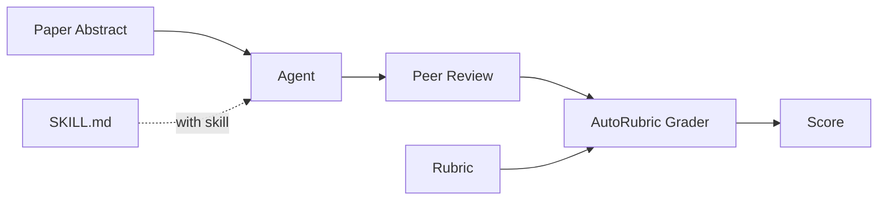
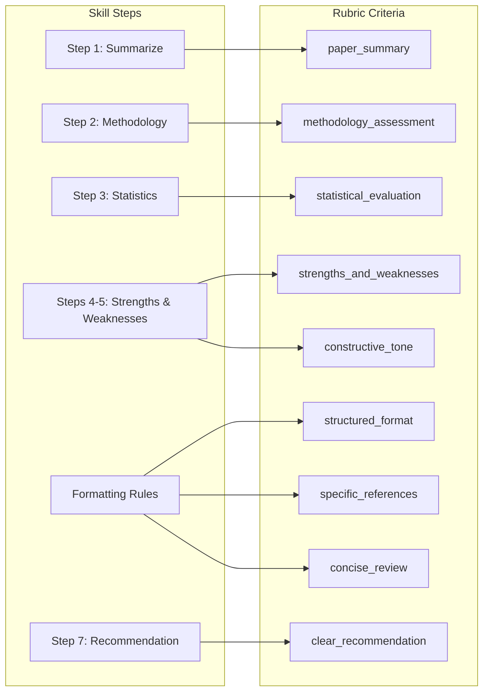
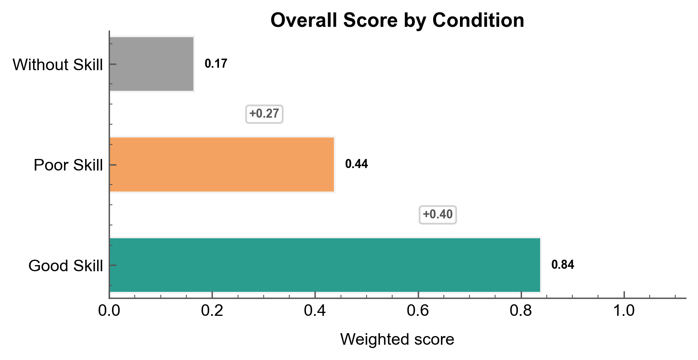
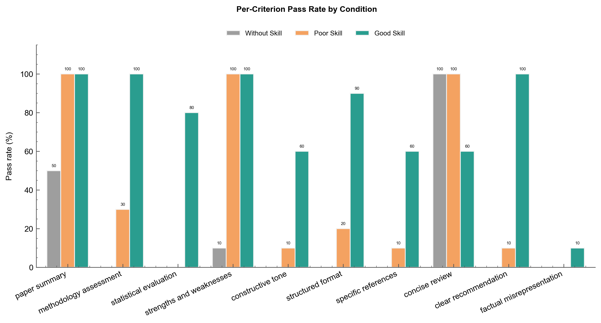
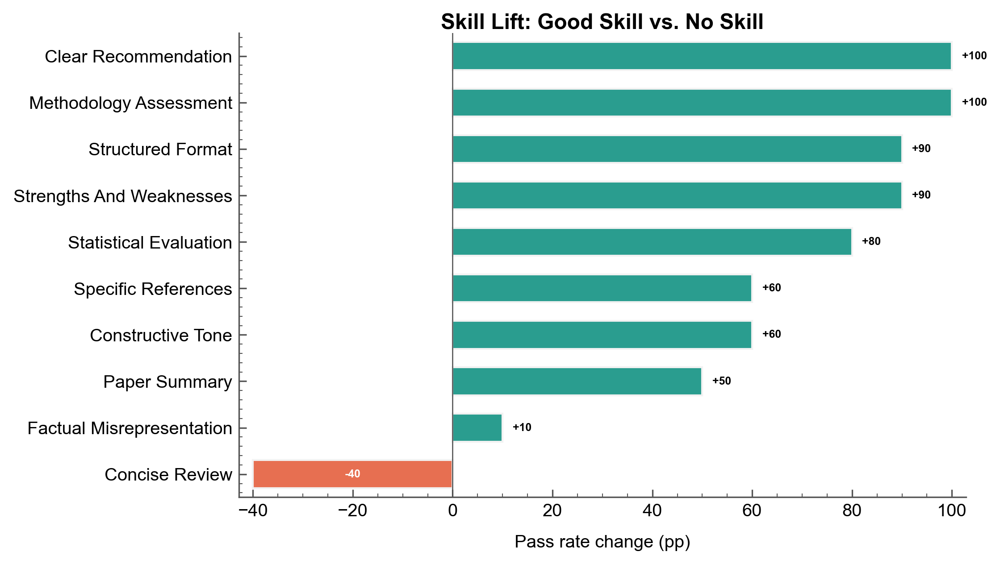
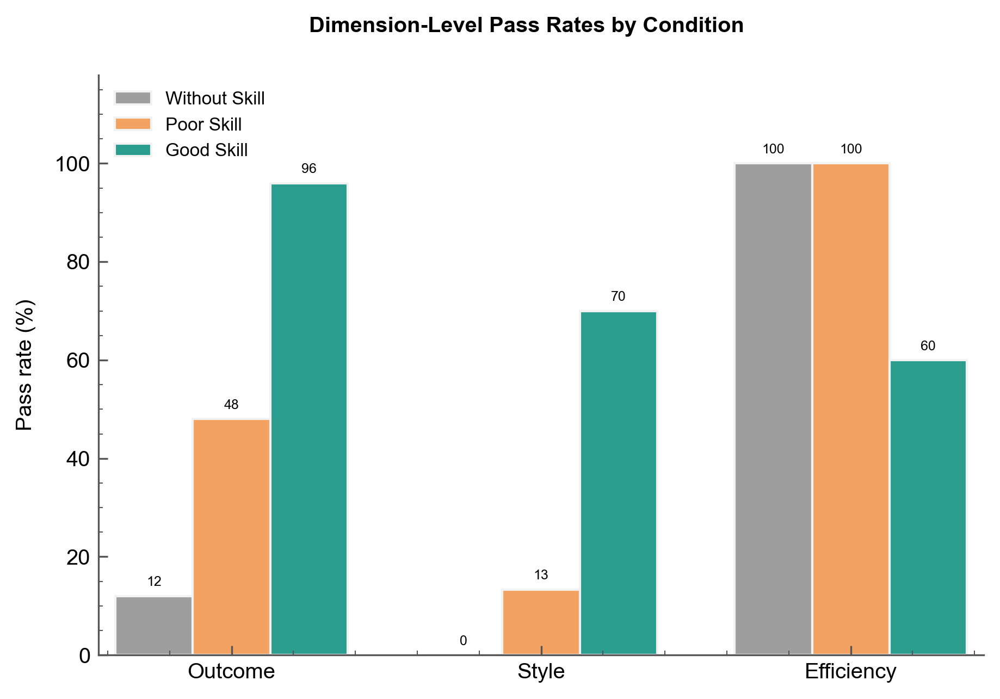
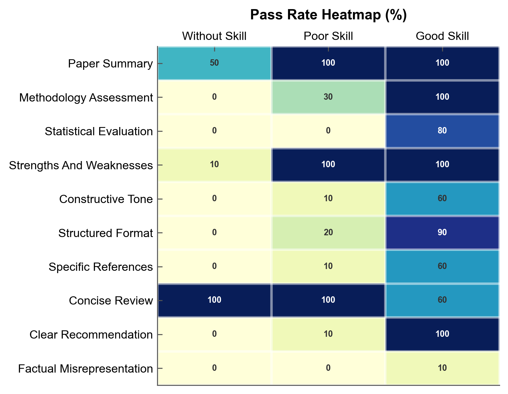

# Evaluating Agent Skills

Measure whether an agent skill improves output quality using controlled comparisons.

## The Scenario

You've built an agent skill for scientific peer review --- a structured `SKILL.md` that guides an LLM through a 7-step review procedure. Now you need to measure whether the skill actually improves output quality, and by how much.

This mirrors the methodology from SkillsBench (Li et al., 2026), which evaluates agent skills by comparing task performance across three conditions:

1. **Without skill** --- Agent gets only the task prompt
2. **Poor skill** --- Agent gets a vague, informational skill (like a self-generated one)
3. **Good skill** --- Agent gets a specific, procedural skill (curated by experts)

AutoRubric serves as the grading layer: the same rubric evaluates all conditions, and the **score delta** between conditions measures skill efficacy.



Three instances of this pipeline — one per condition (no skill / poor skill / good skill) — produce scores that are compared to measure skill efficacy.

## What You'll Learn

- Designing rubrics that map to skill procedural steps
- Evaluating agent outputs under with-skill vs. without-skill conditions
- Three-condition comparison (no skill / poor skill / good skill)
- Dimension analysis grouping criteria by category
- Failure mode analysis to understand where skills help most
- Using `improve_rubric()` to refine the evaluation criteria

## The Solution

### Step 1: Design the Skill

A good skill is a structured procedure with imperative language, specific steps, and formatting requirements. A poor skill is vague and suggestive, offering information without procedure.

**Good skill** (`SKILL.md`):

```markdown
# Scientific Peer Review

## Procedure

1. **Summarize** the paper in 2-3 sentences covering contribution, methodology, and findings.
2. **Evaluate methodology** --- assess study design, appropriateness for the research question, and specific limitations.
3. **Assess statistics** --- check appropriateness of tests, sample size justification, and effect sizes.
4. **List strengths** --- identify at least 2 specific strengths with references to the paper.
5. **List weaknesses** --- identify at least 2 specific weaknesses with actionable suggestions.
6. **Pose questions** --- ask 2-3 clarifying questions for the authors.
7. **Recommend** --- state Accept, Minor Revision, Major Revision, or Reject with justification.

## Formatting
- Use section headers for each step.
- Reference specific sections, figures, and quoted results.
- Keep under 800 words.
```

**Poor skill** (`SKILL_v1.md`):

```markdown
# Peer Review Guide

When reviewing scientific papers, you should consider the methodology, results, and
overall quality. It can be helpful to mention strengths and weaknesses. You may want
to include a recommendation. Good reviews are thorough and constructive.
```

The good skill works because it uses imperative verbs ("Summarize", "Evaluate"), specifies concrete outputs ("2-3 sentences", "at least 2 specific strengths"), and includes formatting constraints ("Keep under 800 words"). The poor skill fails because it uses hedging language ("you should consider", "it can be helpful", "you may want") and provides no procedure.

### Step 2: Design the Rubric

Each rubric criterion maps to a skill procedure step. This 1:1 alignment lets you attribute score improvements to particular parts of the skill procedure.

The criteria are organized by dimension:

| Dimension | Weight | Criteria |
|-----------|--------|----------|
| Outcome (55%) | 55 | paper_summary, methodology_assessment, statistical_evaluation, strengths_and_weaknesses, clear_recommendation |
| Style (25%) | 25 | constructive_tone, structured_format, specific_references |
| Efficiency (20%) | 20 | concise_review |
| Penalty | -15 | factual_misrepresentation |

**Criterion-to-skill mapping:**



The `factual_misrepresentation` criterion (negative weight) is not mapped to a skill step — it catches hallucinated content regardless of condition.

```python
from autorubric import Rubric

rubric = Rubric.from_dict([
    {"name": "paper_summary", "weight": 10.0, "requirement": "Review begins with an accurate 2-3 sentence summary of the paper's contribution, methodology, and findings"},
    {"name": "methodology_assessment", "weight": 15.0, "requirement": "Review evaluates the study design and whether the methodology is appropriate for the research question, noting specific limitations"},
    {"name": "statistical_evaluation", "weight": 15.0, "requirement": "Review addresses the statistical analysis quality, including appropriateness of tests, sample size, and effect sizes"},
    {"name": "strengths_and_weaknesses", "weight": 15.0, "requirement": "Review identifies at least 2 specific strengths and 2 specific weaknesses with concrete references to the paper"},
    {"name": "constructive_tone", "weight": 10.0, "requirement": "Weaknesses include specific, actionable suggestions for improvement rather than just identifying problems"},
    {"name": "structured_format", "weight": 8.0, "requirement": "Review uses clear section headers and follows a logical progression (summary, methodology, statistics, strengths, weaknesses, questions, recommendation)"},
    {"name": "specific_references", "weight": 7.0, "requirement": "Critique references specific details from the paper (section numbers, figure references, quoted results, sample sizes) rather than making generic statements"},
    {"name": "concise_review", "weight": 10.0, "requirement": "Review is focused and stays under 800 words without padding or tangential discussion"},
    {"name": "clear_recommendation", "weight": 10.0, "requirement": "Review concludes with a definitive recommendation (Accept, Minor Revision, Major Revision, or Reject) and a brief justification tied to the analysis"},
    {"name": "factual_misrepresentation", "weight": -15.0, "requirement": "Review makes claims about the paper's content that contradict or are not supported by the actual text"},
])
```

!!! tip "Criteria-Skill Alignment"
    Map each rubric criterion to a specific skill step. This 1:1 alignment lets you attribute
    score improvements to particular parts of the skill procedure, making it clear which steps
    contribute the most value.

### Step 3: Prepare the Dataset

The dataset contains 10 scientific papers, each reviewed under all three conditions, for 30 total items. Every item uses the same rubric but includes a condition tag in its description. Each item has a per-item prompt with the paper's structured abstract.

```python
from autorubric.dataset import RubricDataset

dataset = RubricDataset.from_file("examples/data/peer_review_skill_eval.json")
print(f"{len(dataset.items)} items, {len(dataset.rubric.rubric)} criteria")
# 30 items, 10 criteria
```

The dataset structure:

```json
{
  "rubric": [
    {"name": "paper_summary", "weight": 10.0, "requirement": "..."},
    ...
  ],
  "items": [
    {
      "submission": "The paper presents an interesting study...",
      "description": "[without-skill] Paper 1: RCT of cognitive behavioral therapy",
      "prompt": "Review the following paper:\n\nTitle: ..."
    },
    {
      "submission": "This paper examines the effects of CBT...",
      "description": "[poor-skill] Paper 1: RCT of cognitive behavioral therapy",
      "prompt": "Review the following paper:\n\nTitle: ..."
    },
    {
      "submission": "## Summary\nThis randomized controlled trial...",
      "description": "[good-skill] Paper 1: RCT of cognitive behavioral therapy",
      "prompt": "Review the following paper:\n\nTitle: ..."
    }
  ]
}
```

!!! note "Condition Tags"
    Each item's `description` field includes a tag like `[without-skill]`, `[poor-skill]`, or
    `[good-skill]`. This lets you partition results by condition after evaluation.

### Step 4: Run the Evaluation

Evaluate all 30 items with a single grader. The same rubric applies to every condition:

```python
import asyncio
from autorubric import LLMConfig, evaluate
from autorubric.graders import CriterionGrader

grader = CriterionGrader(
    llm_config=LLMConfig(
        model="gemini/gemini-3-flash-preview",
        temperature=1.0,
        thinking="medium",
        max_parallel_requests=10,
    ),
    normalize=True,
)

async def main():
    eval_result = await evaluate(
        dataset=dataset,
        grader=grader,
        show_progress=True,
    )
    metrics = eval_result.compute_metrics(dataset, bootstrap=True)
    print(metrics.summary())
    return eval_result

eval_result = asyncio.run(main())
```

### Step 5: Analyze by Condition

Partition results by condition tag and compute mean scores:

```python
conditions = {"without-skill": [], "poor-skill": [], "good-skill": []}
for item_result in eval_result.item_results:
    desc = item_result.item.description
    for cond in conditions:
        if f"[{cond}]" in desc:
            conditions[cond].append(item_result)
            break

for cond, results in conditions.items():
    mean_score = sum(r.report.score for r in results) / len(results)
    print(f"{cond}: {mean_score:.2f}")
```

Expected output:

```
without-skill: 0.17
poor-skill:    0.44
good-skill:    0.84
```

Compute skill efficacy deltas to quantify impact:

```python
scores = {}
for cond, results in conditions.items():
    scores[cond] = sum(r.report.score for r in results) / len(results)

print(f"\nSkill Efficacy Deltas:")
print(f"  Poor skill vs none:  +{scores['poor-skill'] - scores['without-skill']:.2f}")
print(f"  Good skill vs none:  +{scores['good-skill'] - scores['without-skill']:.2f}")
print(f"  Good skill vs poor:  +{scores['good-skill'] - scores['poor-skill']:.2f}")
```

```
Skill Efficacy Deltas:
  Poor skill vs none:  +0.27
  Good skill vs none:  +0.67
  Good skill vs poor:  +0.40
```

!!! tip "Interpreting Deltas"
    The poor-skill condition shows only marginal improvement over no skill at all (+0.27),
    confirming that vague, self-generated skills provide limited benefit. The good-skill
    condition nearly triples the score (+0.67), demonstrating that skill quality --- not just
    skill presence --- drives performance.



The headline scores show a clear progression: without any skill the agent scores 0.17, a vague skill bumps it to 0.44, and a well-structured procedural skill reaches 0.84.



The chart above shows ground-truth pass rates per criterion across all three conditions. Criteria like `methodology_assessment` and `statistical_evaluation` jump from 0% (without skill) to 80-100% (good skill), while `concise_review` starts high and actually drops under the good skill — the structured procedure encourages thoroughness at the cost of brevity.



Sorting by delta reveals which criteria benefit most from the skill. `methodology_assessment` and `clear_recommendation` see the largest gains (+100pp each), while `concise_review` is the only criterion that regresses (-40pp) — the structured procedure encourages thoroughness at the cost of brevity.

### Step 6: Dimension Analysis

Group criteria by dimension to see where skills have the most impact:

```python
dimensions = {
    "Outcome": ["paper_summary", "methodology_assessment", "statistical_evaluation",
                 "strengths_and_weaknesses", "clear_recommendation"],
    "Style": ["constructive_tone", "structured_format", "specific_references"],
    "Efficiency": ["concise_review"],
}

for dim_name, criteria_names in dimensions.items():
    print(f"\n{dim_name}:")
    for cond, results in conditions.items():
        met_count = 0
        total_count = 0
        for r in results:
            for cr in r.report.report:
                if cr.criterion.name in criteria_names:
                    total_count += 1
                    if cr.final_verdict.value == "MET":
                        met_count += 1
        accuracy = met_count / total_count if total_count > 0 else 0
        print(f"  {cond}: {accuracy:.0%}")
```

Sample output:

```
Outcome:
  without-skill: 12%
  poor-skill:    48%
  good-skill:    96%

Style:
  without-skill: 0%
  poor-skill:    13%
  good-skill:    70%

Efficiency:
  without-skill: 100%
  poor-skill:    100%
  good-skill:    60%
```



The Outcome dimension benefits most from the good skill (12% → 96%), which makes sense --- the skill's 7-step procedure directly targets outcome quality. Style criteria also see large gains from the formatting requirements. The Efficiency regression (100% → 60%) reveals a tradeoff: the structured procedure encourages thoroughness at the cost of brevity.

### Step 7: Failure Mode Analysis

Identify which criteria fail most often per condition to understand where skills help and where gaps remain:

```python
print(f"{'Criterion':<28} {'No Skill':>10} {'Poor':>10} {'Good':>10}")
print("-" * 60)

criterion_names = [c.name for c in dataset.rubric.rubric]
for cr_name in criterion_names:
    row = f"{cr_name:<28}"
    for cond in ["without-skill", "poor-skill", "good-skill"]:
        met = 0
        total = 0
        for r in conditions[cond]:
            for cr in r.report.report:
                if cr.criterion.name == cr_name:
                    total += 1
                    if cr.final_verdict.value == "MET":
                        met += 1
        rate = met / total if total > 0 else 0
        row += f" {rate:>9.0%}"
    print(row)
```

Sample output:

```
Criterion                     No Skill       Poor       Good
------------------------------------------------------------
paper_summary                      50%       100%       100%
methodology_assessment              0%        30%       100%
statistical_evaluation              0%         0%        80%
strengths_and_weaknesses           10%       100%       100%
constructive_tone                   0%        10%        60%
structured_format                   0%        20%        90%
specific_references                 0%        10%        60%
concise_review                    100%       100%        60%
clear_recommendation                0%        10%       100%
factual_misrepresentation           0%         0%        10%
```



The heatmap makes two patterns immediately visible: the block of dark cells in the Good Skill column shows broad improvement, while the persistent light row for `factual_misrepresentation` confirms that skills do not reduce hallucination risk.

!!! warning "Negative Criteria"
    The `factual_misrepresentation` penalty fires at a similar rate across all conditions.
    Skills can introduce new failure modes --- a structured procedure might encourage the
    model to fill in details it does not actually know. Monitor negative-weight criteria
    carefully when evaluating skills.

### Step 8 (Optional): Rubric Improvement

If you want to refine the rubric before running a large-scale evaluation, use `improve_rubric()`:

```python
from autorubric.meta import improve_rubric

async def improve():
    result = await improve_rubric(
        rubric=dataset.rubric,
        eval_llm=LLMConfig(
            model="gemini/gemini-3-flash-preview",
            temperature=1.0,
            thinking="medium",
        ),
        revision_llm=LLMConfig(
            model="anthropic/claude-sonnet-4-5-20250929",
            temperature=0.5,
        ),
        max_iterations=5,
    )
    print(f"Improved from {len(result.original_rubric.rubric)} to "
          f"{len(result.final_rubric.rubric)} criteria")
    print(f"Converged: {result.convergence_reason}")
    return result

improvement = asyncio.run(improve())
```

This catches issues like vague requirements, double-barreled criteria, or missing dimensions before they affect your evaluation results. See [Automated Rubric Improvement](automated-rubric-improvement.md) for the full guide.

## Key Takeaways

| SkillsBench / Blog Concept | AutoRubric Feature |
|---|---|
| SKILL.md procedural steps | Rubric criteria that check each step's output quality |
| Three conditions (no / poor / curated skills) | Same rubric applied to all; score deltas = skill efficacy |
| Deterministic verifiers | Criteria with objective requirements (word count, section headers) |
| Qualitative assessment | `CriterionGrader` handles subjective criteria (constructiveness, accuracy) |
| Pass rate metric | `compute_metrics()` with accuracy, precision, recall, kappa |
| Domain-level analysis | Per-dimension grouping (Outcome / Style / Efficiency) |
| Skill description optimization | Compare poor-skill vs good-skill scores; `improve_rubric()` refines criteria |
| Multiple model configs | Ensemble `JudgeSpec` with different LLMs |
| Self-generated skills = no benefit | Poor-skill condition shows marginal improvement over without-skill |

- **The same rubric grades all conditions** --- score deltas directly measure skill impact
- **Criteria should map 1:1 to skill procedure steps** for clear attribution
- **Negative-weight criteria catch new failure modes** skills might introduce (e.g., hallucinated content)
- **Three conditions (not two)** reveal whether skill quality matters, not just skill presence

## Going Further

- [Ensemble Judging](ensemble-judging.md) - Use multiple judges for higher reliability
- [Automated Rubric Improvement](automated-rubric-improvement.md) - Refine criteria with LLM feedback
- [Judge Validation](judge-validation.md) - Validate your grader against human labels

---

## Appendix: Complete Code

```python
"""Agent Skill Evaluation - Scientific Peer Review"""

import asyncio
from pathlib import Path

from autorubric import LLMConfig, evaluate
from autorubric.dataset import RubricDataset
from autorubric.graders import CriterionGrader

DATASET_PATH = Path(__file__).parent / "data" / "peer_review_skill_eval.json"

DIMENSIONS = {
    "Outcome": ["paper_summary", "methodology_assessment", "statistical_evaluation",
                 "strengths_and_weaknesses", "clear_recommendation"],
    "Style": ["constructive_tone", "structured_format", "specific_references"],
    "Efficiency": ["concise_review"],
}


async def main():
    # Phase 1: Load dataset
    dataset = RubricDataset.from_file(DATASET_PATH)
    print(f"Loaded {len(dataset.items)} items, {len(dataset.rubric.rubric)} criteria")

    # Phase 2: Evaluate
    grader = CriterionGrader(
        llm_config=LLMConfig(
            model="gemini/gemini-3-flash-preview",
            temperature=1.0,
            thinking="medium",
            max_parallel_requests=10,
        ),
        normalize=True,
    )

    eval_result = await evaluate(
        dataset=dataset,
        grader=grader,
        show_progress=True,
    )
    metrics = eval_result.compute_metrics(dataset, bootstrap=True)
    print(metrics.summary())

    # Phase 3: Partition by condition
    conditions = {"without-skill": [], "poor-skill": [], "good-skill": []}
    for item_result in eval_result.item_results:
        desc = item_result.item.description
        for cond in conditions:
            if f"[{cond}]" in desc:
                conditions[cond].append(item_result)
                break

    # Phase 4: Report scores and deltas
    print("\n" + "=" * 50)
    print("SKILL EFFICACY RESULTS")
    print("=" * 50)

    scores = {}
    for cond, results in conditions.items():
        mean_score = sum(r.report.score for r in results) / len(results)
        scores[cond] = mean_score
        print(f"  {cond}: {mean_score:.2f}")

    print(f"\nDeltas:")
    print(f"  Poor skill vs none:  +{scores['poor-skill'] - scores['without-skill']:.2f}")
    print(f"  Good skill vs none:  +{scores['good-skill'] - scores['without-skill']:.2f}")
    print(f"  Good skill vs poor:  +{scores['good-skill'] - scores['poor-skill']:.2f}")

    # Dimension analysis
    for dim_name, criteria_names in DIMENSIONS.items():
        print(f"\n{dim_name}:")
        for cond, results in conditions.items():
            met_count = 0
            total_count = 0
            for r in results:
                for cr in r.report.report:
                    if cr.criterion.name in criteria_names:
                        total_count += 1
                        if cr.final_verdict.value == "MET":
                            met_count += 1
            accuracy = met_count / total_count if total_count > 0 else 0
            print(f"  {cond}: {accuracy:.0%}")

    # Per-criterion breakdown
    criterion_names = [c.name for c in dataset.rubric.rubric]
    print(f"\n{'Criterion':<28} {'No Skill':>10} {'Poor':>10} {'Good':>10}")
    print("-" * 60)
    for cr_name in criterion_names:
        row = f"{cr_name:<28}"
        for cond in ["without-skill", "poor-skill", "good-skill"]:
            met = sum(
                1 for r in conditions[cond]
                for cr in r.report.report
                if cr.criterion.name == cr_name and cr.final_verdict.value == "MET"
            )
            total = sum(
                1 for r in conditions[cond]
                for cr in r.report.report
                if cr.criterion.name == cr_name
            )
            rate = met / total if total > 0 else 0
            row += f" {rate:>9.0%}"
        print(row)

    if eval_result.total_completion_cost:
        print(f"\nTotal cost: ${eval_result.total_completion_cost:.4f}")


if __name__ == "__main__":
    asyncio.run(main())
```
