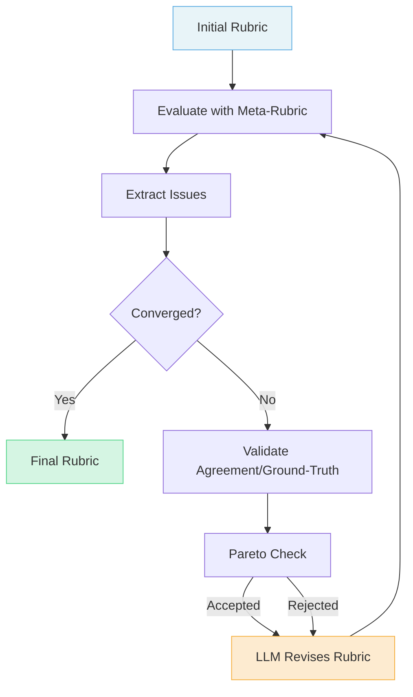
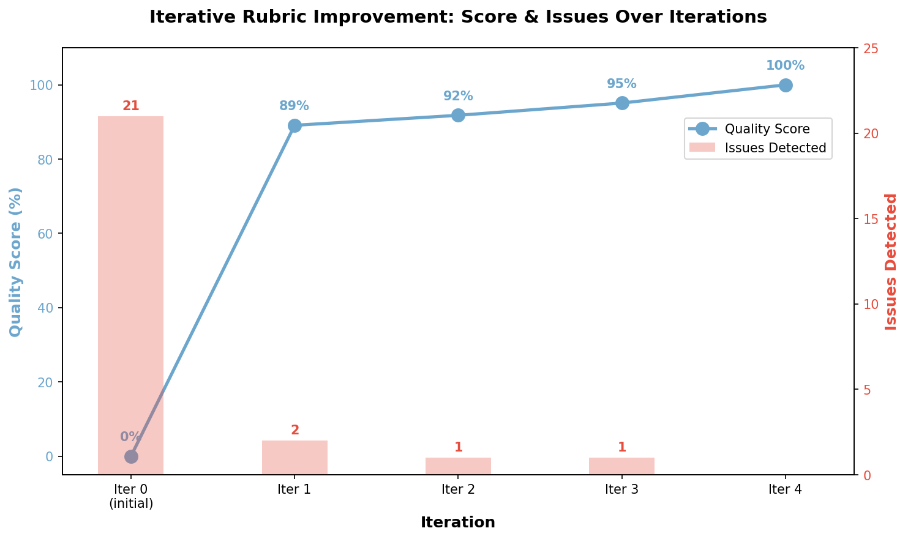

# Automated Rubric Improvement

Use LLM-driven feedback loops to iteratively refine rubrics until they meet quality standards.

## The Scenario

You're building an evaluation system for a new domain, but crafting high-quality rubrics from scratch is difficult. Your initial rubrics suffer from common problems: vague language, double-barreled criteria, and generic boilerplate that doesn't capture task-specific quality dimensions.

Rather than manually iterating through rubric revisions---evaluating, identifying issues, rewriting, and re-evaluating---you want to automate this refinement process. The system should:

1. Evaluate rubric quality using meta-rubrics
2. Extract actionable feedback from the evaluation
3. Use an LLM to revise the rubric based on that feedback
4. Repeat until no issues remain or a quality threshold is met

AutoRubric's `improve_rubric()` function and `ImprovementRunner` class automate this entire loop.

## What You'll Learn

- How to improve rubrics with the `improve_rubric()` convenience function
- How to use `ImprovementRunner` for full control over the loop
- How to validate improvements with ground-truth data or multi-judge agreement
- How to write custom convergence functions
- How to inspect artifacts from the improvement process
- How to use building blocks for custom improvement pipelines

## The Solution

### The Improvement Loop

The automated improvement process follows a feedback loop with optional validation:



### Step 1: Define the Flawed Initial Rubric

Start with a rubric that exhibits common anti-patterns. In practice, this might be a first draft or a rubric borrowed from a similar domain:

```python
from autorubric import Rubric

initial_rubric = Rubric.from_dict([
    {
        "weight": 10,
        "requirement": "The response is well-written, accurate, and demonstrates creativity",
    },
    {
        "weight": 8,
        "requirement": "The response shows good understanding of the topic",
    },
    {
        "weight": 6,
        "requirement": "The response may include some relevant examples if appropriate",
    },
    {
        "weight": 5,
        "requirement": "The response is of high quality",
    },
    {
        "weight": 7,
        "requirement": "Writing quality is acceptable and the text flows well",
    },
])
```

This rubric has several anti-patterns: double-barreled criteria, vague wording ("good"), hedging language ("may"), generic boilerplate ("high quality"), and overlapping criteria.

### Step 2: Improve with `improve_rubric()`

The simplest way to improve a rubric is the `improve_rubric()` convenience function. It handles the entire loop---evaluation, issue extraction, validation, revision, and convergence detection:

```python
import asyncio
from autorubric import LLMConfig
from autorubric.meta import improve_rubric

eval_llm = LLMConfig(
    model="gemini/gemini-2.5-flash",
    temperature=0.0,
    thinking="medium",
    max_parallel_requests=10,
)

revision_llm = LLMConfig(
    model="gemini/gemini-2.5-pro",
    temperature=0.3,
    thinking="medium",
)

task_prompt = (
    "Write a comprehensive analysis of the environmental impact of electric "
    "vehicles compared to traditional gasoline vehicles. Include discussion "
    "of manufacturing, operation, and end-of-life considerations."
)

async def main():
    result = await improve_rubric(
        initial_rubric,
        task_prompt,
        eval_llm=eval_llm,
        revision_llm=revision_llm,
        show_progress=True,
        artifacts_dir="ev_rubric_improvement",
    )

    print(f"Quality: {result.iterations[0].quality_score:.0%} -> "
          f"{result.iterations[result.best_iteration].quality_score:.0%}")
    print(f"Issues: {len(result.iterations[0].issues)} -> "
          f"{len(result.iterations[result.best_iteration].issues)}")
    print(f"Converged: {result.convergence_reason}")
    print(f"Cost: ${result.total_completion_cost or 0:.4f}")

asyncio.run(main())
```

The function uses `in_context` mode by default, evaluating the rubric against the task prompt. It stops when no issues remain, quality thresholds are met, a score plateau is detected, or max iterations are reached.

### Step 3: Use `ImprovementRunner` for Full Control

For more control, use `ImprovementRunner` with an `ImprovementConfig`:

```python
from autorubric.meta import ImprovementRunner, ImprovementConfig

config = ImprovementConfig(
    eval_llm=eval_llm,
    revision_llm=revision_llm,
    mode="in_context",
    max_iterations=10,
    min_quality_score=0.95,
    score_plateau_threshold=0.02,
    plateau_patience=2,
    history_window=3,
    save_artifacts=True,
    artifacts_dir="ev_rubric_improvement",
    show_progress=True,
)

async def main():
    runner = ImprovementRunner(initial_rubric, task_prompt, config=config)
    result = await runner.run()

    # Access the best rubric
    print(f"Best iteration: {result.best_iteration}")
    for c in result.best_rubric.rubric:
        print(f"  [{c.weight:+}] {c.requirement}")

asyncio.run(main())
```

`ImprovementConfig` exposes all tuning knobs:

| Parameter | Default | Purpose |
|-----------|---------|---------|
| `max_iterations` | 10 | Cap on improvement cycles |
| `min_quality_score` | 0.95 | Stop when quality exceeds this |
| `min_agreement` | 0.85 | Stop when validation agreement exceeds this |
| `score_plateau_threshold` | 0.02 | Minimum score delta to avoid plateau |
| `plateau_patience` | 2 | Plateau iterations before stopping |
| `history_window` | 3 | Recent iterations included in revision prompt |
| `reject_agreement_regression` | True | Reject revisions that decrease validation reliability |
| `max_total_cost` | None | Budget cap in USD |

### Step 4: Add Validation Data

Without validation data, the loop optimizes only for meta-rubric quality. Adding validation data ensures the rubric also produces reliable scores in practice. Two modes are supported:

#### Ground-Truth Validation

When items have `ground_truth` verdicts, the loop measures Spearman rank correlation between rubric scores and expected scores. Revisions that decrease correlation are rejected (Pareto constraint).

```python
from autorubric.dataset import RubricDataset

validation_data = RubricDataset.from_file("validation_items.json")

result = await improve_rubric(
    initial_rubric,
    task_prompt,
    eval_llm=eval_llm,
    revision_llm=revision_llm,
    validation_data=validation_data,
)

for it in result.iterations:
    corr = f"{it.agreement:.2f}" if it.agreement is not None else "N/A"
    print(f"Iter {it.iteration}: quality={it.quality_score:.0%}, "
          f"correlation={corr}")
```

#### Multi-Judge Validation

When items lack `ground_truth`, use an ensemble of judges to measure inter-judge agreement. This requires `eval_llm` to be a `list[JudgeSpec]` with at least 2 judges:

```python
from autorubric.graders import JudgeSpec

judges = [
    JudgeSpec(
        llm_config=LLMConfig(model="openai/gpt-4.1-mini"),
        judge_id="gpt4-mini",
    ),
    JudgeSpec(
        llm_config=LLMConfig(model="gemini/gemini-2.5-flash"),
        judge_id="gemini-flash",
    ),
]

validation_data = RubricDataset.from_file("unlabeled_items.json")

result = await improve_rubric(
    initial_rubric,
    task_prompt,
    eval_llm=judges,
    revision_llm=revision_llm,
    validation_data=validation_data,
)
```

The revision prompt includes per-criterion agreement data, guiding the LLM to clarify criteria where judges disagree.

!!! tip "Even a Small Validation Set Helps"
    Providing as few as 5-10 items with ground-truth verdicts significantly improves the
    loop's ability to detect and fix rubric issues. The meta-rubric checks structural quality
    (clarity, specificity, overlap), but a validation set adds an objective behavioral signal:
    does the rubric actually rank responses correctly? That complementary signal catches
    problems that structural analysis alone misses.

### Step 5: Custom Convergence Functions

The built-in convergence logic handles common cases. For custom stopping conditions, provide a `convergence_fn`:

```python
from autorubric.meta import ConvergenceFn, IterationResult

def custom_convergence(
    current: IterationResult,
    history: list[IterationResult],
) -> str | None:
    """Stop when quality >= 90% and no anti-patterns remain."""
    has_antipatterns = any(i.is_antipattern for i in current.issues)

    if current.quality_score >= 0.90 and not has_antipatterns:
        return "quality_met_no_antipatterns"

    if len(history) >= 3:
        recent_scores = [h.quality_score for h in history[-3:]]
        if max(recent_scores) - min(recent_scores) < 0.01:
            return "scores_converged"

    return None  # Continue

result = await improve_rubric(
    initial_rubric,
    task_prompt,
    eval_llm=eval_llm,
    revision_llm=revision_llm,
    config=ImprovementConfig(
        eval_llm=eval_llm,
        revision_llm=revision_llm,
        convergence_fn=custom_convergence,
    ),
)

print(f"Stopped: {result.convergence_reason}")
```

When `convergence_fn` is provided, it replaces the built-in convergence logic entirely. Return a reason string to stop, or `None` to continue.

### Step 6: Inspect Artifacts

When `save_artifacts=True`, the runner writes detailed artifacts to the artifacts directory:

```
ev_rubric_improvement/
  rubric-iter-00.json        # Criteria array for each iteration
  rubric-iter-01.json
  ...
  eval-iter-00.html          # Meta-rubric evaluation report per iteration
  eval-iter-01.html
  ...
  iter-00.json               # Rich per-iteration JSON (quality report, issues,
  iter-01.json               #   validation samples, revision prompts/response)
  ...
  improvement_report.html    # Consolidated HTML report across all iterations
  summary.json               # Full run metadata, config snapshot, per-iteration summary
```

The `summary.json` contains everything needed to analyze a run programmatically:

```python
import json

with open("ev_rubric_improvement/summary.json", encoding="utf-8") as f:
    summary = json.load(f)

print(f"Convergence: {summary['convergence_reason']}")
print(f"Best iteration: {summary['best_iteration']}")
for it in summary["iterations_summary"]:
    print(f"  Iter {it['iteration']}: quality={it['quality_score']:.0%}, "
          f"issues={it['num_issues']}, cost=${it['completion_cost'] or 0:.4f}")
```

### Step 7: Use the Improved Rubric

The result provides three rubric snapshots:

```python
import json

result.original_rubric  # The input rubric
result.final_rubric     # The rubric from the last accepted iteration
result.best_rubric      # The rubric with the best combined quality + agreement

# Save the best rubric for use in production
criteria = [
    {"weight": c.weight, "requirement": c.requirement}
    for c in result.best_rubric.rubric
]
with open("improved_rubric.json", "w", encoding="utf-8") as f:
    json.dump(criteria, f, indent=2)
```

### Step 8: Custom Prompts

Override the revision system prompt or user prompt template for domain-specific guidance:

```python
config = ImprovementConfig(
    eval_llm=eval_llm,
    revision_llm=revision_llm,
    revision_system_prompt=(
        "You are a rubric design expert for scientific peer review evaluation. "
        "Criteria must be grounded in established review standards."
    ),
    revision_user_prompt_template="""Revise this rubric based on feedback.

## Task
{task_prompt}

## Current Criteria
{original_criteria}

## Issues
{issues_text}

## Validation Data
{validation_text}

## Recent History
{history_text}

Return ONLY a JSON array of criteria with "weight" and "requirement" fields.""",
)
```

The user prompt template must include the placeholders `{task_prompt}`, `{original_criteria}`, `{issues_text}`, `{validation_text}`, and `{history_text}`.

## Building Blocks

For fully custom improvement pipelines, the module exports individual building blocks:

| Function | Purpose |
|----------|---------|
| `extract_issues(report)` | Extract `IssueDetail` list from a meta-rubric evaluation report |
| `diff_issues(prev, curr)` | Track which issues were fixed and which were introduced |
| `format_issues_for_prompt(issues)` | Format issues into text for the revision prompt |
| `format_agreement_for_prompt(per_criterion)` | Format per-criterion agreement as a prompt section |
| `format_ground_truth_for_prompt(corr, pairs)` | Format ground-truth validation results as a prompt section |
| `build_revision_history(iterations, window)` | Format recent iteration history for the revision prompt |
| `revise_rubric(rubric, task_prompt, issues, ...)` | Revise a rubric via LLM |
| `validate_agreement(rubric, samples, judges, ...)` | Test inter-judge agreement |
| `validate_ground_truth(rubric, data, expected, ...)` | Grade items and compute Spearman rho |
| `compute_expected_scores(validation_data)` | Compute expected scores from ground-truth verdicts |
| `pareto_accept(curr, prev, ...)` | Check if a revision passes the Pareto constraint |

## Example Results

Running this pipeline on the flawed rubric above produces dramatic improvement:



The chart shows how the quality score increases from 0% to 100% while detected issues drop from 21 to 0 over 5 iterations.

| Iteration | Score | Issues | Key Changes |
|-----------|-------|--------|-------------|
| 0 (Initial) | 0% | 21 | Generic, vague, double-barreled criteria |
| 1 | 89% | 2 | Task-specific criteria addressing manufacturing, operation, end-of-life |
| 2 | 92% | 1 | Split compound criteria, clarified wording |
| 3 | 95% | 1 | Improved comparative framing |
| 4 (Final) | 100% | 0 | Balanced weights, fully optimized |

### Qualitative Transformation

The table below shows how specific criteria evolved through the refinement process:

| Aspect | Initial (Iteration 0) | Final (Iteration 4) |
|--------|----------------------|---------------------|
| **Manufacturing** | Not addressed | "Compares the environmental impacts of manufacturing electric vehicle batteries with the manufacturing processes of gasoline vehicles" |
| **Operation** | Not addressed | "Contrasts the indirect emissions from electricity generation for EVs against the direct tailpipe emissions of gasoline vehicles" |
| **End-of-Life** | Not addressed | "Compares the environmental implications of EV battery disposal or recycling against the end-of-life processing of gasoline vehicles" |
| **Writing Quality** | "well-written, accurate, and demonstrates creativity" (double-barreled, vague) | "Organizes the content using specific headers for manufacturing, operation, and end-of-life phases" (specific, observable) |
| **Overall Quality** | "The response is of high quality" (circular, generic) | "Provides a concluding assessment that weighs the total environmental footprint of EVs against gasoline vehicles" (task-specific) |

The transformation illustrates three key improvements:

1. **Generic to task-specific**: Criteria now directly address the EV analysis requirements
2. **Vague to observable**: "high quality" becomes measurable structural requirements
3. **Compound to unidimensional**: Multi-aspect criteria split into focused assessments

## Key Takeaways

- **Use `improve_rubric()` for the common case**: It handles evaluation, revision, convergence detection, and artifact saving
- **Use `ImprovementRunner` for full control**: Configure all thresholds, convergence logic, and prompt overrides
- **Add validation data**: Ground-truth or multi-judge validation ensures the rubric produces reliable scores, not just high meta-rubric quality
- **Use different models for different tasks**: Fast models for evaluation (parallelizable), strong models for revision (complex reasoning)
- **Inspect artifacts**: The HTML reports and summary JSON provide full audit trails
- **The Pareto constraint prevents regressions**: Revisions that decrease validation reliability are rejected

## Best Practices

### Model Selection

| Task | Recommended Model | Why |
|------|------------------|-----|
| Evaluation | Fast model (Flash/Mini) | Many parallel criterion assessments |
| Revision | Strong model (Pro/4o) | Complex reasoning about rubric design |

### Convergence

The built-in convergence logic stops when:

1. **No issues detected**: All meta-rubric criteria pass
2. **Thresholds met**: Quality >= `min_quality_score` and agreement >= `min_agreement`
3. **Max iterations reached**: Prevents runaway loops (default 10)
4. **Score plateau**: Improvement < `score_plateau_threshold` for `plateau_patience` iterations
5. **Pareto stuck**: 3 consecutive revisions rejected for agreement regression
6. **Cost limit**: Total cost exceeds `max_total_cost`

### Debugging Stuck Loops

If the loop doesn't converge:

1. Check `iter-{NN}.json` artifacts to see if the same issues keep reappearing
2. Look for conflicting meta-rubric criteria in the evaluation reports
3. Lower the revision LLM temperature for more deterministic outputs
4. Increase `history_window` to give the revision LLM more context about prior attempts
5. Provide a custom `revision_system_prompt` with domain-specific guidance

## Going Further

- [Evaluating Rubric Quality](rubric-evaluation.md) - Understanding meta-rubrics in depth
- [Extended Thinking](extended-thinking.md) - Using thinking models for complex evaluations
- [Configuration Management](configuration-management.md) - Sharing optimized rubrics across teams

---

## Appendix: Complete Code

The following is a complete, self-contained version of this recipe built around `improve_rubric()`. For a different, fuller example that improves a rubric against ground-truth data, see [`examples/rubric_improvement_demo.py`](https://github.com/delip/autorubric/blob/main/examples/rubric_improvement_demo.py).

```python
#!/usr/bin/env python3
"""Automated Rubric Improvement Demo

Iteratively refines a rubric using the built-in improve_rubric() API.
"""

import asyncio
import json

from autorubric import LLMConfig, Rubric
from autorubric.meta import improve_rubric


def create_flawed_rubric() -> Rubric:
    """Create a rubric with intentional quality issues."""
    return Rubric.from_dict([
        {
            "weight": 10,
            "requirement": (
                "The response is well-written, accurate, and demonstrates creativity"
            ),
        },
        {
            "weight": 8,
            "requirement": "The response shows good understanding of the topic",
        },
        {
            "weight": 6,
            "requirement": "The response may include relevant examples if appropriate",
        },
        {
            "weight": 5,
            "requirement": "The response is of high quality",
        },
        {
            "weight": 7,
            "requirement": "Writing quality is acceptable and the text flows well",
        },
    ])


async def main():
    eval_llm = LLMConfig(
        model="gemini/gemini-2.5-flash",
        temperature=0.0,
        thinking="medium",
        max_parallel_requests=10,
    )

    revision_llm = LLMConfig(
        model="gemini/gemini-2.5-pro",
        temperature=0.3,
        thinking="medium",
    )

    task_prompt = (
        "Write a comprehensive analysis of the environmental impact of electric "
        "vehicles compared to traditional gasoline vehicles. Include discussion "
        "of manufacturing, operation, and end-of-life considerations."
    )

    result = await improve_rubric(
        create_flawed_rubric(),
        task_prompt,
        eval_llm=eval_llm,
        revision_llm=revision_llm,
        show_progress=True,
        artifacts_dir="ev_rubric_improvement",
    )

    # Summary
    initial = result.iterations[0]
    best = result.iterations[result.best_iteration]
    print(f"\nQuality: {initial.quality_score:.0%} -> {best.quality_score:.0%}")
    print(f"Issues: {len(initial.issues)} -> {len(best.issues)}")
    print(f"Convergence: {result.convergence_reason}")
    if result.total_completion_cost:
        print(f"Total cost: ${result.total_completion_cost:.4f}")

    # Save improved rubric
    criteria = [
        {"weight": c.weight, "requirement": c.requirement}
        for c in result.best_rubric.rubric
    ]
    with open("improved_rubric.json", "w", encoding="utf-8") as f:
        json.dump(criteria, f, indent=2)


if __name__ == "__main__":
    asyncio.run(main())
```
