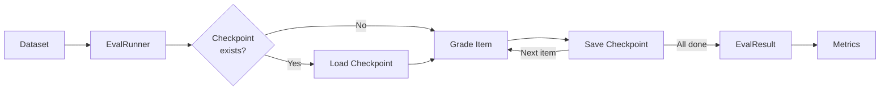

# Production Batch Evaluation

Run large-scale evaluations with checkpointing, resumption, and cost tracking.

## The Scenario

You need to evaluate 10,000 customer feedback responses for sentiment and helpfulness. The evaluation might take hours, and you can't afford to lose progress if something fails. You need checkpointing, automatic resumption, timing statistics, and comprehensive cost tracking.

## What You'll Learn

- Using `EvalRunner` for batch evaluation
- Configuring checkpoints with `EvalConfig`
- Resuming interrupted evaluations with `resume=True`
- Tracking timing statistics and throughput
- Managing costs across large evaluations
- Parallel execution with `max_concurrent_items`

## The Solution



### Step 1: Configure the Evaluation

Set up `EvalConfig` for production runs:

```python
from autorubric import EvalConfig
from pathlib import Path

config = EvalConfig(
    # Error handling
    fail_fast=False,          # Continue on errors (default)

    # Progress display
    show_progress=True,       # Show progress bar
    progress_style="simple",  # "simple" or "detailed"

    # Checkpointing
    experiment_name="customer-feedback-v1",  # Named experiment
    experiments_dir=Path("./experiments"),   # Where to save checkpoints
    resume=True,              # Resume if experiment exists

    # Concurrency
    max_concurrent_items=50,  # Limit parallel items (None = unlimited)
)
```

### Step 2: Create the Runner

```python
from autorubric import LLMConfig, RubricDataset
from autorubric.graders import CriterionGrader
from autorubric.eval import EvalRunner

# Load your dataset
dataset = RubricDataset.from_file("customer_feedback.json")

# Configure grader with rate limiting
grader = CriterionGrader(
    llm_config=LLMConfig(
        model="openai/gpt-4.1-mini",
        max_parallel_requests=20,  # Provider-level rate limit
    )
)

# Create runner
runner = EvalRunner(
    dataset=dataset,
    grader=grader,
    config=config,
)
```

### Step 3: Run the Evaluation

```python
import asyncio

async def main():
    result = await runner.run()
    return result

result = asyncio.run(main())
```

Progress output:

```
⠋ Evaluating ━━━━━━━━━━━━━━━━━━━━━━━━━━━━━━━━ 4,235/10,000 (2.31/s) 0:30:32 -0:42:15
```

### Step 4: Handle Interruptions and Resume

If evaluation is interrupted (Ctrl+C, crash, timeout), resume from checkpoint:

```python
# Same config with same experiment_name
config = EvalConfig(
    experiment_name="customer-feedback-v1",  # Same name
    experiments_dir=Path("./experiments"),
    resume=True,  # Will resume from checkpoint
)

runner = EvalRunner(dataset=dataset, grader=grader, config=config)
result = await runner.run()  # Continues from where it stopped
```

Output when resuming:

```
INFO: Resuming experiment customer-feedback-v1 with 4,235 completed items
⠋ Evaluating ━━━━━━━━━━━━━━━━━━━━━━━━━━━━━━━━ 4,236/10,000 (2.28/s) 0:00:01 -0:42:15
```

!!! tip "Experiment naming conventions"
    Use descriptive experiment names that encode the date, model, and config variant --
    for example, `feedback-gpt4m-2026-03-14` or `feedback-v2-ensemble`. This makes it
    straightforward to resume a specific run and to compare results across experiments
    without opening each checkpoint directory.

### Step 5: Examine Timing Statistics

```python
stats = result.timing_stats

print(f"Total duration: {stats.total_duration_seconds:.1f}s")
print(f"Mean per item: {stats.mean_item_duration_seconds:.2f}s")
print(f"P50 (median): {stats.p50_item_duration_seconds:.2f}s")
print(f"P95: {stats.p95_item_duration_seconds:.2f}s")
print(f"Min/Max: {stats.min_item_duration_seconds:.2f}s / {stats.max_item_duration_seconds:.2f}s")
print(f"Throughput: {stats.items_per_second:.2f} items/s")
```

Sample output:

```
Total duration: 4325.3s
Mean per item: 0.43s
P50 (median): 0.38s
P95: 0.89s
Min/Max: 0.12s / 3.24s
Throughput: 2.31 items/s
```

### Step 6: Track Costs

```python
print(f"\nCost Summary:")
print(f"  Total cost: ${result.total_completion_cost:.2f}")
print(f"  Cost per item: ${result.total_completion_cost / result.successful_items:.4f}")

# Token breakdown
if result.total_token_usage:
    usage = result.total_token_usage
    print(f"\nToken Usage:")
    print(f"  Prompt tokens: {usage.prompt_tokens:,}")
    print(f"  Completion tokens: {usage.completion_tokens:,}")
    print(f"  Total tokens: {usage.total_tokens:,}")

    # Cache efficiency (if using Anthropic prompt caching)
    if usage.cache_read_input_tokens:
        cache_rate = usage.cache_read_input_tokens / usage.prompt_tokens
        print(f"  Cache hit rate: {cache_rate:.1%}")
```

### Step 7: Process Results

```python
# Get all scores
scores = result.get_scores()
print(f"Mean score: {sum(scores) / len(scores):.2f}")

# Filter successful vs failed
successful = result.filter_successful()
failed = result.filter_failed()

print(f"Successful: {len(successful)}")
print(f"Failed: {len(failed)}")

# Examine failures
if failed:
    print("\nSample failures:")
    for item_result in failed[:3]:
        print(f"  Item {item_result.item_idx}: {item_result.error}")
```

### Step 8: Load Results from Experiment Directory

Results are persisted to disk. Load them later:

```python
from autorubric.eval import EvalResult

# Load from experiment directory
result = EvalResult.from_experiment("./experiments/customer-feedback-v1")

print(f"Loaded {result.total_items} items")
print(f"Status: {result.successful_items} successful, {result.failed_items} failed")
```

### Using the Convenience Function

For simpler cases, use `evaluate()` directly:

```python
from autorubric import evaluate

result = await evaluate(
    dataset,
    grader,
    show_progress=True,
    experiment_name="quick-eval",
    resume=True,
    max_concurrent_items=100,
)
```

### Concurrency Tuning

Balance throughput against rate limits:

```python
# LLMConfig.max_parallel_requests: Provider-level rate limit
# Limits concurrent API calls to this provider
grader = CriterionGrader(
    llm_config=LLMConfig(
        model="openai/gpt-4.1-mini",
        max_parallel_requests=20,  # Max 20 concurrent OpenAI calls
    )
)

# EvalConfig.max_concurrent_items: Dataset-level parallelism
# Limits how many items are being graded simultaneously
config = EvalConfig(
    max_concurrent_items=50,  # Max 50 items in flight
)
```

For ensemble graders with multiple providers:

```python
from autorubric.graders import JudgeSpec

grader = CriterionGrader(
    judges=[
        JudgeSpec(
            LLMConfig(model="openai/gpt-4.1-mini", max_parallel_requests=15),
            judge_id="openai"
        ),
        JudgeSpec(
            LLMConfig(model="anthropic/claude-haiku-3-5-20241022", max_parallel_requests=15),
            judge_id="anthropic"
        ),
    ],
    aggregation="majority",
)

# Each provider has independent rate limit
```

| Dataset Size | Concurrent Items | Parallel Requests | Notes |
|---|---|---|---|
| < 100 | 10 | 5 | Small experiments; low concurrency avoids throttling |
| 100 - 1,000 | 25 - 50 | 10 - 15 | Moderate workloads; monitor rate-limit errors |
| 1,000 - 10,000 | 50 - 100 | 15 - 20 | Set `fail_fast=False` and use checkpointing |
| > 10,000 | 100 - 200 | 20 - 30 | Ensure provider tier supports the request rate |

## Key Takeaways

- **`EvalRunner`** provides production-grade batch evaluation
- **Checkpoints save automatically** after each item
- **`resume=True`** continues from where you left off
- **`timing_stats`** gives throughput and latency percentiles
- **Cost tracking** works automatically with LiteLLM
- **Two-level concurrency**: `max_parallel_requests` (provider) and `max_concurrent_items` (dataset)
- **`EvalResult.from_experiment()`** loads past results

## Going Further

- [Cost Optimization](cost-optimization.md) - Reduce costs with caching
- [Judge Validation](judge-validation.md) - Compute metrics on batch results
- [API Reference: Eval](../api/eval-runner.md) - Full EvalRunner documentation

---

## Appendix: Complete Code

```python
"""Production Batch Evaluation - Customer Feedback Analysis"""

import asyncio
from pathlib import Path
from autorubric import (
    Rubric, RubricDataset, LLMConfig, EvalConfig, evaluate
)
from autorubric.graders import CriterionGrader
from autorubric.eval import EvalRunner, EvalResult


def create_feedback_dataset() -> RubricDataset:
    """Create a sample customer feedback dataset."""

    rubric = Rubric.from_dict([
        {
            "name": "sentiment_clarity",
            "weight": 8.0,
            "requirement": "Feedback clearly expresses positive or negative sentiment"
        },
        {
            "name": "specific_feedback",
            "weight": 10.0,
            "requirement": "Provides specific details about the experience"
        },
        {
            "name": "actionable_insight",
            "weight": 12.0,
            "requirement": "Contains actionable insights for improvement"
        },
        {
            "name": "constructive_tone",
            "weight": 6.0,
            "requirement": "Maintains constructive tone even when critical"
        },
        {
            "name": "abusive_content",
            "weight": -15.0,
            "requirement": "Contains abusive, profane, or threatening language"
        }
    ])

    dataset = RubricDataset(
        prompt="Analyze this customer feedback for quality and actionability.",
        rubric=rubric,
        name="customer-feedback-sample"
    )

    # Sample feedback items
    feedback_items = [
        "The checkout process was confusing. I couldn't find where to apply my coupon code.",
        "WORST EXPERIENCE EVER!!! Never shopping here again!!!",
        "Great product, fast shipping. The packaging could be more eco-friendly though.",
        "The app keeps crashing when I try to view my order history on iOS 17.",
        "Meh. It's fine I guess.",
        "Your customer service rep Sarah was incredibly helpful resolving my issue.",
        "The sizing chart was inaccurate. Ordered medium but it fits like a small.",
        "Love the new dark mode feature! Makes browsing at night much easier.",
        "Delivery was 3 days late with no notification. Very frustrating.",
        "This is a scam! I want my money back! You people are criminals!",
        "The product quality has declined since last year. Disappointed.",
        "Easy returns process. Got my refund within 24 hours.",
        "Website loads slowly on mobile. Took 8 seconds to load product page.",
        "Great variety of products. Found exactly what I was looking for.",
        "The email notifications are excessive. 5 emails for one order is too many.",
    ]

    for i, text in enumerate(feedback_items):
        dataset.add_item(
            submission=text,
            description=f"Feedback item {i+1}"
        )

    return dataset


async def run_batch_evaluation():
    """Run a batch evaluation with checkpointing."""

    # Create dataset
    dataset = create_feedback_dataset()
    print(f"Dataset: {dataset.name}")
    print(f"Items: {len(dataset)}")

    # Configure grader
    grader = CriterionGrader(
        llm_config=LLMConfig(
            model="openai/gpt-4.1-mini",
            temperature=0.0,
            max_parallel_requests=10,  # Rate limit
        )
    )

    # Configure evaluation
    config = EvalConfig(
        experiment_name="feedback-analysis-demo",
        experiments_dir=Path("./experiments"),
        resume=True,
        show_progress=True,
        max_concurrent_items=10,
    )

    # Run evaluation
    print("\n" + "=" * 60)
    print("RUNNING BATCH EVALUATION")
    print("=" * 60)

    runner = EvalRunner(dataset=dataset, grader=grader, config=config)
    result = await runner.run()

    # Summary
    print("\n" + "=" * 60)
    print("EVALUATION COMPLETE")
    print("=" * 60)

    print(f"\nResults:")
    print(f"  Total items: {result.total_items}")
    print(f"  Successful: {result.successful_items}")
    print(f"  Failed: {result.failed_items}")

    # Timing
    stats = result.timing_stats
    print(f"\nTiming:")
    print(f"  Total duration: {stats.total_duration_seconds:.1f}s")
    print(f"  Mean per item: {stats.mean_item_duration_seconds:.2f}s")
    print(f"  P50: {stats.p50_item_duration_seconds:.2f}s")
    print(f"  P95: {stats.p95_item_duration_seconds:.2f}s")
    print(f"  Throughput: {stats.items_per_second:.2f} items/s")

    # Cost
    if result.total_completion_cost:
        print(f"\nCost:")
        print(f"  Total: ${result.total_completion_cost:.4f}")
        print(f"  Per item: ${result.total_completion_cost / result.successful_items:.6f}")

    # Tokens
    if result.total_token_usage:
        print(f"\nTokens:")
        print(f"  Total: {result.total_token_usage.total_tokens:,}")

    # Score distribution
    scores = result.get_scores()
    if scores:
        print(f"\nScore Distribution:")
        print(f"  Mean: {sum(scores) / len(scores):.2f}")
        print(f"  Min: {min(scores):.2f}")
        print(f"  Max: {max(scores):.2f}")

    # Sample results. report.score is `float | None` (None if that item's grade failed).
    print(f"\nSample Results:")
    for item_result in result.item_results[:5]:
        score = item_result.report.score
        desc = item_result.item.description
        print(f"  {desc}: {score:.2f}" if score is not None else f"  {desc}: n/a")

    return result


async def demonstrate_resume():
    """Demonstrate resuming from checkpoint."""

    print("\n" + "=" * 60)
    print("DEMONSTRATING RESUME CAPABILITY")
    print("=" * 60)

    # Load previous experiment
    exp_path = Path("./experiments/feedback-analysis-demo")
    if exp_path.exists():
        result = EvalResult.from_experiment(exp_path)
        print(f"\nLoaded experiment: {result.experiment_name}")
        print(f"  Items: {result.total_items}")
        print(f"  Completed: {result.successful_items + result.failed_items}")
        print(f"  Duration: {result.timing_stats.total_duration_seconds:.1f}s")
    else:
        print("\nNo previous experiment found. Run evaluation first.")


async def main():
    # Run batch evaluation
    result = await run_batch_evaluation()

    # Demonstrate resume
    await demonstrate_resume()


if __name__ == "__main__":
    asyncio.run(main())
```
