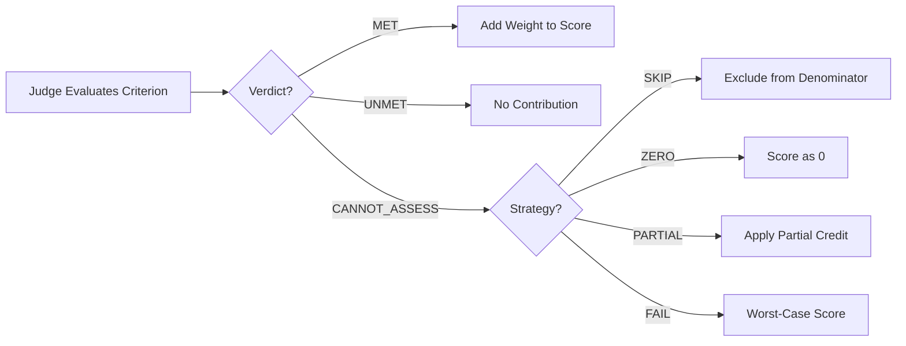
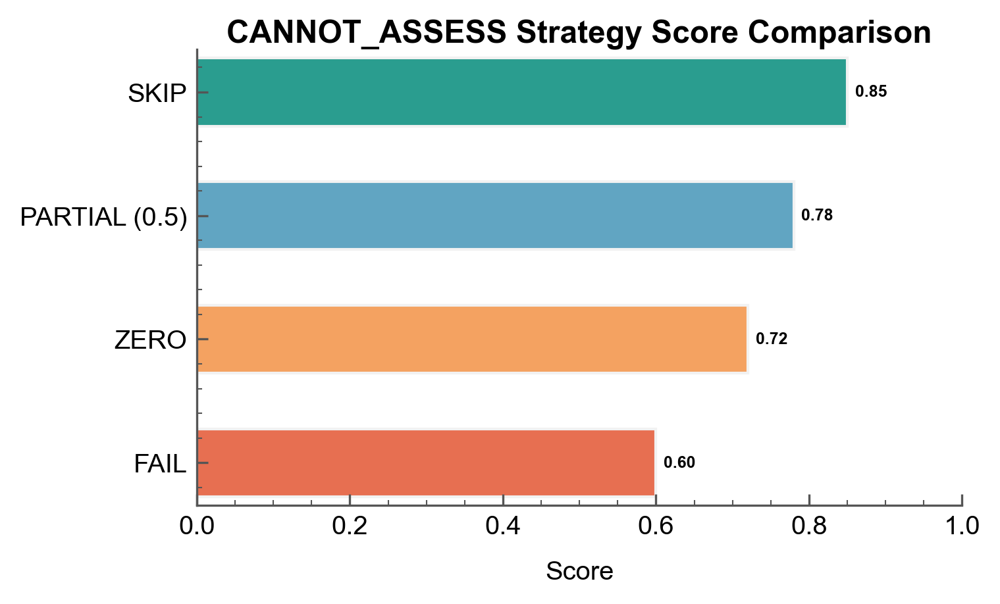

# Handling Uncertain Assessments

Configure how CANNOT_ASSESS verdicts affect scoring for robust evaluation.

## The Scenario

You're evaluating responses from a RAG-based research assistant. Sometimes the judge cannot determine if a criterion is met—perhaps the source documents aren't provided, or the claim is too technical to verify. You need a strategy for handling these uncertain assessments that fits your use case.

## What You'll Learn

- Understanding when judges return `CANNOT_ASSESS`
- Configuring `CannotAssessConfig` with different strategies
- Choosing between `SKIP`, `ZERO`, `PARTIAL`, and `FAIL`
- Tracking `cannot_assess_count` in results

## The Solution

### Step 1: Define a RAG Evaluation Rubric

Create criteria that may require verifiable evidence:

```python
from autorubric import Rubric

rubric = Rubric.from_dict([
    {
        "name": "factual_accuracy",
        "weight": 15.0,
        "requirement": "All factual claims are accurate and supported by sources"
    },
    {
        "name": "source_citation",
        "weight": 10.0,
        "requirement": "Cites specific sources for key claims"
    },
    {
        "name": "complete_answer",
        "weight": 8.0,
        "requirement": "Fully addresses the question asked"
    },
    {
        "name": "clear_explanation",
        "weight": 6.0,
        "requirement": "Explains concepts clearly and accessibly"
    },
    {
        "name": "hallucination",
        "weight": -20.0,
        "requirement": "Contains made-up facts or citations that don't exist"
    }
])
```

### Step 2: Understand When CANNOT_ASSESS Occurs

The judge returns `CANNOT_ASSESS` when:

- The submission doesn't contain enough information to evaluate the criterion
- The criterion requires external verification the judge can't perform
- The question and submission are ambiguous or contradictory

```python
# Example: Judge can't verify factual accuracy without access to sources
response = """
According to the 2023 WHO report, global vaccination rates increased by 15%.
The specific data can be found on page 47 of the annual report.
"""
# The judge may return CANNOT_ASSESS for "factual_accuracy" because
# it cannot verify the WHO report claim without access to the document.
```



### Step 3: Configure CANNOT_ASSESS Handling

Choose a strategy based on your needs:

```python
from autorubric import LLMConfig, CannotAssessConfig, CannotAssessStrategy
from autorubric.graders import CriterionGrader

# Strategy 1: SKIP - Exclude from scoring (default)
# Use when: Missing data shouldn't penalize the response
grader_skip = CriterionGrader(
    llm_config=LLMConfig(model="openai/gpt-4.1-mini"),
    cannot_assess_config=CannotAssessConfig(
        strategy=CannotAssessStrategy.SKIP
    )
)

# Strategy 2: ZERO - Treat as UNMET (0 contribution)
# Use when: Burden of proof is on the response
grader_zero = CriterionGrader(
    llm_config=LLMConfig(model="openai/gpt-4.1-mini"),
    cannot_assess_config=CannotAssessConfig(
        strategy=CannotAssessStrategy.ZERO
    )
)

# Strategy 3: PARTIAL - Give partial credit
# Use when: You want a middle ground
grader_partial = CriterionGrader(
    llm_config=LLMConfig(model="openai/gpt-4.1-mini"),
    cannot_assess_config=CannotAssessConfig(
        strategy=CannotAssessStrategy.PARTIAL,
        partial_credit=0.5  # Award 50% of weight
    )
)

# Strategy 4: FAIL - Treat as worst case
# Use when: Conservative scoring is critical (safety-critical)
grader_fail = CriterionGrader(
    llm_config=LLMConfig(model="openai/gpt-4.1-mini"),
    cannot_assess_config=CannotAssessConfig(
        strategy=CannotAssessStrategy.FAIL
    )
)
```

### Strategy Comparison

| Strategy | CANNOT_ASSESS Effect | Score Impact | Best For |
|----------|---------------------|--------------|----------|
| `SKIP` | Excluded from calculation | Higher (fewer criteria in denominator) | Missing context shouldn't penalize |
| `ZERO` | Counts as UNMET | Lower (0 contribution) | Burden of proof on response |
| `PARTIAL` | Partial weight credit | Middle ground | Balanced uncertainty handling |
| `FAIL` | Worst case (UNMET for positive, MET for negative) | Lowest | Safety-critical applications |

!!! tip "Choosing a default strategy"
    SKIP is the safest default because it avoids penalizing submissions for criteria the judge genuinely cannot evaluate. The denominator shrinks, so assessed criteria still receive their full weight. However, ZERO or FAIL may be more appropriate when the inability to assess itself signals a problem -- for instance, if a response lacks citations and citation quality is a criterion, the missing evidence is the finding.

### Step 4: Compare Strategy Effects

See how different strategies affect the same response:

```python
import asyncio

query = "What are the latest statistics on renewable energy adoption?"

response = """
Renewable energy adoption has grown significantly in recent years.
According to industry reports, solar and wind capacity increased by
approximately 20% in the past year. However, exact figures vary by region
and source methodology.
"""

async def compare_strategies():
    strategies = [
        ("SKIP", CannotAssessStrategy.SKIP),
        ("ZERO", CannotAssessStrategy.ZERO),
        ("PARTIAL (0.5)", CannotAssessStrategy.PARTIAL),
        ("FAIL", CannotAssessStrategy.FAIL),
    ]

    print(f"{'Strategy':<15} {'Score':>8} {'CA Count':>10}")
    print("-" * 35)

    for name, strategy in strategies:
        config = CannotAssessConfig(
            strategy=strategy,
            partial_credit=0.5 if strategy == CannotAssessStrategy.PARTIAL else 0.5
        )

        grader = CriterionGrader(
            llm_config=LLMConfig(model="openai/gpt-4.1-mini"),
            cannot_assess_config=config
        )

        result = await rubric.grade(
            to_grade=response,
            grader=grader,
            query=query
        )

        # result.score is `float | None` (None if the grade failed).
        score_str = f"{result.score:>8.2f}" if result.score is not None else f"{'n/a':>8}"
        print(f"{name:<15} {score_str} {result.cannot_assess_count:>10}")

asyncio.run(compare_strategies())
```

Sample output:

```
Strategy        Score    CA Count
-----------------------------------
SKIP             0.85         1
ZERO             0.72         1
PARTIAL (0.5)    0.78         1
FAIL             0.60         1
```



### Step 5: Monitor CANNOT_ASSESS Frequency

Track how often the judge can't make a determination:

```python
result = await rubric.grade(to_grade=response, grader=grader, query=query)

print(f"Total criteria: {len(result.report)}")
print(f"Could not assess: {result.cannot_assess_count}")

# Identify which criteria caused issues
for criterion in result.report:
    if criterion.verdict == CriterionVerdict.CANNOT_ASSESS:
        print(f"\nCANNOT_ASSESS: {criterion.name}")
        print(f"  Reason: {criterion.reason}")
```

!!! warning "High CANNOT_ASSESS Rates"
    If many criteria return CANNOT_ASSESS, your rubric may be poorly matched
    to the content being evaluated. Consider:

    - Providing more context in the query
    - Rewording criteria to be more observable
    - Ensuring the submission contains evaluable content

## Key Takeaways

- **CANNOT_ASSESS** is legitimate when evidence is insufficient
- **SKIP** (default) is safest for general use—excludes unknowns from scoring
- **ZERO** puts burden of proof on the response
- **PARTIAL** offers a configurable middle ground
- **FAIL** is conservative for safety-critical applications
- **Monitor `cannot_assess_count`** to identify problematic criteria

## Going Further

- [Judge Validation](judge-validation.md) - Measure how often judges agree on CANNOT_ASSESS
- [Multi-Choice Rubrics](multi-choice-rubrics.md) - NA options for multi-choice criteria
- [API Reference: CANNOT_ASSESS](../api/cannot-assess.md) - Full configuration options

---

## Appendix: Complete Code

```python
"""Handling Uncertain Assessments - RAG Response Evaluation"""

import asyncio
from autorubric import (
    Rubric, LLMConfig, CannotAssessConfig, CannotAssessStrategy,
    CriterionVerdict
)
from autorubric.graders import CriterionGrader


# Sample RAG responses with varying verifiability
RAG_RESPONSES = [
    {
        "query": "What are the latest statistics on renewable energy adoption?",
        "response": """
Renewable energy adoption has accelerated. According to the
International Energy Agency's 2024 report, global renewable capacity grew
by 50% compared to the previous year, the fastest growth rate in decades.
Solar alone added 420 GW, while wind contributed 117 GW.

Source: IEA Renewables 2024, pages 15-18
""",
        "description": "Well-sourced response with specific citations"
    },
    {
        "query": "Explain the causes of the 2008 financial crisis.",
        "response": """
The 2008 financial crisis resulted from multiple factors including subprime
mortgage lending, complex financial instruments like CDOs and MBS, inadequate
regulatory oversight, and excessive leverage by major financial institutions.
When housing prices declined, it triggered a cascade of defaults that spread
throughout the global financial system.
""",
        "description": "General knowledge, no specific sources"
    },
    {
        "query": "What is the current population of Tokyo?",
        "response": """
Tokyo's population is around 14 million in the city proper, though the
greater Tokyo metropolitan area has approximately 37 million residents,
making it the world's largest metropolitan area.
""",
        "description": "Common knowledge claim without citation"
    },
    {
        "query": "Summarize the findings from the Johnson et al. 2023 study on AI safety.",
        "response": """
The Johnson et al. 2023 study examined AI alignment techniques across 50
large language models. Key findings included that RLHF reduced harmful outputs
by 73% compared to base models, while constitutional AI methods showed a
65% improvement. The study recommended combining multiple techniques for
optimal safety outcomes.

Note: I cannot verify if this specific study exists as I don't have access
to the research database.
""",
        "description": "Fabricated citation acknowledged"
    },
    {
        "query": "What are the health benefits of green tea?",
        "response": """
Green tea contains catechins, particularly EGCG, which have antioxidant
properties. Research suggests potential benefits including improved
cardiovascular health, modest metabolic effects, and possible cognitive
benefits. However, clinical evidence varies in quality and specific health
claims should be verified with healthcare providers.
""",
        "description": "Balanced response with appropriate hedging"
    },
    {
        "query": "Explain quantum entanglement in simple terms.",
        "response": """
Quantum entanglement occurs when two particles become correlated such that
measuring one instantly affects the other, regardless of distance. Einstein
called it "spooky action at distance." When you measure the spin of one
entangled particle, you immediately know the spin of its partner.

This doesn't allow faster-than-light communication because you can't control
what measurement result you get - you only learn about the correlation
after comparing results.
""",
        "description": "Educational explanation without sources"
    }
]


async def main():
    # Define RAG evaluation rubric
    rubric = Rubric.from_dict([
        {
            "name": "factual_accuracy",
            "weight": 15.0,
            "requirement": "All factual claims are accurate and verifiable"
        },
        {
            "name": "source_citation",
            "weight": 10.0,
            "requirement": "Cites specific sources for key claims"
        },
        {
            "name": "complete_answer",
            "weight": 8.0,
            "requirement": "Fully addresses the question asked"
        },
        {
            "name": "clear_explanation",
            "weight": 6.0,
            "requirement": "Explains concepts clearly and accessibly"
        },
        {
            "name": "hallucination",
            "weight": -20.0,
            "requirement": "Contains made-up facts or fabricated citations"
        }
    ])

    # Test all strategies
    strategies = [
        ("SKIP", CannotAssessStrategy.SKIP),
        ("ZERO", CannotAssessStrategy.ZERO),
        ("PARTIAL", CannotAssessStrategy.PARTIAL),
        ("FAIL", CannotAssessStrategy.FAIL),
    ]

    print("=" * 80)
    print("RAG RESPONSE EVALUATION - CANNOT_ASSESS STRATEGY COMPARISON")
    print("=" * 80)

    for response_data in RAG_RESPONSES:
        print(f"\n{'─' * 80}")
        print(f"Query: {response_data['query'][:60]}...")
        print(f"Description: {response_data['description']}")
        print(f"{'─' * 80}")

        print(f"\n{'Strategy':<12} {'Score':>8} {'CA':>5} | Verdicts")
        print("-" * 70)

        for name, strategy in strategies:
            grader = CriterionGrader(
                llm_config=LLMConfig(model="openai/gpt-4.1-mini", temperature=0.0),
                cannot_assess_config=CannotAssessConfig(
                    strategy=strategy,
                    partial_credit=0.5
                )
            )

            result = await rubric.grade(
                to_grade=response_data["response"],
                grader=grader,
                query=response_data["query"]
            )

            # Summarize verdicts
            verdicts = []
            for cr in result.report:
                v = cr.verdict.value
                if v == "MET":
                    verdicts.append("✓")
                elif v == "UNMET":
                    verdicts.append("✗")
                else:
                    verdicts.append("?")

            verdict_str = " ".join(verdicts)

            # result.score is `float | None` (None if the grade failed).
            score_str = f"{result.score:>8.2f}" if result.score is not None else f"{'n/a':>8}"
            print(f"{name:<12} {score_str} {result.cannot_assess_count:>5} | {verdict_str}")

    # Detailed analysis of one response
    print("\n" + "=" * 80)
    print("DETAILED ANALYSIS: Fabricated Citation Response")
    print("=" * 80)

    target = RAG_RESPONSES[3]  # The fabricated citation one

    grader = CriterionGrader(
        llm_config=LLMConfig(model="openai/gpt-4.1-mini", temperature=0.0),
        cannot_assess_config=CannotAssessConfig(strategy=CannotAssessStrategy.SKIP)
    )

    result = await rubric.grade(
        to_grade=target["response"],
        grader=grader,
        query=target["query"]
    )

    for cr in result.report:
        status = cr.verdict.value
        name = cr.name
        print(f"\n[{status:^6}] {name}")
        print(f"  Weight: {cr.weight:+.0f}")
        print(f"  Reason: {cr.reason}")


if __name__ == "__main__":
    asyncio.run(main())
```
