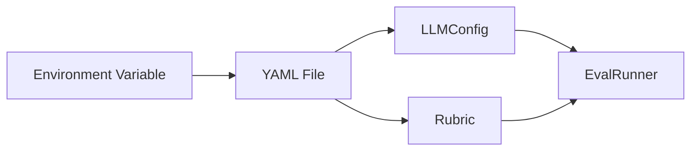

# Configuration Management for Teams

Share reproducible evaluation configurations across research teams.

## The Scenario

Your research team evaluates academic paper reviews. Multiple researchers run evaluations, and you need consistent, reproducible configurations. You want to store rubrics, LLM configs, and experiment settings in version-controlled files that team members can share.

## What You'll Learn

- Saving/loading `LLMConfig` with `to_yaml()` and `from_yaml()`
- Storing rubrics in JSON/YAML files
- Organizing sectioned rubrics for complex evaluations
- Using `experiment_name` for reproducible experiments
- Building configuration hierarchies for different environments

## The Solution

### Step 1: Store LLM Configuration in YAML

Create reusable LLM configurations:

```yaml
# configs/llm/production.yaml
model: openai/gpt-4.1-mini
temperature: 0.0
max_tokens: 1024
cache_enabled: true
cache_dir: .cache/autorubric
cache_ttl: 86400
max_parallel_requests: 20
```

Load in Python:

```python
from autorubric import LLMConfig

config = LLMConfig.from_yaml("configs/llm/production.yaml")
```

!!! tip "YAML over JSON for human-edited configs"
    Prefer YAML for configuration files that team members edit by hand. YAML supports inline
    comments and reads more naturally than JSON, which matters when configs are reviewed in
    pull requests. Reserve JSON for machine-generated files like exported rubrics.

### Step 2: Create Environment-Specific Configs

```yaml
# configs/llm/development.yaml
model: openai/gpt-4.1-mini
temperature: 0.0
cache_enabled: true
cache_dir: .cache/dev

# configs/llm/staging.yaml
model: openai/gpt-4.1
temperature: 0.0
max_parallel_requests: 10

# configs/llm/production.yaml
model: openai/gpt-4.1
temperature: 0.0
max_parallel_requests: 50
prompt_caching: true
```

Load based on environment:

```python
import os

env = os.getenv("EVAL_ENV", "development")
config = LLMConfig.from_yaml(f"configs/llm/{env}.yaml")
```

| Environment | Model | Cache | Parallelism | Use Case |
|---|---|---|---|---|
| development | `gpt-4.1-mini` | Enabled (local) | 1 (default) | Rapid iteration with cached responses |
| staging | `gpt-4.1` | Disabled | 10 | Pre-production validation on full model |
| production | `gpt-4.1` | Prompt caching | 50 | High-throughput batch evaluation |

### Step 3: Store Rubrics in JSON

Save rubrics as version-controlled files:

```python
from autorubric import Rubric

rubric = Rubric.from_dict([
    {
        "name": "technical_accuracy",
        "weight": 15.0,
        "requirement": "Review accurately assesses technical correctness"
    },
    {
        "name": "constructive_feedback",
        "weight": 12.0,
        "requirement": "Provides constructive suggestions for improvement"
    },
    # ... more criteria
])

# Save to JSON
import json
with open("configs/rubrics/paper_review.json", "w") as f:
    json.dump([c.to_dict() for c in rubric.criteria], f, indent=2)
```

The JSON file:

```json
[
  {
    "name": "technical_accuracy",
    "weight": 15.0,
    "requirement": "Review accurately assesses technical correctness"
  },
  {
    "name": "constructive_feedback",
    "weight": 12.0,
    "requirement": "Provides constructive suggestions for improvement"
  }
]
```

Load rubric from file:

```python
import json
from autorubric import Rubric

with open("configs/rubrics/paper_review.json") as f:
    criteria = json.load(f)

rubric = Rubric.from_dict(criteria)
```

### Step 4: Create Sectioned Rubrics

Organize complex rubrics into logical sections:

```json
{
  "sections": {
    "technical": [
      {
        "name": "technical_accuracy",
        "weight": 15.0,
        "requirement": "Review accurately assesses technical correctness"
      },
      {
        "name": "methodology_evaluation",
        "weight": 12.0,
        "requirement": "Evaluates research methodology appropriately"
      }
    ],
    "presentation": [
      {
        "name": "clarity_assessment",
        "weight": 8.0,
        "requirement": "Comments on writing clarity and organization"
      },
      {
        "name": "figure_quality",
        "weight": 6.0,
        "requirement": "Evaluates figure and table quality"
      }
    ],
    "constructiveness": [
      {
        "name": "actionable_suggestions",
        "weight": 10.0,
        "requirement": "Provides specific, actionable improvement suggestions"
      },
      {
        "name": "respectful_tone",
        "weight": 5.0,
        "requirement": "Maintains respectful, professional tone"
      }
    ],
    "red_flags": [
      {
        "name": "unfair_criticism",
        "weight": -12.0,
        "requirement": "Contains unfair or ad hominem criticism"
      }
    ]
  }
}
```

Load sectioned rubric:

```python
import json
from autorubric import Rubric

with open("configs/rubrics/paper_review_sectioned.json") as f:
    config = json.load(f)

# Flatten sections into single list
all_criteria = []
for section_name, criteria in config["sections"].items():
    for criterion in criteria:
        criterion["section"] = section_name  # Optional: track section
        all_criteria.append(criterion)

rubric = Rubric.from_dict(all_criteria)
```

!!! warning "Section names must be unique"
    When sections are flattened into a single criteria list, section names serve as dictionary
    keys. Duplicate section names will silently overwrite earlier entries. Use distinct,
    descriptive names (e.g., `technical`, `presentation`) and verify uniqueness before loading.

### Step 5: Version Control Experiment Configs

Create a complete experiment configuration:

```yaml
# configs/experiments/paper_review_v2.yaml
name: paper-review-experiment-v2
description: "Evaluate peer review quality with improved rubric"

llm:
  model: openai/gpt-4.1-mini
  temperature: 0.0
  max_parallel_requests: 20

rubric_file: configs/rubrics/paper_review_v2.json
dataset_file: data/peer_reviews_2024.json

evaluation:
  fail_fast: false
  show_progress: true
  max_concurrent_items: 50

few_shot:
  n_examples: 3
  balance_verdicts: true
```

Load and run:

```python
import yaml
from autorubric import LLMConfig, RubricDataset, FewShotConfig, EvalConfig, evaluate
from autorubric.graders import CriterionGrader

# Load experiment config
with open("configs/experiments/paper_review_v2.yaml") as f:
    exp_config = yaml.safe_load(f)

# Build components
llm_config = LLMConfig(**exp_config["llm"])
dataset = RubricDataset.from_file(exp_config["dataset_file"])

# Load rubric
with open(exp_config["rubric_file"]) as f:
    rubric_criteria = json.load(f)
rubric = Rubric.from_dict(rubric_criteria)

# Create grader
grader = CriterionGrader(
    llm_config=llm_config,
    few_shot_config=FewShotConfig(**exp_config.get("few_shot", {})),
)

# Run evaluation
eval_config = EvalConfig(
    experiment_name=exp_config["name"],
    **exp_config.get("evaluation", {})
)

result = await evaluate(dataset, grader, **vars(eval_config))
```

### Step 6: Project Structure

Organize your evaluation project:

```
project/
├── configs/
│   ├── llm/
│   │   ├── development.yaml
│   │   ├── staging.yaml
│   │   └── production.yaml
│   ├── rubrics/
│   │   ├── paper_review_v1.json
│   │   └── paper_review_v2.json
│   └── experiments/
│       ├── baseline.yaml
│       └── paper_review_v2.yaml
├── data/
│   ├── peer_reviews_2024.json
│   └── peer_reviews_labeled.json
├── experiments/
│   └── [auto-generated experiment directories]
├── scripts/
│   └── run_experiment.py
└── README.md
```



### Step 7: Reproducibility with Experiment Names

Use deterministic experiment names for reproducibility:

```python
from datetime import datetime
import hashlib

def experiment_name(rubric_version: str, dataset_version: str, model: str) -> str:
    """Generate reproducible experiment name."""
    components = [rubric_version, dataset_version, model]
    hash_input = "-".join(components)
    short_hash = hashlib.sha256(hash_input.encode()).hexdigest()[:8]
    date = datetime.now().strftime("%Y%m%d")
    return f"{rubric_version}-{date}-{short_hash}"

# Usage
name = experiment_name("paper_review_v2", "reviews_2024", "gpt4-mini")
# Output: "paper_review_v2-20240115-a3f2b1c9"
```

### Step 8: Share Configurations via Git

```bash
# .gitignore
.cache/
experiments/
*.pyc
__pycache__/
.env

# Track config files
# configs/ directory is NOT ignored
```

Team workflow:

```bash
# Researcher A creates new rubric
git checkout -b feature/improved-rubric
# Edit configs/rubrics/paper_review_v3.json
git add configs/rubrics/paper_review_v3.json
git commit -m "Add paper review rubric v3 with methodology criteria"
git push

# Researcher B uses the rubric
git pull
python scripts/run_experiment.py --config configs/experiments/paper_review_v3.yaml
```

!!! note "Keep secrets out of config files"
    API keys and other credentials must never appear in YAML config files that are committed
    to version control. Store them in `.env` files or environment variables instead, and
    confirm that `.env` is listed in your `.gitignore`.

## Key Takeaways

- **`LLMConfig.from_yaml()`** loads configurations from version-controlled files
- **Environment-specific configs** enable dev/staging/prod workflows
- **Sectioned rubrics** organize complex evaluation criteria
- **Deterministic experiment names** enable reproducibility
- **Git-tracked configs** ensure team consistency
- **Flat project structure** keeps configs discoverable

## Going Further

- [Batch Evaluation](batch-evaluation.md) - Experiment checkpointing
- [Few-Shot Calibration](few-shot-calibration.md) - Configuring few-shot
- [API Reference: LLMConfig](../api/llm.md) - Full configuration options

---

## Appendix: Complete Code

```python
"""Configuration Management - Academic Paper Review Evaluation"""

import asyncio
import json
import os
from pathlib import Path
from datetime import datetime
import hashlib
import yaml

from autorubric import (
    Rubric, RubricDataset, CriterionVerdict,
    LLMConfig, FewShotConfig, EvalConfig, evaluate
)
from autorubric.graders import CriterionGrader


def create_config_structure():
    """Create example configuration file structure."""

    # Create directories
    for dir_path in ["configs/llm", "configs/rubrics", "configs/experiments", "data"]:
        Path(dir_path).mkdir(parents=True, exist_ok=True)

    # LLM configs
    llm_configs = {
        "development": {
            "model": "openai/gpt-4.1-mini",
            "temperature": 0.0,
            "cache_enabled": True,
            "cache_dir": ".cache/dev",
        },
        "production": {
            "model": "openai/gpt-4.1-mini",
            "temperature": 0.0,
            "cache_enabled": True,
            "cache_dir": ".cache/prod",
            "max_parallel_requests": 20,
            "prompt_caching": True,
        }
    }

    for name, config in llm_configs.items():
        with open(f"configs/llm/{name}.yaml", "w") as f:
            yaml.safe_dump(config, f, default_flow_style=False)

    # Rubric config (sectioned)
    rubric_config = {
        "version": "2.0",
        "description": "Academic paper review quality rubric",
        "sections": {
            "technical": [
                {
                    "name": "technical_accuracy",
                    "weight": 15.0,
                    "requirement": "Review accurately assesses the technical correctness of the paper"
                },
                {
                    "name": "methodology_evaluation",
                    "weight": 12.0,
                    "requirement": "Evaluates research methodology and experimental design"
                },
                {
                    "name": "related_work",
                    "weight": 8.0,
                    "requirement": "Assesses coverage of related work and positioning"
                }
            ],
            "presentation": [
                {
                    "name": "clarity_assessment",
                    "weight": 8.0,
                    "requirement": "Comments on writing clarity, organization, and readability"
                },
                {
                    "name": "figure_quality",
                    "weight": 5.0,
                    "requirement": "Evaluates quality and clarity of figures and tables"
                }
            ],
            "constructiveness": [
                {
                    "name": "actionable_suggestions",
                    "weight": 10.0,
                    "requirement": "Provides specific, actionable suggestions for improvement"
                },
                {
                    "name": "respectful_tone",
                    "weight": 5.0,
                    "requirement": "Maintains professional and respectful tone"
                }
            ],
            "red_flags": [
                {
                    "name": "unfair_criticism",
                    "weight": -12.0,
                    "requirement": "Contains unfair, unconstructive, or ad hominem criticism"
                }
            ]
        }
    }

    with open("configs/rubrics/paper_review.json", "w") as f:
        json.dump(rubric_config, f, indent=2)

    # Experiment config
    experiment_config = {
        "name": "paper-review-eval-v2",
        "description": "Evaluate peer review quality",
        "llm": {
            "model": "openai/gpt-4.1-mini",
            "temperature": 0.0,
            "max_parallel_requests": 20,
        },
        "rubric_file": "configs/rubrics/paper_review.json",
        "evaluation": {
            "fail_fast": False,
            "show_progress": True,
        },
        "few_shot": {
            "n_examples": 3,
            "balance_verdicts": True,
        }
    }

    with open("configs/experiments/paper_review_v2.yaml", "w") as f:
        yaml.safe_dump(experiment_config, f, default_flow_style=False)

    print("Created configuration files:")
    print("  configs/llm/development.yaml")
    print("  configs/llm/production.yaml")
    print("  configs/rubrics/paper_review.json")
    print("  configs/experiments/paper_review_v2.yaml")


def load_sectioned_rubric(path: str) -> Rubric:
    """Load a sectioned rubric from JSON."""
    with open(path, encoding="utf-8") as f:
        config = json.load(f)

    all_criteria = []
    for section_name, criteria in config.get("sections", {}).items():
        for criterion in criteria:
            all_criteria.append(criterion)

    return Rubric.from_dict(all_criteria)


def generate_experiment_name(prefix: str, config_hash: str) -> str:
    """Generate deterministic experiment name."""
    date = datetime.now().strftime("%Y%m%d")
    short_hash = hashlib.sha256(config_hash.encode()).hexdigest()[:8]
    return f"{prefix}-{date}-{short_hash}"


def create_sample_dataset() -> RubricDataset:
    """Create sample peer review dataset."""

    rubric = load_sectioned_rubric("configs/rubrics/paper_review.json")

    dataset = RubricDataset(
        prompt="Evaluate this academic peer review for quality and constructiveness.",
        rubric=rubric,
        name="peer-reviews-sample"
    )

    reviews = [
        {
            "submission": """
This paper presents an interesting approach to neural network pruning.
The technical contribution is solid, with clear improvements over baselines.

Strengths:
- Novel pruning criterion based on gradient information
- Comprehensive experiments on ImageNet and CIFAR
- Clear writing and good organization

Weaknesses:
- Missing comparison with recent structured pruning methods
- Theoretical analysis could be strengthened

Minor: Figure 3 is hard to read. Consider using larger fonts.

Overall, I recommend acceptance with minor revisions.
""",
            "description": "Constructive positive review"
        },
        {
            "submission": """
This paper is terrible and should never have been submitted.
The authors clearly don't understand the field. The experiments
are worthless and the writing is awful. Reject immediately.
""",
            "description": "Hostile unconstructive review"
        },
        {
            "submission": """
The paper studies an important problem in federated learning.

Technical Assessment:
- Theorem 1 appears correct but the proof sketch in Appendix A
  has a gap in equation (12). Please clarify the bound on E[||g_i||^2].
- The convergence rate matches existing results but doesn't improve them.

Experiments:
- Results on FEMNIST are competitive but not state-of-the-art.
- Missing: heterogeneous data distribution experiments.

Suggestions:
1. Add experiments with different levels of data heterogeneity
2. Compare with FedProx and SCAFFOLD
3. Discuss computational overhead of the proposed method

Writing is generally clear. Section 3.2 could be reorganized.
""",
            "description": "Detailed technical review"
        },
        {
            "submission": """
Good paper overall. I liked the experiments.
The method seems to work well on the datasets tested.
Accept.
""",
            "description": "Brief uninformative review"
        },
        {
            "submission": """
Summary: The paper proposes using attention mechanisms for time series
forecasting.

The main contribution is applying standard Transformer architecture to
a new domain without significant modifications. While the results are
positive, the novelty is limited.

Specific comments:
- Equation (3): The positional encoding should account for irregular
  time intervals common in real-world data.
- Section 4.1: Training details are insufficient for reproduction.
  Please specify batch size, learning rate schedule, and early stopping.
- Table 2: Statistical significance tests needed.

The paper would benefit from:
1. Comparison with recent temporal Transformers (Informer, Autoformer)
2. Analysis of attention patterns to provide insights
3. Ablation study on positional encoding choices

I appreciate the clear writing and code availability promise.
""",
            "description": "Balanced review with specific suggestions"
        }
    ]

    for review in reviews:
        dataset.add_item(**review)

    return dataset


async def run_experiment_from_config(config_path: str):
    """Run evaluation using a configuration file."""

    # Load experiment config
    with open(config_path, encoding="utf-8") as f:
        exp_config = yaml.safe_load(f)

    print(f"\n{'=' * 60}")
    print(f"EXPERIMENT: {exp_config['name']}")
    print(f"{'=' * 60}")

    # Load rubric
    rubric = load_sectioned_rubric(exp_config["rubric_file"])
    print(f"Rubric: {exp_config['rubric_file']}")
    print(f"  Criteria: {len(rubric.criteria)}")

    # Create dataset
    dataset = create_sample_dataset()
    print(f"Dataset: {dataset.name} ({len(dataset)} items)")

    # Configure grader
    llm_config = LLMConfig(**exp_config["llm"])
    few_shot_config = FewShotConfig(**exp_config.get("few_shot", {})) if "few_shot" in exp_config else None

    grader = CriterionGrader(
        llm_config=llm_config,
        few_shot_config=few_shot_config,
    )

    # Run evaluation
    eval_settings = exp_config.get("evaluation", {})
    result = await evaluate(
        dataset,
        grader,
        experiment_name=exp_config["name"],
        **eval_settings
    )

    # Report results
    print(f"\n{'=' * 60}")
    print("RESULTS")
    print(f"{'=' * 60}")
    print(f"Successful: {result.successful_items}/{result.total_items}")
    print(f"Cost: ${result.total_completion_cost or 0:.4f}")

    for item_result in result.item_results:
        print(f"\n  {item_result.item.description}")
        # report.score is `float | None` (None if that item's grade failed).
        score = item_result.report.score
        print(f"    Score: {score:.2f}" if score is not None else "    Score: n/a")


async def main():
    # Create config structure
    create_config_structure()

    # Load config from environment
    env = os.getenv("EVAL_ENV", "development")
    print(f"\nEnvironment: {env}")

    # Load LLM config
    llm_config = LLMConfig.from_yaml(f"configs/llm/{env}.yaml")
    print(f"LLM Model: {llm_config.model}")

    # Run experiment from config file
    await run_experiment_from_config("configs/experiments/paper_review_v2.yaml")


if __name__ == "__main__":
    asyncio.run(main())
```
