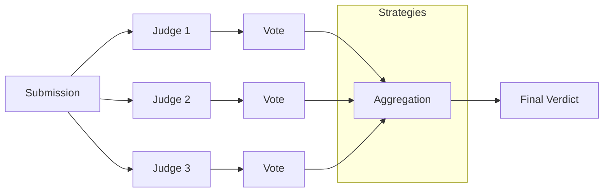

# Ensemble Judging for High-Stakes Decisions

Use multiple LLM judges with voting to increase reliability for critical evaluations.

## The Scenario

You're building an automated screening system for job applications. These are high-stakes decisions that affect people's careers, so a single LLM's opinion isn't enough. You want multiple judges to evaluate each candidate, with final verdicts based on consensus.

## What You'll Learn

- Configuring ensemble grading with `JudgeSpec`
- Understanding aggregation strategies (majority, weighted, unanimous, any)
- Interpreting `EnsembleEvaluationReport` with per-judge breakdowns
- Measuring judge agreement with `mean_agreement`

## The Solution

### Step 1: Define Your Rubric

Create criteria for evaluating job application responses:

```python
from autorubric import Rubric

rubric = Rubric.from_dict([
    {
        "name": "relevant_experience",
        "weight": 12.0,
        "requirement": "Demonstrates relevant professional experience for the role"
    },
    {
        "name": "clear_communication",
        "weight": 8.0,
        "requirement": "Communicates ideas clearly and professionally"
    },
    {
        "name": "specific_examples",
        "weight": 10.0,
        "requirement": "Provides specific examples to support claims"
    },
    {
        "name": "role_understanding",
        "weight": 8.0,
        "requirement": "Shows understanding of the role requirements"
    },
    {
        "name": "red_flags",
        "weight": -15.0,
        "requirement": "Contains concerning statements (dishonesty, inappropriate content)"
    }
])
```

### Step 2: Configure Multiple Judges

Create an ensemble with different LLM providers:

```python
from autorubric import LLMConfig
from autorubric.graders import CriterionGrader, JudgeSpec

grader = CriterionGrader(
    judges=[
        JudgeSpec(
            llm_config=LLMConfig(model="openai/gpt-4.1"),
            judge_id="gpt4",
            weight=1.0  # Equal voting weight
        ),
        JudgeSpec(
            llm_config=LLMConfig(model="anthropic/claude-sonnet-4-5-20250929"),
            judge_id="claude",
            weight=1.0
        ),
        JudgeSpec(
            llm_config=LLMConfig(model="gemini/gemini-2.5-flash"),
            judge_id="gemini",
            weight=1.0
        ),
    ],
    aggregation="majority",  # Final verdict requires >50% agreement
)
```

!!! tip "Model Diversity"
    Using judges from different providers reduces the risk of shared biases.
    If all judges are from the same family (e.g., all GPT models), they may
    make correlated errors.



### Step 3: Understand Aggregation Strategies

Choose how judge votes are combined:

```python
# Majority: >50% must agree (default, good balance)
grader = CriterionGrader(judges=[...], aggregation="majority")

# Weighted: Votes weighted by judge weight
grader = CriterionGrader(judges=[...], aggregation="weighted")

# Unanimous: All judges must agree for MET (conservative)
grader = CriterionGrader(judges=[...], aggregation="unanimous")

# Any: Any judge voting MET results in MET (permissive)
grader = CriterionGrader(judges=[...], aggregation="any")
```

| Strategy | MET Condition | Best For |
|----------|--------------|----------|
| `majority` | >50% vote MET | General use, balanced |
| `weighted` | Weighted sum favors MET | Expert judges with different reliability |
| `unanimous` | All vote MET | High-stakes, avoid false positives |
| `any` | Any votes MET | Recall-focused, catch all positives |

### Step 4: Grade and Examine Results

The `EnsembleEvaluationReport` includes per-judge details:

```python
import asyncio

query = "Why are you interested in this Senior Software Engineer position?"

candidate_response = """
I've been a software engineer for 8 years, most recently leading a team
at TechCorp where we rebuilt the payment processing system handling $2M
daily transactions. I reduced processing latency by 40% through query
optimization and caching strategies.

I'm excited about this role because your focus on scalable systems aligns
with my experience. I particularly enjoyed reading about your migration
to microservices in your engineering blog.
"""

async def main():
    result = await rubric.grade(
        to_grade=candidate_response,
        grader=grader,
        query=query,
    )
    return result

result = asyncio.run(main())
```

### Step 5: Analyze Judge Agreement

```python
# Overall score and agreement. score / mean_agreement are `float | None`
# (None on a failed grade); guard before formatting.
print(f"Final Score: {result.score:.2f}" if result.score is not None else "Final Score: n/a")
print(
    f"Mean Agreement: {result.mean_agreement:.1%}"
    if result.mean_agreement is not None
    else "Mean Agreement: n/a"
)

# Per-judge scores
print("\nPer-Judge Scores:")
for judge_id, score in result.judge_scores.items():
    print(f"  {judge_id}: {score:.2f}")

# Per-criterion voting breakdown
print("\nPer-Criterion Votes:")
for criterion_report in result.report:
    criterion = criterion_report.criterion
    final = criterion_report.final_verdict.value
    agreement = criterion_report.agreement

    print(f"\n[{final}] {criterion.name} (agreement: {agreement:.0%})")

    # Show each judge's vote
    for vote in criterion_report.votes:
        print(f"  {vote.judge_id}: {vote.verdict.value}")
        print(f"    Reason: {vote.reason[:80]}...")
```

Sample output:

```
Final Score: 0.88
Mean Agreement: 93.3%

Per-Judge Scores:
  gpt4: 0.88
  claude: 0.88
  gemini: 0.88

Per-Criterion Votes:

[MET] relevant_experience (agreement: 100%)
  gpt4: MET
    Reason: 8 years experience, led team at TechCorp, rebuilt payment system...
  claude: MET
    Reason: Demonstrates clear relevant experience with specific achievements...
  gemini: MET
    Reason: Strong professional experience with quantifiable results...

[MET] specific_examples (agreement: 100%)
  gpt4: MET
    Reason: Specific example of $2M payment system, 40% latency reduction...
  claude: MET
    Reason: Provides concrete numbers and specific project details...
  gemini: MET
    Reason: Quantified achievements with $2M transactions and 40% improvement...

[UNMET] red_flags (agreement: 100%)
  gpt4: UNMET
    Reason: No concerning statements or red flags identified...
```

!!! note "Low agreement signals ambiguous criteria"
    When a criterion consistently shows low agreement across judges, the
    requirement text is likely ambiguous. Revise the wording to be more
    specific before trusting ensemble results on that criterion.

### Step 6: Weighted Judges for Expert Calibration

If some judges are more reliable, weight them higher:

```python
grader = CriterionGrader(
    judges=[
        JudgeSpec(
            LLMConfig(model="openai/gpt-4.1"),
            judge_id="gpt4",
            weight=2.0  # Trust GPT-4 more
        ),
        JudgeSpec(
            LLMConfig(model="openai/gpt-4.1-mini"),
            judge_id="gpt4-mini",
            weight=1.0
        ),
        JudgeSpec(
            LLMConfig(model="gemini/gemini-2.5-flash"),
            judge_id="gemini-flash",
            weight=1.0
        ),
    ],
    aggregation="weighted",
)
```

With these weights:

- GPT-4 MET + others UNMET → Total weight: 2 MET vs 2 UNMET → Tie (defaults to UNMET)
- GPT-4 MET + one other MET → Total weight: 3 MET vs 1 UNMET → MET wins

| GPT-4 Vote | GPT-4-Mini Vote | Gemini Flash Vote | Weight (MET vs UNMET) | Result |
|------------|-----------------|--------------------|-----------------------|--------|
| MET        | MET             | MET                | 4 vs 0                | MET    |
| MET        | MET             | UNMET              | 3 vs 1                | MET    |
| MET        | UNMET           | UNMET              | 2 vs 2                | UNMET  |
| UNMET      | MET             | MET                | 2 vs 2                | UNMET  |
| UNMET      | UNMET           | UNMET              | 0 vs 4                | UNMET  |

!!! warning "Tie-breaking defaults to UNMET"
    When weighted votes are perfectly split, the aggregation defaults to UNMET.
    This is a conservative choice that avoids false positives in quality
    assurance. Adjust judge weights to reduce the likelihood of ties.

## Key Takeaways

- **Ensemble judging** reduces single-model bias and increases reliability
- **Mix providers** to avoid correlated errors from model families
- **Choose aggregation strategy** based on your tolerance for false positives/negatives
- **`mean_agreement`** indicates how much judges agree overall
- **Per-criterion agreement** helps identify ambiguous criteria
- **Weighted voting** lets you trust some judges more than others

## Going Further

- [Few-Shot Calibration](few-shot-calibration.md) - Calibrate ensembles with examples
- [Judge Validation](judge-validation.md) - Compare ensemble vs single judge accuracy
- [API Reference: Ensemble](../api/ensemble.md) - Full ensemble configuration docs

---

## Appendix: Complete Code

```python
"""Ensemble Judging - Job Application Screening"""

import asyncio
from autorubric import Rubric, LLMConfig
from autorubric.graders import CriterionGrader, JudgeSpec


# Sample job application responses
APPLICATIONS = [
    {
        "query": "Why are you interested in this Senior Software Engineer position?",
        "response": """
I've been a software engineer for 8 years, most recently leading a team at TechCorp
where we rebuilt the payment processing system handling $2M daily transactions. I
reduced processing latency by 40% through query optimization and caching strategies.

I'm excited about this role because your focus on scalable systems aligns with my
experience. I particularly enjoyed reading about your migration to microservices
in your engineering blog.
""",
        "description": "Strong candidate with relevant experience"
    },
    {
        "query": "Describe a challenging project you've worked on.",
        "response": """
I worked on some projects at my last job. They were challenging and I learned a lot.
I'm a hard worker and a team player. I think I would be a good fit for your company
because I really need this job.
""",
        "description": "Weak response lacking specifics"
    },
    {
        "query": "How do you handle disagreements with team members?",
        "response": """
When disagreements arise, I focus on understanding the other person's perspective
first. In my last role, a colleague and I disagreed on database architecture. I
suggested we prototype both approaches and benchmark them. The data showed his
approach was actually 30% faster, and I was happy to go with it. I believe in
making decisions based on evidence, not ego.
""",
        "description": "Mature conflict resolution with example"
    },
    {
        "query": "What's your experience with cloud infrastructure?",
        "response": """
I've managed AWS infrastructure for 3 years, including EC2, RDS, Lambda, and EKS.
Last year I led our Kubernetes migration, moving 40 microservices from ECS to EKS.
We reduced deployment time from 30 minutes to 5 minutes and cut our AWS bill by 25%
through better resource utilization and spot instances.
""",
        "description": "Strong technical background with metrics"
    },
    {
        "query": "Why are you leaving your current position?",
        "response": """
My current manager is terrible and doesn't recognize my contributions. The company
is going downhill anyway. Also, your company pays more, which is what really matters
to me right now. I need to pay off some debts.
""",
        "description": "Red flags - negativity about current employer"
    },
    {
        "query": "Tell us about a time you failed and what you learned.",
        "response": """
Early in my career, I deployed a database migration to production without adequate
testing. It corrupted user data and we had to restore from backup, causing 4 hours
of downtime. I learned to always run migrations in staging first and have a rollback
plan. Now I've implemented automated migration testing in our CI pipeline that has
prevented several similar issues.
""",
        "description": "Honest about failure with growth mindset"
    },
    {
        "query": "What interests you about our company?",
        "response": """
I've followed your company for years. Your open-source contributions to the data
engineering community, especially the streaming library, have been invaluable to
my work. I've even submitted a few bug fixes! I'm excited about your mission to
make data infrastructure accessible to smaller teams.
""",
        "description": "Genuine interest with demonstrated knowledge"
    },
    {
        "query": "How do you stay current with technology trends?",
        "response": """
I read Hacker News daily and subscribe to several engineering blogs. But more
importantly, I maintain side projects to experiment with new tech. Last month I
built a Rust-based CLI tool to learn the language. I also attend our local tech
meetup where I've given two talks on distributed systems.
""",
        "description": "Active learner with concrete examples"
    }
]


async def main():
    # Define the rubric
    rubric = Rubric.from_dict([
        {
            "name": "relevant_experience",
            "weight": 12.0,
            "requirement": "Demonstrates relevant professional experience for the role"
        },
        {
            "name": "clear_communication",
            "weight": 8.0,
            "requirement": "Communicates ideas clearly and professionally"
        },
        {
            "name": "specific_examples",
            "weight": 10.0,
            "requirement": "Provides specific examples to support claims"
        },
        {
            "name": "role_understanding",
            "weight": 8.0,
            "requirement": "Shows understanding of the role requirements"
        },
        {
            "name": "red_flags",
            "weight": -15.0,
            "requirement": "Contains concerning statements (negativity, dishonesty, inappropriate content)"
        }
    ])

    # Configure ensemble grader with 3 judges
    grader = CriterionGrader(
        judges=[
            JudgeSpec(
                llm_config=LLMConfig(model="openai/gpt-4.1-mini"),
                judge_id="gpt4-mini",
                weight=1.0
            ),
            JudgeSpec(
                llm_config=LLMConfig(model="anthropic/claude-sonnet-4-5-20250929"),
                judge_id="claude-sonnet",
                weight=1.0
            ),
            JudgeSpec(
                llm_config=LLMConfig(model="gemini/gemini-2.5-flash"),
                judge_id="gemini-flash",
                weight=1.0
            ),
        ],
        aggregation="majority",
    )

    print("=" * 70)
    print("JOB APPLICATION SCREENING - ENSEMBLE EVALUATION")
    print("=" * 70)
    print(f"Judges: {[j.judge_id for j in grader._judges]}")
    print(f"Aggregation: majority vote")

    total_cost = 0.0

    for i, app in enumerate(APPLICATIONS, 1):
        result = await rubric.grade(
            to_grade=app["response"],
            grader=grader,
            query=app["query"],
        )

        print(f"\n{'=' * 70}")
        print(f"Application {i}: {app['description']}")
        print(f"{'=' * 70}")
        # score / mean_agreement are `float | None` (None on a failed grade).
        print(f"Final Score: {result.score:.2f}" if result.score is not None else "Final Score: n/a")
        print(
            f"Mean Agreement: {result.mean_agreement:.1%}"
            if result.mean_agreement is not None
            else "Mean Agreement: n/a"
        )

        # Per-judge scores
        print("\nPer-Judge Scores:")
        for judge_id, score in result.judge_scores.items():
            print(f"  {judge_id}: {score:.2f}")

        # Per-criterion breakdown (abbreviated)
        print("\nCriteria:")
        for cr in result.report:
            verdict = cr.final_verdict.value
            agreement = cr.agreement
            name = cr.criterion.name
            print(f"  [{verdict:^6}] {name} ({agreement:.0%} agree)")

        if result.completion_cost:
            total_cost += result.completion_cost

    print(f"\n{'=' * 70}")
    print(f"TOTAL COST: ${total_cost:.4f}")


if __name__ == "__main__":
    asyncio.run(main())
```
