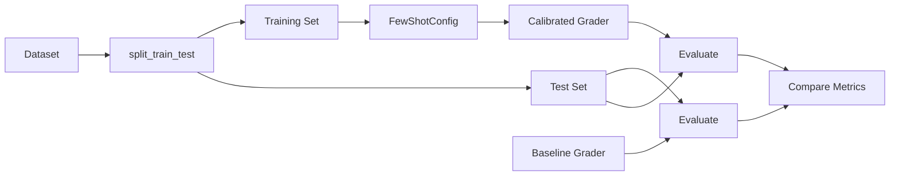
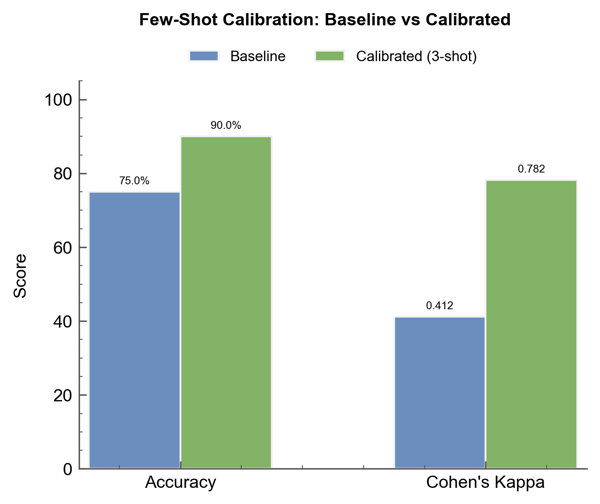

# Improving Accuracy with Few-Shot Calibration

Calibrate your LLM judge with labeled examples to improve accuracy on nuanced criteria.

## The Scenario

You're evaluating legal contract clauses for compliance with company standards. The LLM judge keeps missing subtle legal requirements—it marks clauses as compliant when they have technical deficiencies that human reviewers catch. You have 15 expert-labeled clauses and want to use some as few-shot examples to calibrate the judge.

## What You'll Learn

- Configuring few-shot prompting with `FewShotConfig`
- Using `training_data` to provide calibration examples
- Controlling example selection with `balance_verdicts` and `n_examples`
- Measuring accuracy improvement with `compute_metrics()`

## The Solution



### Step 1: Prepare Your Labeled Dataset

Start with a dataset that has expert-assigned ground truth:

```python
from autorubric import Rubric, RubricDataset, CriterionVerdict

rubric = Rubric.from_dict([
    {
        "name": "termination_clause",
        "weight": 10.0,
        "requirement": "Contains a valid termination clause with at least 30 days notice"
    },
    {
        "name": "liability_cap",
        "weight": 10.0,
        "requirement": "Includes a liability cap that limits damages to contract value"
    },
    {
        "name": "ip_assignment",
        "weight": 8.0,
        "requirement": "Clearly assigns intellectual property rights to the client"
    },
    {
        "name": "missing_jurisdiction",
        "weight": -12.0,
        "requirement": "Fails to specify governing law or jurisdiction"
    }
])

dataset = RubricDataset(
    prompt="Review this contract clause for compliance with company standards.",
    rubric=rubric,
    name="contract-review-v1"
)

# Add items with ground truth (15 total)
# ... (see appendix for full dataset)
```

### Step 2: Split Train and Test

Reserve some examples for calibration, the rest for evaluation:

```python
# Split: 10 examples for training, 5 for testing
train_data, test_data = dataset.split_train_test(
    n_train=10,
    stratify=True,  # Balance MET/UNMET across splits
    seed=42
)

print(f"Training examples: {len(train_data)}")
print(f"Test examples: {len(test_data)}")
```

### Step 3: Create Grader Without Few-Shot (Baseline)

First, establish a baseline without calibration:

```python
from autorubric import LLMConfig
from autorubric.graders import CriterionGrader

baseline_grader = CriterionGrader(
    llm_config=LLMConfig(model="openai/gpt-4.1-mini", temperature=0.0)
)
```

### Step 4: Create Few-Shot Calibrated Grader

Now create a grader that uses training examples:

```python
from autorubric import FewShotConfig

calibrated_grader = CriterionGrader(
    llm_config=LLMConfig(model="openai/gpt-4.1-mini", temperature=0.0),
    training_data=train_data,
    few_shot_config=FewShotConfig(
        n_examples=3,           # Include 3 examples per criterion
        balance_verdicts=True,  # Try to include both MET and UNMET examples
        include_reason=False,   # Don't include explanations (cleaner prompts)
        seed=42                 # Reproducible example selection
    )
)
```

!!! tip "How Few-Shot Works"
    For each criterion, AutoRubric selects `n_examples` items from the training
    data and includes them in the prompt. With `balance_verdicts=True`, it tries
    to include roughly equal numbers of MET and UNMET examples.

### Step 5: Compare Baseline vs Calibrated

Evaluate both graders on the test set:

```python
import asyncio
from autorubric import evaluate

async def compare_graders():
    # Evaluate baseline
    baseline_result = await evaluate(
        test_data,
        baseline_grader,
        show_progress=True,
        experiment_name="baseline-no-fewshot"
    )

    # Evaluate calibrated
    calibrated_result = await evaluate(
        test_data,
        calibrated_grader,
        show_progress=True,
        experiment_name="calibrated-3shot"
    )

    # Compute metrics against ground truth
    baseline_metrics = baseline_result.compute_metrics(test_data)
    calibrated_metrics = calibrated_result.compute_metrics(test_data)

    # criterion_accuracy / mean_kappa are `float | None` (None when undefined, e.g. a
    # multi-choice-only rubric has no binary MET class); guard the format spec.
    def pct(x):
        return f"{x:.1%}" if x is not None else "n/a"

    def num(x):
        return f"{x:.3f}" if x is not None else "n/a"

    print("\n=== BASELINE (no few-shot) ===")
    print(f"Criterion Accuracy: {pct(baseline_metrics.criterion_accuracy)}")
    print(f"Cohen's Kappa: {num(baseline_metrics.mean_kappa)}")

    print("\n=== CALIBRATED (3-shot) ===")
    print(f"Criterion Accuracy: {pct(calibrated_metrics.criterion_accuracy)}")
    print(f"Cohen's Kappa: {num(calibrated_metrics.mean_kappa)}")

asyncio.run(compare_graders())
```

Sample output:

```
=== BASELINE (no few-shot) ===
Criterion Accuracy: 75.0%
Cohen's Kappa: 0.412

=== CALIBRATED (3-shot) ===
Criterion Accuracy: 90.0%
Cohen's Kappa: 0.782
```



| Metric | Baseline | Calibrated (3-shot) | Delta |
|---|---|---|---|
| Criterion Accuracy | 75.0% | 90.0% | +15.0% |
| Cohen's Kappa | 0.412 | 0.782 | +0.370 |
| False Compliant Rate | 30.0% | 10.0% | -20.0% |
| Cost per Item | $0.0032 | $0.0051 | +$0.0019 |

### Step 6: Tune Example Count

Experiment with different numbers of examples:

```python
for n in [1, 2, 3, 5]:
    grader = CriterionGrader(
        llm_config=LLMConfig(model="openai/gpt-4.1-mini"),
        training_data=train_data,
        few_shot_config=FewShotConfig(n_examples=n, balance_verdicts=True)
    )

    result = await evaluate(test_data, grader, show_progress=False)
    metrics = result.compute_metrics(test_data)

    # criterion_accuracy / mean_kappa are `float | None`; render None as "n/a".
    acc = f"{metrics.criterion_accuracy:.1%}" if metrics.criterion_accuracy is not None else "n/a"
    kappa = f"{metrics.mean_kappa:.3f}" if metrics.mean_kappa is not None else "n/a"
    print(f"{n}-shot: Accuracy={acc}, "
          f"Kappa={kappa}, "
          f"Cost=${result.total_completion_cost or 0:.4f}")
```

!!! note "Diminishing Returns"
    More examples don't always improve accuracy. Beyond 3-5 examples,
    you may see diminishing returns while costs increase. Test to find
    the sweet spot for your use case.

## Key Takeaways

- **Few-shot calibration** significantly improves accuracy on nuanced criteria
- **`balance_verdicts=True`** ensures the judge sees examples of both MET and UNMET
- **Split your data** into training (few-shot) and test (evaluation) sets
- **Measure improvement** with `compute_metrics()` against ground truth
- **3-5 examples** is often sufficient; more may not help and increases cost

## Going Further

- [Managing Datasets](managing-datasets.md) - Creating datasets with ground truth
- [Judge Validation](judge-validation.md) - Comprehensive metrics for judge evaluation
- [API Reference: Few-Shot](../api/few-shot.md) - Full `FewShotConfig` documentation

---

## Appendix: Complete Code

```python
"""Few-Shot Calibration - Legal Contract Clause Review"""

import asyncio
from autorubric import (
    Rubric, RubricDataset, CriterionVerdict, LLMConfig,
    FewShotConfig, evaluate
)
from autorubric.graders import CriterionGrader


def create_contract_dataset() -> RubricDataset:
    """Create a legal contract review dataset with ground truth."""

    rubric = Rubric.from_dict([
        {
            "name": "termination_clause",
            "weight": 10.0,
            "requirement": "Contains a valid termination clause with at least 30 days notice"
        },
        {
            "name": "liability_cap",
            "weight": 10.0,
            "requirement": "Includes a liability cap that limits damages to contract value"
        },
        {
            "name": "ip_assignment",
            "weight": 8.0,
            "requirement": "Clearly assigns intellectual property rights to the client"
        },
        {
            "name": "missing_jurisdiction",
            "weight": -12.0,
            "requirement": "Fails to specify governing law or jurisdiction"
        }
    ])

    dataset = RubricDataset(
        prompt="Review this contract clause for compliance with company standards.",
        rubric=rubric,
        name="contract-review-v1"
    )

    # 15 contract clauses with expert ground truth
    items = [
        {
            "submission": """
TERMINATION: Either party may terminate this Agreement with 30 days written notice.
LIABILITY: Total liability under this Agreement shall not exceed the fees paid in
the 12 months preceding the claim. GOVERNING LAW: This Agreement shall be governed
by the laws of the State of Delaware.
""",
            "description": "Compliant contract - all clauses present",
            "ground_truth": [CriterionVerdict.MET, CriterionVerdict.MET,
                           CriterionVerdict.UNMET, CriterionVerdict.UNMET]
        },
        {
            "submission": """
This agreement may be terminated by either party at any time for convenience.
No liability cap is specified. All work product created under this agreement
shall be owned exclusively by the Client.
""",
            "description": "Missing termination notice period and liability cap",
            "ground_truth": [CriterionVerdict.UNMET, CriterionVerdict.UNMET,
                           CriterionVerdict.MET, CriterionVerdict.MET]
        },
        {
            "submission": """
TERMINATION: This Agreement may be terminated by either party upon 60 days
prior written notice. LIMITATION OF LIABILITY: In no event shall either party
be liable for an amount exceeding the total fees paid under this Agreement.
IP RIGHTS: All intellectual property developed shall be assigned to and owned
by the Client. JURISDICTION: Any disputes shall be resolved in New York courts.
""",
            "description": "Fully compliant contract",
            "ground_truth": [CriterionVerdict.MET, CriterionVerdict.MET,
                           CriterionVerdict.MET, CriterionVerdict.UNMET]
        },
        {
            "submission": """
Either party may end this agreement with 14 days notice. The contractor's
liability is limited to direct damages only. Work products remain the
property of the contractor until full payment is received.
""",
            "description": "Insufficient notice period, weak IP assignment",
            "ground_truth": [CriterionVerdict.UNMET, CriterionVerdict.UNMET,
                           CriterionVerdict.UNMET, CriterionVerdict.MET]
        },
        {
            "submission": """
TERMINATION: 45 days written notice required. LIABILITY CAP: Limited to
contract value for the current term. All deliverables and IP created during
the engagement shall become the sole property of Client upon payment.
Governed by California law, venue in San Francisco.
""",
            "description": "Compliant with strong protections",
            "ground_truth": [CriterionVerdict.MET, CriterionVerdict.MET,
                           CriterionVerdict.MET, CriterionVerdict.UNMET]
        },
        {
            "submission": """
The agreement continues until terminated. Liability is unlimited for
intentional misconduct. Contractor retains all IP rights and grants
Client a non-exclusive license.
""",
            "description": "No termination clause, no cap, weak IP",
            "ground_truth": [CriterionVerdict.UNMET, CriterionVerdict.UNMET,
                           CriterionVerdict.UNMET, CriterionVerdict.MET]
        },
        {
            "submission": """
Termination: 30 day notice period applies. Maximum liability equals fees
paid in prior 6 months. Client owns all work product. Texas law governs.
""",
            "description": "Compliant - minimum requirements met",
            "ground_truth": [CriterionVerdict.MET, CriterionVerdict.MET,
                           CriterionVerdict.MET, CriterionVerdict.UNMET]
        },
        {
            "submission": """
Agreement terminates after project completion. No liability for
consequential damages. IP rights to be negotiated separately.
Disputes resolved through arbitration.
""",
            "description": "Missing explicit termination notice",
            "ground_truth": [CriterionVerdict.UNMET, CriterionVerdict.UNMET,
                           CriterionVerdict.UNMET, CriterionVerdict.MET]
        },
        {
            "submission": """
TERM: Either party may terminate with 90 days notice. DAMAGES: Capped at
2x annual contract value. OWNERSHIP: All materials, inventions, and IP
developed hereunder are work-for-hire and belong to Client. LAW: UK law applies.
""",
            "description": "Strong contract with generous terms",
            "ground_truth": [CriterionVerdict.MET, CriterionVerdict.MET,
                           CriterionVerdict.MET, CriterionVerdict.UNMET]
        },
        {
            "submission": """
This engagement letter confirms our consulting arrangement. Payment terms
are net 30. Services will be provided on a time and materials basis.
We look forward to working with you.
""",
            "description": "Informal letter missing all key clauses",
            "ground_truth": [CriterionVerdict.UNMET, CriterionVerdict.UNMET,
                           CriterionVerdict.UNMET, CriterionVerdict.MET]
        },
        {
            "submission": """
TERMINATION: 30 days notice for convenience; immediate for cause.
LIMITATION OF LIABILITY: Neither party liable beyond total contract fees.
INTELLECTUAL PROPERTY: All IP vests in Client immediately upon creation.
GOVERNING LAW: State of Washington; King County venue.
""",
            "description": "Well-structured compliant contract",
            "ground_truth": [CriterionVerdict.MET, CriterionVerdict.MET,
                           CriterionVerdict.MET, CriterionVerdict.UNMET]
        },
        {
            "submission": """
Services may be cancelled with one week notice. We accept no responsibility
for any damages arising from our services. Contractor maintains ownership
of all methodologies and tools.
""",
            "description": "Consumer-unfriendly terms",
            "ground_truth": [CriterionVerdict.UNMET, CriterionVerdict.UNMET,
                           CriterionVerdict.UNMET, CriterionVerdict.MET]
        },
        {
            "submission": """
Either party may terminate upon 30 days written notice to the other party.
Total aggregate liability shall not exceed the amounts paid under this
agreement during the twelve month period preceding any claim. All work
product, including but not limited to code, designs, and documentation,
shall be owned by Client. This agreement is governed by Illinois law.
""",
            "description": "Comprehensive compliant contract",
            "ground_truth": [CriterionVerdict.MET, CriterionVerdict.MET,
                           CriterionVerdict.MET, CriterionVerdict.UNMET]
        },
        {
            "submission": """
The project runs for 6 months with automatic renewal. Liability for
service failures is excluded. Background IP remains with Contractor;
foreground IP licensed to Client.
""",
            "description": "Auto-renewal without termination rights",
            "ground_truth": [CriterionVerdict.UNMET, CriterionVerdict.UNMET,
                           CriterionVerdict.UNMET, CriterionVerdict.MET]
        },
        {
            "submission": """
TERMINATION: Minimum 30 days advance written notice required by either
party. LIABILITY: Capped at lesser of $1M or total contract value.
IP: All intellectual property rights in deliverables transfer to Client.
JURISDICTION: Massachusetts courts have exclusive jurisdiction.
""",
            "description": "Enterprise-grade contract",
            "ground_truth": [CriterionVerdict.MET, CriterionVerdict.MET,
                           CriterionVerdict.MET, CriterionVerdict.UNMET]
        }
    ]

    for item in items:
        dataset.add_item(**item)

    return dataset


async def main():
    # Create and split dataset
    dataset = create_contract_dataset()
    train_data, test_data = dataset.split_train_test(n_train=10, stratify=True, seed=42)

    print(f"Dataset: {len(dataset)} total, {len(train_data)} train, {len(test_data)} test")
    print(f"Criteria: {dataset.criterion_names}")

    # Baseline grader (no few-shot)
    baseline_grader = CriterionGrader(
        llm_config=LLMConfig(model="openai/gpt-4.1-mini", temperature=0.0)
    )

    # Calibrated grader (3-shot)
    calibrated_grader = CriterionGrader(
        llm_config=LLMConfig(model="openai/gpt-4.1-mini", temperature=0.0),
        training_data=train_data,
        few_shot_config=FewShotConfig(
            n_examples=3,
            balance_verdicts=True,
            seed=42
        )
    )

    print("\n" + "=" * 60)
    print("EVALUATING BASELINE (no few-shot)")
    print("=" * 60)

    baseline_result = await evaluate(
        test_data, baseline_grader,
        show_progress=True,
        experiment_name="contract-baseline"
    )
    baseline_metrics = baseline_result.compute_metrics(test_data)

    # criterion_accuracy / mean_kappa are `float | None`; guard before formatting.
    def pct(x):
        return f"{x:.1%}" if x is not None else "n/a"

    def num(x):
        return f"{x:.3f}" if x is not None else "n/a"

    print(f"\nCriterion Accuracy: {pct(baseline_metrics.criterion_accuracy)}")
    print(f"Cohen's Kappa: {num(baseline_metrics.mean_kappa)}")
    print(f"Cost: ${baseline_result.total_completion_cost or 0:.4f}")

    print("\n" + "=" * 60)
    print("EVALUATING CALIBRATED (3-shot)")
    print("=" * 60)

    calibrated_result = await evaluate(
        test_data, calibrated_grader,
        show_progress=True,
        experiment_name="contract-calibrated"
    )
    calibrated_metrics = calibrated_result.compute_metrics(test_data)

    print(f"\nCriterion Accuracy: {pct(calibrated_metrics.criterion_accuracy)}")
    print(f"Cohen's Kappa: {num(calibrated_metrics.mean_kappa)}")
    print(f"Cost: ${calibrated_result.total_completion_cost or 0:.4f}")

    # Compare costs
    print("\n" + "=" * 60)
    print("SUMMARY")
    print("=" * 60)

    # criterion_accuracy is `float | None`; only diff when both sides are defined.
    cal_acc = calibrated_metrics.criterion_accuracy
    base_acc = baseline_metrics.criterion_accuracy
    if cal_acc is not None and base_acc is not None:
        improvement = cal_acc - base_acc
        print(f"Accuracy improvement: +{improvement:.1%}")
    else:
        print("Accuracy improvement: n/a (accuracy undefined for one or both runs)")
    cost_increase = (calibrated_result.total_completion_cost or 0) - (baseline_result.total_completion_cost or 0)
    print(f"Cost increase: ${cost_increase:.4f}")


if __name__ == "__main__":
    asyncio.run(main())
```
