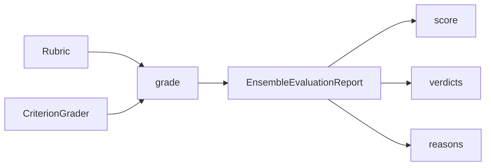

# Your First Rubric Evaluation

Learn the fundamentals of AutoRubric by evaluating tech support ticket responses.

## The Scenario

You're a QA lead at a tech company. Support agents respond to customer tickets, and you need to ensure responses are helpful, accurate, and professional. Manual review doesn't scale, so you want to automate quality assessment with an LLM judge.



## What You'll Learn

- Creating rubrics with `Rubric.from_dict()`
- Configuring an LLM judge with `LLMConfig` and `CriterionGrader`
- Grading responses with `rubric.grade()`
- Interpreting `EvaluationReport` results
- Understanding positive and negative criteria weights

## The Solution

### Step 1: Define Your Evaluation Criteria

First, define what makes a good support response. Each criterion has a **weight** (importance) and a **requirement** (what to check).

```python
from autorubric import Rubric

rubric = Rubric.from_dict([
    {
        "name": "addresses_issue",
        "weight": 10.0,
        "requirement": "The response directly addresses the customer's reported issue"
    },
    {
        "name": "provides_solution",
        "weight": 8.0,
        "requirement": "The response provides a clear solution or next steps"
    },
    {
        "name": "professional_tone",
        "weight": 5.0,
        "requirement": "The response maintains a professional and courteous tone"
    },
    {
        "name": "factual_errors",
        "weight": -15.0,  # Negative weight = penalty if criterion is MET
        "requirement": "The response contains factually incorrect technical information"
    }
])
```

| Criterion | Weight | Type | What It Checks |
|-----------|--------|------|----------------|
| addresses_issue | +10.0 | Positive | Response directly addresses the reported issue |
| provides_solution | +8.0 | Positive | Response provides a clear solution or next steps |
| professional_tone | +5.0 | Positive | Response maintains professional, courteous tone |
| factual_errors | -15.0 | Negative (penalty) | Response contains incorrect technical information |

!!! tip "Positive vs Negative Weights"
    - **Positive weights**: Desirable traits. MET adds to the score.
    - **Negative weights**: Undesirable traits (errors, hallucinations). MET subtracts from the score.

### Step 2: Configure the LLM Judge

Create a grader with your chosen LLM provider:

```python
from autorubric import LLMConfig
from autorubric.graders import CriterionGrader

grader = CriterionGrader(
    llm_config=LLMConfig(
        model="openai/gpt-4.1-mini",  # or "anthropic/claude-sonnet-4-5-20250929"
        temperature=0.0,  # Deterministic for reproducibility
    )
)
```

### Step 3: Grade a Response

Evaluate a support response:

```python
import asyncio

# The customer's original question
query = """
Subject: Cannot connect to WiFi after update
My laptop won't connect to WiFi after the latest Windows update.
I've tried restarting but it still doesn't work.
"""

# The support agent's response to evaluate
response = """
Hi there,

I understand how frustrating connectivity issues can be. Let me help you troubleshoot.

First, let's try resetting the network adapter:
1. Press Windows + X and select "Device Manager"
2. Expand "Network adapters"
3. Right-click your WiFi adapter and select "Disable device"
4. Wait 10 seconds, then right-click again and select "Enable device"

If that doesn't work, try running the Network Troubleshooter:
1. Go to Settings > System > Troubleshoot > Other troubleshooters
2. Run the "Network Adapter" troubleshooter

Let me know if these steps help or if you need further assistance!

Best regards,
Support Team
"""

async def main():
    result = await rubric.grade(
        to_grade=response,
        grader=grader,
        query=query,
    )
    return result

result = asyncio.run(main())
```

### Step 4: Interpret the Results

The `EvaluationReport` contains the overall score and per-criterion breakdown:

```python
# Overall score: `float | None` — 0.0 to 1.0, or None if the grade failed.
print(f"Score: {result.score:.2f}" if result.score is not None else "Score: n/a (grade failed)")

# Check token usage and cost
if result.token_usage:
    print(f"Tokens used: {result.token_usage.total_tokens}")
if result.completion_cost:
    print(f"Cost: ${result.completion_cost:.4f}")

# Per-criterion breakdown
for criterion in result.report:
    # Get the verdict (MET, UNMET, or CANNOT_ASSESS).
    # final_verdict is None for failed/multi-choice criteria, so guard it.
    verdict = criterion.final_verdict.value if criterion.final_verdict else "n/a"

    # The criterion's name and weight live on the nested criterion
    name = criterion.criterion.name or "unnamed"
    weight = criterion.criterion.weight

    # The judge's explanation
    reason = criterion.final_reason

    print(f"\n[{verdict}] {name} (weight: {weight})")
    print(f"  Reason: {reason}")
```

Sample output:

```
Score: 1.00

[MET] addresses_issue (weight: 10.0)
  Reason: The response directly addresses the WiFi connectivity issue reported after the Windows update.

[MET] provides_solution (weight: 8.0)
  Reason: Clear step-by-step solutions are provided: resetting the network adapter and running the troubleshooter.

[MET] professional_tone (weight: 5.0)
  Reason: The response is courteous, empathetic, and maintains professional language throughout.

[UNMET] factual_errors (weight: -15.0)
  Reason: The technical instructions are accurate for Windows troubleshooting.
```

### Understanding the Score

| Step | Calculation | Value |
|------|-------------|-------|
| MET positive weights | 10.0 + 8.0 + 5.0 | 23.0 |
| MET negative weights | (factual_errors UNMET, no penalty) | 0.0 |
| Total positive weight | 10.0 + 8.0 + 5.0 | 23.0 |
| Normalized score | 23.0 / 23.0 | **1.00** |
| If factual_errors were MET | (23.0 - 15.0) / 23.0 | **0.35** |

The score calculation:

1. Sum weights of MET positive criteria: 10.0 + 8.0 + 5.0 = 23.0
2. Sum weights of MET negative criteria: 0.0 (factual_errors was UNMET, so no penalty)
3. Total positive weight possible: 10.0 + 8.0 + 5.0 = 23.0
4. Final score: 23.0 / 23.0 = 1.00

If the response had contained factual errors (that criterion MET), the score would be:
(23.0 - 15.0) / 23.0 = 0.35

!!! note "Score Normalization"
    Scores are divided by the total positive weight, so they always range from 0 to 1.
    Negative-weight criteria do not contribute to the denominator. When a negative criterion
    is MET, its absolute weight is subtracted from the numerator after normalization, which
    means scores can drop well below what the positive criteria alone would produce.

## Key Takeaways

- **Rubrics are lists of criteria** with weights and requirements
- **Negative weights** penalize undesirable traits (errors, off-topic content)
- **Verdicts are MET, UNMET, or CANNOT_ASSESS** for each criterion
- **Scores are normalized to 0-1** by default (sum of MET weights / total positive weight)
- **Always provide context** via the `query` parameter for accurate evaluation

## Going Further

- [Managing Datasets](managing-datasets.md) - Organize multiple items for batch evaluation
- [Ensemble Judging](ensemble-judging.md) - Use multiple LLMs for more reliable verdicts
- [API Reference: Core Grading](../api/core-grading.md) - Full `Rubric` and grading documentation

---

## Appendix: Complete Code

```python
"""Your First Rubric Evaluation - Tech Support Quality Assessment"""

import asyncio
from autorubric import Rubric, LLMConfig
from autorubric.graders import CriterionGrader


# Sample support tickets to evaluate
SUPPORT_TICKETS = [
    {
        "query": """
Subject: Cannot connect to WiFi after update
My laptop won't connect to WiFi after the latest Windows update.
I've tried restarting but it still doesn't work.
""",
        "response": """
Hi there,

I understand how frustrating connectivity issues can be.
Let me help you troubleshoot.

First, let's try resetting the network adapter:
1. Press Windows + X and select "Device Manager"
2. Expand "Network adapters"
3. Right-click your WiFi adapter and select "Disable device"
4. Wait 10 seconds, then right-click again and select "Enable device"

If that doesn't work, try running the Network Troubleshooter:
1. Go to Settings > System > Troubleshoot > Other troubleshooters
2. Run the "Network Adapter" troubleshooter

Let me know if these steps help or if you need further assistance!

Best regards,
Support Team
""",
        "description": "Good response - addresses issue with clear steps"
    },
    {
        "query": """
Subject: Software crashes on startup
The application crashes immediately when I try to open it.
I'm running Windows 11.
""",
        "response": """
Have you tried turning it off and on again?
""",
        "description": "Poor response - dismissive, no real help"
    },
    {
        "query": """
Subject: How do I export data to CSV?
I need to export my project data to a CSV file for a report.
""",
        "response": """
To export to CSV:
1. Go to File > Export
2. Select "CSV" as the format
3. Choose your destination folder
4. Click "Export"

Note: CSV exports include all visible columns. To customize which columns
are exported, first adjust your view using View > Column Settings.

The exported file will use UTF-8 encoding, which works well with Excel
and Google Sheets.
""",
        "description": "Excellent response - clear instructions with helpful tips"
    },
    {
        "query": """
Subject: Billing question
I was charged twice for my subscription this month.
""",
        "response": """
I apologize for the billing inconvenience.

Looking at your account, I can see the duplicate charge occurred due to
a payment processing delay. I've initiated a refund for the duplicate
charge of $29.99, which should appear in your account within 3-5 business days.

I've also added a note to your account to prevent this from happening again.
Is there anything else I can help you with?
""",
        "description": "Good response - apologizes and provides resolution"
    },
    {
        "query": """
Subject: App not working on iPhone
The app keeps freezing on my iPhone 15.
""",
        "response": """
Thank you for reaching out!

For app freezing issues on iPhone 15, please try these steps:

1. Force close the app: Swipe up from bottom and hold, then swipe the app away
2. Update the app: Check the App Store for updates
3. Restart your iPhone: Hold side button + volume button, slide to power off
4. Reinstall if needed: Delete the app and download it again from App Store

Also make sure you're running iOS 17 or later, as our app requires it for
optimal performance on iPhone 15.

Let us know if the issue persists after trying these steps!
""",
        "description": "Good response - systematic troubleshooting for mobile"
    }
]


async def main():
    # Define the evaluation rubric
    rubric = Rubric.from_dict([
        {
            "name": "addresses_issue",
            "weight": 10.0,
            "requirement": "The response directly addresses the customer's reported issue"
        },
        {
            "name": "provides_solution",
            "weight": 8.0,
            "requirement": "The response provides a clear solution or actionable next steps"
        },
        {
            "name": "professional_tone",
            "weight": 5.0,
            "requirement": "The response maintains a professional and courteous tone"
        },
        {
            "name": "factual_errors",
            "weight": -15.0,
            "requirement": "The response contains factually incorrect technical information"
        }
    ])

    # Configure the grader
    grader = CriterionGrader(
        llm_config=LLMConfig(
            model="openai/gpt-4.1-mini",
            temperature=0.0,
        )
    )

    # Evaluate each support ticket
    print("=" * 60)
    print("TECH SUPPORT QUALITY ASSESSMENT")
    print("=" * 60)

    total_cost = 0.0
    for i, ticket in enumerate(SUPPORT_TICKETS, 1):
        result = await rubric.grade(
            to_grade=ticket["response"],
            grader=grader,
            query=ticket["query"],
        )

        print(f"\n--- Ticket {i}: {ticket['description']} ---")
        # result.score is `float | None` (None if the grade failed).
        print(f"Score: {result.score:.2f}" if result.score is not None else "Score: n/a (grade failed)")

        if result.completion_cost:
            total_cost += result.completion_cost

        # Show per-criterion verdicts
        for criterion in result.report:
            verdict = criterion.final_verdict.value if criterion.final_verdict else "n/a"
            name = criterion.criterion.name or "unnamed"
            weight = criterion.criterion.weight
            symbol = "+" if weight > 0 else "-"
            print(f"  [{verdict:^6}] {symbol}{abs(weight):.0f} {name}")

    print(f"\n{'=' * 60}")
    print(f"Total evaluation cost: ${total_cost:.4f}")


if __name__ == "__main__":
    asyncio.run(main())
```
