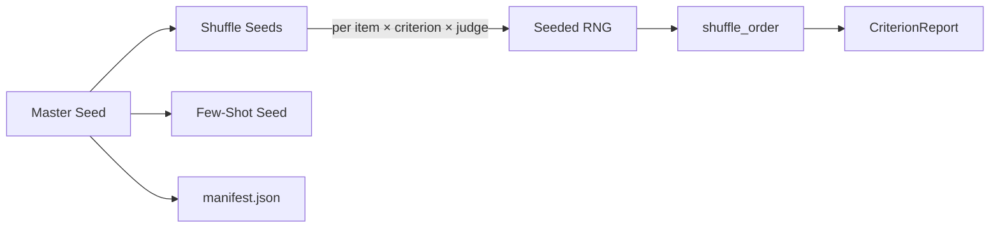

# Fixing Seeds for Reproducible Evaluations

Pin all non-LLM randomness so that option shuffles and few-shot selections are identical across runs.

## The Scenario

You're evaluating product review summaries with multi-choice quality scales. Your team needs to reproduce each other's results exactly—same shuffled option orders, same few-shot examples—even though LLM temperature is above zero. Without a fixed seed, every run shuffles multi-choice options differently, making it impossible to attribute score changes to rubric edits vs. random variation.

## What You'll Learn

- Using `CriterionGrader(seed=...)` to pin all non-LLM randomness
- How the master seed coordinates option shuffling and few-shot selection
- Inspecting `shuffle_order` in criterion reports
- How seeds are persisted in experiment checkpoints
- Comparing runs with identical seeds to isolate rubric changes

## The Solution



### Step 1: Create a Seeded Grader

Pass `seed` to `CriterionGrader`. This single value governs all non-LLM randomness:

```python
from autorubric import LLMConfig
from autorubric.graders import CriterionGrader

grader = CriterionGrader(
    llm_config=LLMConfig(model="openai/gpt-4.1-mini", temperature=0.3),
    seed=42,
)

print(f"Seed: {grader.seed}")  # 42
```

If you omit `seed`, one is auto-generated and accessible via `grader.seed`. This means randomness is always pinned after construction—you just need to record the seed to reproduce later.

```python
grader = CriterionGrader(
    llm_config=LLMConfig(model="openai/gpt-4.1-mini"),
)
print(f"Auto seed: {grader.seed}")  # e.g. 1738294021
```

### Step 2: Understand What Gets Seeded

The master seed controls two sources of randomness:

| Source | Without Seed | With Seed |
|--------|-------------|-----------|
| **Option shuffling** | Different permutation every call | Deterministic per (item, criterion, judge) |
| **Few-shot example selection** | Random sampling | Reproducible stratified sampling |

LLM sampling (temperature, top-p) is **not** affected—it depends on provider-level randomness. The seed pins everything you control on the client side.

### Step 3: Define a Multi-Choice Rubric

```python
from autorubric import Rubric

rubric = Rubric.from_dict([
    {
        "name": "accuracy",
        "weight": 10.0,
        "requirement": "How accurately does the summary capture the key points?",
        "options": [
            {"label": "Inaccurate", "value": 0.0},
            {"label": "Partially accurate", "value": 0.5},
            {"label": "Accurate", "value": 0.8},
            {"label": "Highly accurate", "value": 1.0},
        ],
        "scale_type": "ordinal"
    },
    {
        "name": "conciseness",
        "weight": 8.0,
        "requirement": "How concise is the summary?",
        "options": [
            {"label": "Verbose", "value": 0.0},
            {"label": "Somewhat concise", "value": 0.5},
            {"label": "Concise", "value": 1.0},
        ],
        "scale_type": "ordinal"
    }
])
```

### Step 4: Run Evaluation and Inspect Shuffle Orders

```python
import asyncio
from autorubric import RubricDataset, evaluate

dataset = RubricDataset(
    prompt="Summarize this product review in 2-3 sentences.",
    rubric=rubric,
    name="review-summaries-v1",
)

# Add items...
dataset.add_item(
    submission="This laptop has great battery life and a sharp display, but the keyboard is mushy.",
    description="Laptop review summary",
)

async def main():
    result = await evaluate(
        dataset, grader,
        show_progress=False,
        experiment_name="seeded-run-42",
    )

    # Inspect shuffle orders in criterion reports
    for item_result in result.item_results:
        report = item_result.report
        if report.report:
            for cr in report.report:
                # The aggregate report never sets shuffle_order; it is recorded on
                # each per-judge vote. For a single judge, read vote 0.
                if cr.multi_choice_votes:
                    shuffle_order = cr.multi_choice_votes[0].shuffle_order
                    if shuffle_order is not None:
                        print(f"  {cr.criterion.name}: shuffle_order={shuffle_order}")

asyncio.run(main())
```

Output:

```
  accuracy: shuffle_order=[4, 2, 3, 1, 0]
  conciseness: shuffle_order=[0, 1, 3, 2]
```

The `shuffle_order` maps shuffled position to original index. Note that with the default `auto_na_option=True`, the grader appends a canonical "Cannot assess / not applicable" option to every multi-choice criterion before shuffling—so accuracy's four declared options become five (and conciseness's three become four), growing each `shuffle_order` by one. Here, the LLM saw accuracy options in the order `[Cannot assess / not applicable, Accurate, Highly accurate, Partially accurate, Inaccurate]` instead of the original order. (With `auto_na_option=False` the lengths would be 4 and 3.)

### Step 5: Verify Reproducibility

Run the same evaluation twice with the same seed:

```python
async def verify_reproducibility():
    grader_a = CriterionGrader(
        llm_config=LLMConfig(model="openai/gpt-4.1-mini", temperature=0.3),
        seed=42,
    )
    grader_b = CriterionGrader(
        llm_config=LLMConfig(model="openai/gpt-4.1-mini", temperature=0.3),
        seed=42,
    )

    result_a = await evaluate(dataset, grader_a, show_progress=False,
                              experiment_name="run-a")
    result_b = await evaluate(dataset, grader_b, show_progress=False,
                              experiment_name="run-b")

    # Shuffle orders are identical
    for a, b in zip(result_a.item_results, result_b.item_results):
        for cr_a, cr_b in zip(a.report.report, b.report.report):
            assert cr_a.criterion.name == cr_b.criterion.name
            # shuffle_order lives on the per-judge votes (single judge here, vote 0).
            order_a = cr_a.multi_choice_votes[0].shuffle_order
            order_b = cr_b.multi_choice_votes[0].shuffle_order
            assert order_a == order_b
    print("Shuffle orders match across runs.")

asyncio.run(verify_reproducibility())
```

!!! note "LLM outputs may still differ"
    With `temperature > 0`, the LLM's chosen option may differ between runs even with identical shuffle orders. The seed guarantees identical *presentation* to the LLM, not identical *responses*.

### Step 6: Check the Checkpoint

The master seed is persisted in the experiment manifest:

```python
import json
from pathlib import Path

with open(Path("experiments/seeded-run-42/manifest.json")) as f:
    manifest = json.load(f)

print(manifest["grader_config"]["master_seed"])      # 42
print(manifest["grader_config"]["shuffle_options"])   # True
```

When resuming an interrupted evaluation, the same seed produces the same shuffle orders for remaining items—no special handling required.

### Step 7: Coordinate with Few-Shot Selection

When using few-shot examples, the master seed automatically flows to `FewShotConfig.seed` if you haven't set one explicitly:

```python
from autorubric import FewShotConfig

grader = CriterionGrader(
    llm_config=LLMConfig(model="openai/gpt-4.1-mini"),
    training_data=train_data,
    few_shot_config=FewShotConfig(n_examples=3),
    seed=42,  # Also governs example selection
)

# FewShotConfig.seed was set to 42 automatically
print(grader._few_shot_config.seed)  # 42
```

If you set `FewShotConfig(seed=99)` explicitly, the master seed does not override it.

## Key Takeaways

| Concept | Detail |
|---------|--------|
| `seed` parameter | Single value on `CriterionGrader` that pins all non-LLM randomness |
| Auto-generation | Omitting `seed` auto-generates one; access via `grader.seed` |
| Scope | Controls option shuffling and few-shot selection; does not affect LLM sampling |
| Concurrency-safe | Per-call RNG derived from `(seed, content_hash, criterion_idx, judge_id)` |
| Persistence | `shuffle_order` in `CriterionReport`, `master_seed` in experiment manifest |

## Going Further

- [Multi-Choice Rubrics](multi-choice-rubrics.md) - Ordinal/nominal scales and aggregation
- [Few-Shot Calibration](few-shot-calibration.md) - Calibrating judges with labeled examples
- [Batch Evaluation](batch-evaluation.md) - Checkpointing, resumption, and cost tracking
- [API Reference: Graders](../api/graders.md) - Full `CriterionGrader` parameter documentation

---

## Appendix: Complete Code

```python
"""Fixing Seeds for Reproducible Evaluations - Product Review Summaries"""

import asyncio
import json
from pathlib import Path

from autorubric import (
    CriterionVerdict,
    FewShotConfig,
    LLMConfig,
    Rubric,
    RubricDataset,
    evaluate,
)
from autorubric.graders import CriterionGrader


def create_dataset() -> RubricDataset:
    """Create a product review summary dataset."""
    rubric = Rubric.from_dict([
        {
            "name": "accuracy",
            "weight": 10.0,
            "requirement": "How accurately does the summary capture the key points?",
            "options": [
                {"label": "Inaccurate", "value": 0.0},
                {"label": "Partially accurate", "value": 0.5},
                {"label": "Accurate", "value": 0.8},
                {"label": "Highly accurate", "value": 1.0},
            ],
            "scale_type": "ordinal"
        },
        {
            "name": "conciseness",
            "weight": 8.0,
            "requirement": "How concise is the summary?",
            "options": [
                {"label": "Verbose", "value": 0.0},
                {"label": "Somewhat concise", "value": 0.5},
                {"label": "Concise", "value": 1.0},
            ],
            "scale_type": "ordinal"
        }
    ])

    dataset = RubricDataset(
        prompt="Summarize this product review in 2-3 sentences.",
        rubric=rubric,
        name="review-summaries-v1",
    )

    dataset.add_item(
        submission=(
            "This laptop has great battery life and a sharp display, "
            "but the keyboard feels mushy and the trackpad is too small."
        ),
        description="Laptop review - mixed",
    )
    dataset.add_item(
        submission=(
            "Excellent noise cancellation and comfortable fit. "
            "Battery lasts 30 hours. Bass could be stronger."
        ),
        description="Headphones review - positive",
    )
    dataset.add_item(
        submission=(
            "The blender struggles with ice and the lid leaks. "
            "It's loud and the motor overheats after 2 minutes."
        ),
        description="Blender review - negative",
    )

    return dataset


async def main():
    dataset = create_dataset()

    # Create a seeded grader
    grader = CriterionGrader(
        llm_config=LLMConfig(model="openai/gpt-4.1-mini", temperature=0.3),
        seed=42,
    )
    print(f"Master seed: {grader.seed}")

    # Run evaluation
    result = await evaluate(
        dataset, grader,
        show_progress=True,
        experiment_name="seeded-review-eval",
    )

    # Print shuffle orders
    print("\nShuffle orders:")
    for item_result in result.item_results:
        print(f"\nItem {item_result.item_idx}: {item_result.item.description}")
        if item_result.report.report:
            for cr in item_result.report.report:
                # shuffle_order is recorded per-judge, not on the aggregate report.
                if cr.multi_choice_votes:
                    shuffle_order = cr.multi_choice_votes[0].shuffle_order
                    if shuffle_order is not None:
                        print(f"  {cr.criterion.name}: {shuffle_order}")

    # Verify seed in checkpoint
    manifest_path = Path("experiments/seeded-review-eval/manifest.json")
    if manifest_path.exists():
        with open(manifest_path, encoding="utf-8") as f:
            manifest = json.load(f)
        print(f"\nCheckpoint master_seed: {manifest['grader_config'].get('master_seed')}")

    # Print scores. report.score is `float | None` (None if that item's grade failed).
    print("\nScores:")
    for item_result in result.item_results:
        score = item_result.report.score
        score_str = f"{score:.2f}" if score is not None else "n/a"
        print(f"  Item {item_result.item_idx}: {score_str}")


if __name__ == "__main__":
    asyncio.run(main())
```
