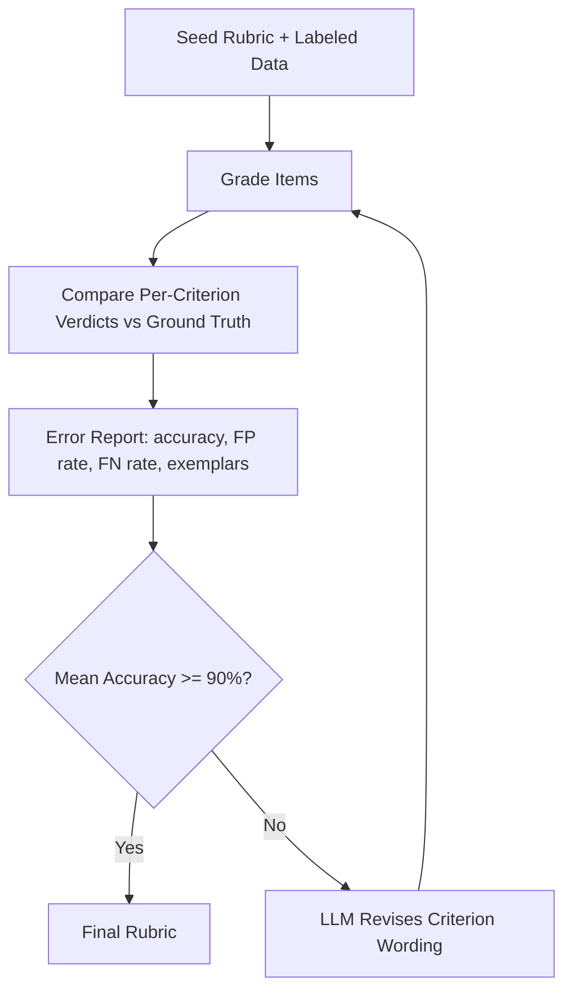
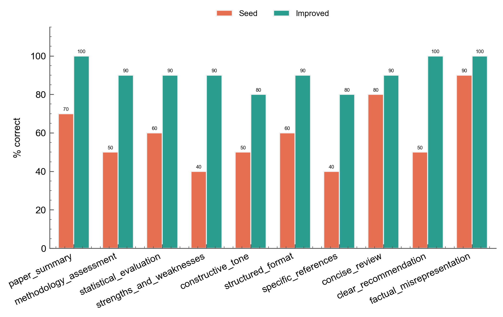
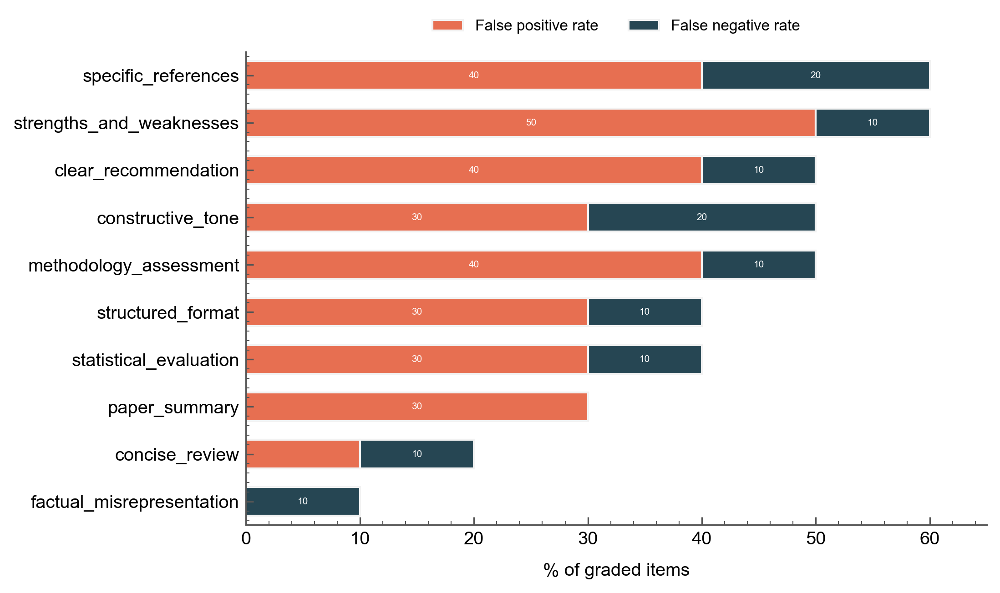
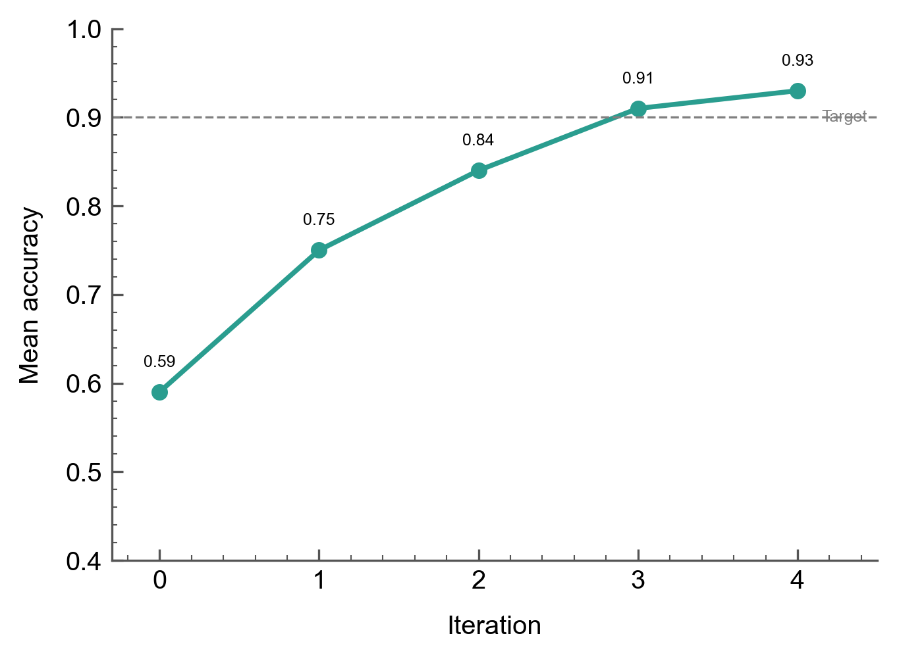

# Held-Out Rubric Improvement

Refine rubric criterion wording by optimizing against grading errors on labeled data.

## The Scenario

You have a rubric with the right criteria names and weights, but the requirement text is imprecise --- vague wording that causes the grader to misclassify items. You also have a labeled dataset with ground-truth verdicts for each criterion. Rather than manually comparing grading outputs to labels and rewriting criteria, you want an automated loop that identifies per-criterion errors and revises wording to reduce them.

The `held_out` improvement strategy does exactly this. It grades items with the current rubric, compares per-criterion verdicts against ground truth, builds an error report (accuracy, false positive rate, false negative rate, and disagreement exemplars per criterion), and passes that report to an LLM to revise criterion wording. Unlike the `meta_rubric` strategy (which optimizes structural quality --- clarity, overlap, specificity), `held_out` optimizes against real grading behavior.

## What You'll Learn

- Using `improve_rubric(strategy="held_out")` with labeled validation data
- Designing seed rubrics that expose failure modes
- Interpreting per-criterion error diagnostics (accuracy, FP/FN rates, exemplars)
- Comparing improved wording against a gold standard
- Chaining `held_out` and `meta_rubric` strategies

## The Solution

### How the held-out loop works



The loop preserves criterion count and order across iterations --- only the `requirement` text changes. This makes before/after comparison straightforward and ensures weights remain stable.

### Step 1: Load the dataset

The peer review skill evaluation dataset contains 30 items (10 papers x 3 conditions) with ground-truth verdict vectors generated by grading against a precise gold rubric. Each item has 10 binary verdicts.

```python
from autorubric.dataset import RubricDataset

dataset = RubricDataset.from_file("examples/data/peer_review_skill_eval.json")
print(f"{len(dataset.items)} items, {len(dataset.rubric.rubric)} criteria")
# 30 items, 10 criteria
```

The gold rubric in the dataset has precise, observable requirements (e.g., "identifies at least 2 specific strengths and 2 specific weaknesses with concrete references to the paper"). We will start with only the ground-truth labels, not the gold wording --- the goal is to recover that precision from behavioral signal alone.

### Step 2: Define the seed rubric

The seed rubric uses the same 10 criterion names and weights as the gold rubric but with deliberately weakened `requirement` text. The weakening strategy: remove specificity, thresholds, and observability while keeping the criterion conceptually correct.

```python
from autorubric import Rubric

seed_rubric = Rubric.from_dict([
    {"name": "paper_summary", "weight": 10.0,
     "requirement": "Review includes a summary of the paper"},
    {"name": "methodology_assessment", "weight": 15.0,
     "requirement": "Review discusses the methodology"},
    {"name": "statistical_evaluation", "weight": 15.0,
     "requirement": "Review mentions statistical aspects of the study"},
    {"name": "strengths_and_weaknesses", "weight": 15.0,
     "requirement": "Review discusses strengths and weaknesses of the work"},
    {"name": "constructive_tone", "weight": 10.0,
     "requirement": "Review is constructive in tone"},
    {"name": "structured_format", "weight": 8.0,
     "requirement": "Review is organized and easy to follow"},
    {"name": "specific_references", "weight": 7.0,
     "requirement": "Review refers to the paper's content"},
    {"name": "concise_review", "weight": 10.0,
     "requirement": "Review is not excessively long"},
    {"name": "clear_recommendation", "weight": 10.0,
     "requirement": "Review provides a recommendation"},
    {"name": "factual_misrepresentation", "weight": -15.0,
     "requirement": "Review contains inaccurate statements about the paper"},
])
```

Three criteria illustrate the weakening pattern:

- **`strengths_and_weaknesses`**: The gold rubric requires "at least 2 specific strengths and 2 specific weaknesses with concrete references." The seed says only "discusses strengths and weaknesses" --- no count threshold, no concreteness requirement. A vague one-liner like "the paper has strengths and weaknesses" would pass the seed but fail the gold.

- **`constructive_tone`**: The gold rubric checks for "specific, actionable suggestions for improvement" --- an observable behavior. The seed checks whether the review "is constructive in tone" --- a subjective judgment. This shifts the grading decision from factual (does the review contain suggestions?) to impressionistic (does it feel constructive?).

- **`specific_references`**: The gold rubric requires "section numbers, figure references, quoted results, sample sizes." The seed requires only that the review "refers to the paper's content," which any review trivially satisfies.

The common pattern: the seed criteria are too easy to satisfy. This creates a false positive bias --- the grader marks criteria as MET when the gold standard says UNMET.

### Step 3: Run `improve_rubric(strategy="held_out")`

```python
import asyncio
from autorubric import LLMConfig
from autorubric.meta import improve_rubric

eval_llm = LLMConfig(
    model="gemini/gemini-3-flash-preview",
    temperature=1.0,
    thinking="medium",
    max_parallel_requests=10,
)

revision_llm = LLMConfig(
    model="anthropic/claude-sonnet-4-5-20250929",
    temperature=1.0,
)

async def main():
    result = await improve_rubric(
        seed_rubric,
        eval_llm=eval_llm,
        revision_llm=revision_llm,
        strategy="held_out",
        validation_data=dataset,
        max_iterations=5,
        show_progress=True,
        artifacts_dir="held_out_improvement",
    )

    initial = result.iterations[0]
    best = result.iterations[result.best_iteration]
    print(f"Accuracy: {initial.quality_score:.0%} -> {best.quality_score:.0%}")
    print(f"Converged: {result.convergence_reason}")
    print(f"Cost: ${result.total_completion_cost:.4f}")

asyncio.run(main())
```

Key parameters:

| Parameter | Value | Why |
|-----------|-------|-----|
| `strategy` | `"held_out"` | Optimize against grading errors, not structural quality |
| `validation_data` | `dataset` | Items with `ground_truth` verdicts for error measurement |
| `max_iterations` | 5 | Cap on revision cycles |
| `eval_llm` | Gemini Flash | Fast, cheap grading with thinking for 30 items x 10 criteria |
| `revision_llm` | Claude Sonnet | Strong instruction following for structural constraints |

The `held_out` strategy does not require a `task_prompt` --- it derives all signal from grading errors rather than meta-rubric evaluation. The `mode` parameter is also ignored since no meta-rubric evaluation runs.

### Step 4: Inspect results

#### 4a. Per-criterion accuracy before vs after

The grouped bar chart shows how each criterion's grading accuracy changed from the seed rubric (iteration 0) to the best iteration:



The weakest seed criteria (`strengths_and_weaknesses` at 40%, `specific_references` at 40%) show the largest absolute gains. Criteria that were already precise in the seed (`factual_misrepresentation` at 90%, `concise_review` at 80%) improve only marginally.

#### 4b. Error analysis of seed rubric

The initial error report reveals why the seed rubric fails. False positive rates dominate because the vague wording makes criteria too easy to satisfy:



`strengths_and_weaknesses` has a 50% false positive rate --- the grader marks it MET when the review merely mentions strengths and weaknesses without the specificity the gold standard requires. `specific_references` and `methodology_assessment` follow the same pattern. False negatives are lower across the board because vague criteria rarely fail items that should pass.

This FP-heavy error profile is the signature of under-specified rubric wording. The `held_out` strategy feeds these rates and disagreement exemplars directly into the revision prompt, giving the LLM concrete evidence for how to tighten each criterion.

#### 4c. Accuracy convergence

Mean accuracy across all criteria rises from 59% to 93% over 5 iterations, crossing the 90% target at iteration 3:



The steepest gains occur in iterations 0-2 as the most egregiously vague criteria get tightened. Iteration 3-4 shows diminishing returns as the remaining errors require subtler wording adjustments.

#### 4d. Wording diff

Inspecting the artifacts directory (`held_out_improvement/rubric-iter-*.json`) reveals how specific criteria evolved. Two examples:

**`strengths_and_weaknesses`** (40% -> 90%):

| Seed | Improved |
|------|----------|
| "Review discusses strengths and weaknesses of the work" | "Review identifies at least 2 specific strengths and at least 2 specific weaknesses, each with concrete references to sections, methods, or results in the paper" |

The revision added count thresholds ("at least 2") and a concreteness requirement ("concrete references to sections, methods, or results") --- both recoverable from the false positive exemplars where reviews made generic statements that the ground truth marked UNMET.

**`constructive_tone`** (50% -> 80%):

| Seed | Improved |
|------|----------|
| "Review is constructive in tone" | "Weaknesses are accompanied by specific, actionable suggestions for how to address them, rather than merely identifying problems" |

The revision shifted from a subjective tone judgment to an observable behavioral check, closely matching the gold standard's requirement.

### Step 5: Gold rubric reveal

Comparing the improved wording against the gold rubric (which the system never saw) shows how much precision the `held_out` strategy recovered from behavioral signal alone:

| Criterion | Seed | Improved | Gold |
|-----------|------|----------|------|
| `strengths_and_weaknesses` | "discusses strengths and weaknesses of the work" | "identifies at least 2 specific strengths and at least 2 specific weaknesses, each with concrete references" | "identifies at least 2 specific strengths and 2 specific weaknesses with concrete references to the paper" |
| `constructive_tone` | "is constructive in tone" | "weaknesses are accompanied by specific, actionable suggestions for how to address them" | "weaknesses include specific, actionable suggestions for improvement rather than just identifying problems" |
| `specific_references` | "refers to the paper's content" | "references specific details from the paper such as section numbers, figure references, quoted results, or sample sizes" | "references specific details from the paper (section numbers, figure references, quoted results, sample sizes) rather than making generic statements" |
| `clear_recommendation` | "provides a recommendation" | "concludes with a definitive recommendation (Accept, Minor Revision, Major Revision, or Reject) with justification" | "concludes with a definitive recommendation (Accept, Minor Revision, Major Revision, or Reject) and a brief justification tied to the analysis" |

The improved wording independently converges on the same specificity patterns as the gold rubric: count thresholds, enumerated categories, observable behavioral checks. The convergence is not exact --- the gold rubric uses slightly different phrasing --- but the functional precision is comparable.

### Step 6 (Optional): Chaining strategies

The `held_out` strategy optimizes for grading accuracy but does not check structural properties (clarity, overlap between criteria, anti-patterns). Chain the two strategies for comprehensive improvement:

```python
async def chain():
    # First pass: fix grading errors
    held_out_result = await improve_rubric(
        seed_rubric,
        eval_llm=eval_llm,
        revision_llm=revision_llm,
        strategy="held_out",
        validation_data=dataset,
        max_iterations=5,
    )

    # Second pass: fix structural issues
    final_result = await improve_rubric(
        held_out_result.best_rubric,
        eval_llm=eval_llm,
        revision_llm=revision_llm,
        strategy="meta_rubric",
        max_iterations=3,
    )
    return final_result
```

The two strategies use complementary signals: `held_out` catches wording that produces incorrect verdicts; `meta_rubric` catches wording that is ambiguous, double-barreled, or overlapping. Running `held_out` first ensures the criteria are functionally correct before `meta_rubric` polishes their structural quality.

## Key Takeaways

| Concept | AutoRubric Feature |
|---------|-------------------|
| Grading error measurement | `validate_held_out()` computes per-criterion accuracy, FP/FN rates |
| Error-driven revision | `revise_rubric_held_out()` uses error reports + exemplars as revision signal |
| Criterion structure preservation | `validate_criteria_structure()` enforces same count/order across iterations |
| Strategy composition | Feed `result.best_rubric` from one strategy into the next |

- **Use `held_out` when you have labeled data** and want to fix grading accuracy. It directly optimizes the metric you care about.
- **Use `meta_rubric` when you lack labeled data** or want to improve structural quality (clarity, non-overlap, anti-pattern removal).
- **Chain both** for comprehensive improvement: `held_out` first for functional correctness, then `meta_rubric` for structural polish.
- **Seed rubric design matters.** Deliberately weakened seeds expose the failure modes that `held_out` can fix. If the seed is already precise, there is less room for improvement.

## Going Further

- [Automated Rubric Improvement](automated-rubric-improvement.md) - The `meta_rubric` strategy in depth
- [Evaluating Agent Skills](agent-skill-evaluation.md) - The peer review dataset used in this recipe
- [Judge Validation](judge-validation.md) - Measuring agreement with human labels

---

## Appendix: Complete Code

```python
"""Held-Out Rubric Improvement Demo

Refines a deliberately weakened rubric using grading errors from labeled data.
"""

import asyncio
import json

from autorubric import LLMConfig, Rubric
from autorubric.dataset import RubricDataset
from autorubric.meta import improve_rubric


def create_seed_rubric() -> Rubric:
    """Create a rubric with weakened requirement wording."""
    return Rubric.from_dict([
        {"name": "paper_summary", "weight": 10.0,
         "requirement": "Review includes a summary of the paper"},
        {"name": "methodology_assessment", "weight": 15.0,
         "requirement": "Review discusses the methodology"},
        {"name": "statistical_evaluation", "weight": 15.0,
         "requirement": "Review mentions statistical aspects of the study"},
        {"name": "strengths_and_weaknesses", "weight": 15.0,
         "requirement": "Review discusses strengths and weaknesses of the work"},
        {"name": "constructive_tone", "weight": 10.0,
         "requirement": "Review is constructive in tone"},
        {"name": "structured_format", "weight": 8.0,
         "requirement": "Review is organized and easy to follow"},
        {"name": "specific_references", "weight": 7.0,
         "requirement": "Review refers to the paper's content"},
        {"name": "concise_review", "weight": 10.0,
         "requirement": "Review is not excessively long"},
        {"name": "clear_recommendation", "weight": 10.0,
         "requirement": "Review provides a recommendation"},
        {"name": "factual_misrepresentation", "weight": -15.0,
         "requirement": "Review contains inaccurate statements about the paper"},
    ])


async def main():
    dataset = RubricDataset.from_file(
        "examples/data/peer_review_skill_eval.json"
    )

    eval_llm = LLMConfig(
        model="gemini/gemini-3-flash-preview",
        temperature=1.0,
        thinking="medium",
        max_parallel_requests=10,
    )

    revision_llm = LLMConfig(
        model="anthropic/claude-sonnet-4-5-20250929",
        temperature=1.0,
    )

    # Pass 1: Fix grading errors with held_out
    result = await improve_rubric(
        create_seed_rubric(),
        eval_llm=eval_llm,
        revision_llm=revision_llm,
        strategy="held_out",
        validation_data=dataset,
        max_iterations=5,
        show_progress=True,
        artifacts_dir="held_out_improvement",
    )

    initial = result.iterations[0]
    best = result.iterations[result.best_iteration]
    print(f"\nAccuracy: {initial.quality_score:.0%} -> {best.quality_score:.0%}")
    print(f"Convergence: {result.convergence_reason}")
    if result.total_completion_cost:
        print(f"Total cost: ${result.total_completion_cost:.4f}")

    # Save improved rubric
    criteria = [
        {"name": c.name, "weight": c.weight, "requirement": c.requirement}
        for c in result.best_rubric.rubric
    ]
    with open("improved_rubric.json", "w", encoding="utf-8") as f:
        json.dump(criteria, f, indent=2)

    # Optional: chain with meta_rubric for structural polish
    final = await improve_rubric(
        result.best_rubric,
        eval_llm=eval_llm,
        revision_llm=revision_llm,
        strategy="meta_rubric",
        max_iterations=3,
        show_progress=True,
        artifacts_dir="held_out_improvement_meta",
    )
    print(f"\nAfter meta_rubric polish:")
    print(f"Convergence: {final.convergence_reason}")


if __name__ == "__main__":
    asyncio.run(main())
```
