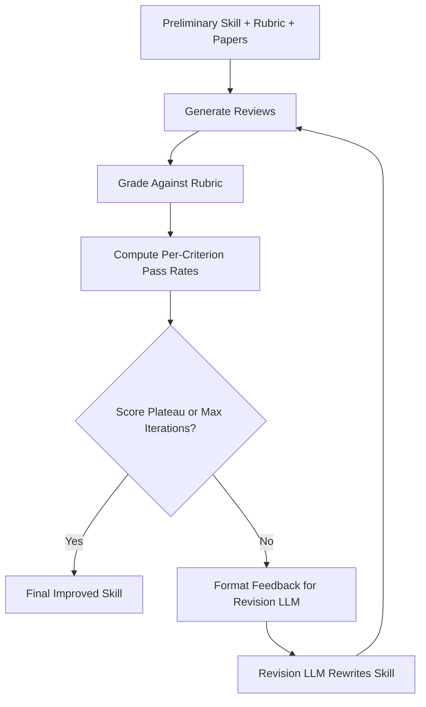
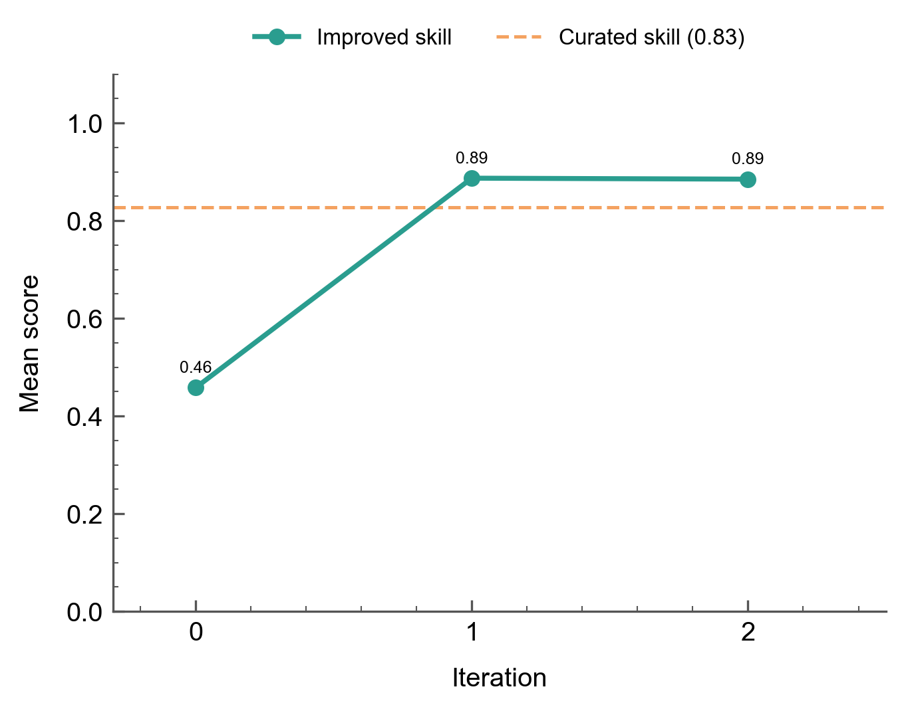
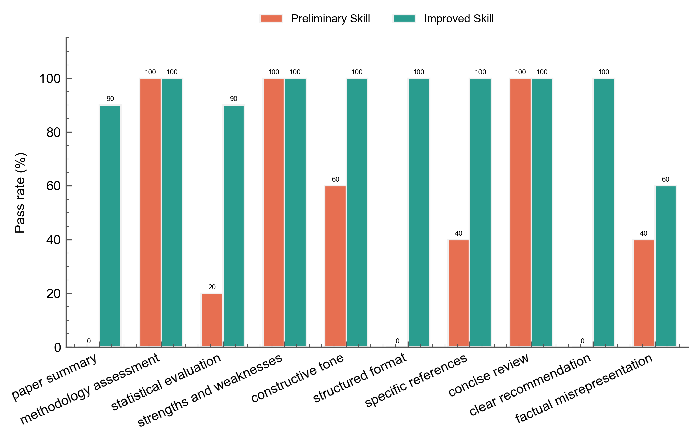
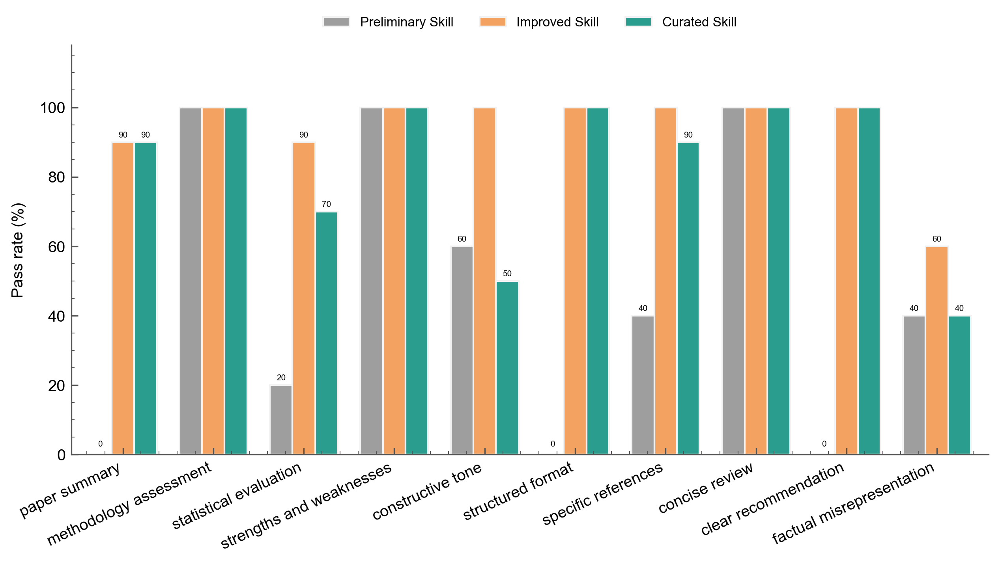

# Improving Agent Skills

Automatically refine an agent skill using a rubric.

## The Scenario

You have a rubric that defines what makes a good peer review, and a preliminary skill that scores poorly against it. The [Evaluating Agent Skills](agent-skill-evaluation.md) recipe showed how to measure skill quality by grading agent outputs under three conditions. This recipe takes the next step: instead of manually rewriting the skill, you build a loop that analyzes per-criterion failures and uses a revision LLM to rewrite the skill automatically.

The approach composes existing AutoRubric building blocks (`LLMClient`, `Rubric.grade()`, `CriterionGrader`) into a custom improvement loop. No new library primitives are needed. A revision LLM receives the current skill, a table of per-criterion pass rates, and sample failure explanations, then outputs a revised skill. The loop repeats until scores plateau.

## What You'll Learn

- Building a skill-improvement loop from AutoRubric building blocks
- Using per-criterion pass rates as the optimization signal
- Formatting rubric feedback for a revision LLM
- Tracking score convergence across iterations
- Comparing the improved skill against a hidden curated skill
- The thoroughness/conciseness tradeoff

## The Solution

### Step 1: The rubric and the preliminary skill

The rubric comes from the peer review skill evaluation dataset: 10 binary criteria covering outcome quality, style, efficiency, and a factual misrepresentation penalty. Each criterion maps to a step in the curated skill procedure (see [Evaluating Agent Skills](agent-skill-evaluation.md#step-2-design-the-rubric)).

```python
from autorubric.dataset import RubricDataset

dataset = RubricDataset.from_file("examples/data/peer_review_skill_eval.json")
rubric = dataset.rubric
print(f"{len(rubric.rubric)} criteria")
# 10 criteria
```

The preliminary skill is deliberately generic --- no mention of peer review, no domain guidance, no structure:

```python
V1_SKILL = "Provide brief feedback on the text below."
```

The gap is fundamental. The preliminary skill gives no task-specific guidance at all: no mention of scientific methodology, no procedure, no formatting constraints. The rubric expects concrete outputs ("2-3 sentence summary", "at least 2 specific strengths", section headers in a specific order), but the skill says only "brief feedback." Paired with a small open-source model (Llama 3.1 8B), the lack of guidance produces short, unstructured reactions that fail on 6 of 10 criteria: `paper_summary` (0%), `statistical_evaluation` (20%), `structured_format` (0%), `specific_references` (50%), `clear_recommendation` (0%), and `factual_misrepresentation` (20% flagged for fabrication).

### Step 2: Generate reviews and grade them

The loop generates a review for each paper using the current skill as the system prompt, then grades each review against the rubric:

```python
from autorubric import LLMConfig
from autorubric.graders import CriterionGrader
from autorubric.llm import LLMClient

agent_config = LLMConfig(
    model="groq/llama-3.1-8b-instant",
    temperature=0.7,
    max_parallel_requests=5,
)
eval_config = LLMConfig(
    model="gemini/gemini-3-flash-preview",
    temperature=1.0,
    thinking="medium",
    max_parallel_requests=10,
)

agent_client = LLMClient(agent_config)
eval_grader = CriterionGrader(llm_config=eval_config, normalize=True)
```

The generate-and-grade helper:

```python
import asyncio
from autorubric import Rubric
from autorubric.types import CriterionVerdict

async def generate_reviews(client, skill, papers):
    """Generate a review for each paper using the given skill."""
    tasks = [
        client.generate(
            system_prompt=skill,
            user_prompt=paper["prompt"],
            return_result=True,
        )
        for paper in papers
    ]
    results = await asyncio.gather(*tasks)
    return [
        {"paper_id": p["paper_id"], "review": r.content, "cost": r.cost or 0.0}
        for p, r in zip(papers, results)
    ]


async def grade_reviews(rubric, grader, reviews, papers):
    """Grade each review against the rubric."""
    tasks = [
        rubric.grade(to_grade=r["review"], grader=grader, query=p["prompt"])
        for r, p in zip(reviews, papers)
    ]
    reports = await asyncio.gather(*tasks)
    graded = []
    for r, report in zip(reviews, reports):
        per_criterion = {}
        # `rubric.grade(..., grader=CriterionGrader)` returns an
        # EnsembleEvaluationReport, whose `report` items are EnsembleCriterionReport
        # (final_verdict / final_reason / nested criterion). A single CriterionReport
        # exposes verdict / reason / name directly; the hasattr fallback handles both.
        for cr in report.report:
            verdict = cr.final_verdict if hasattr(cr, "final_verdict") else cr.verdict
            reason = cr.final_reason if hasattr(cr, "final_reason") else cr.reason
            name = cr.criterion.name if hasattr(cr, "criterion") else cr.name
            per_criterion[name] = {
                "verdict": verdict.value,
                "reason": reason,
            }
        graded.append(
            {
                "paper_id": r["paper_id"],
                "score": report.score,
                "per_criterion": per_criterion,
                "cost": report.completion_cost or 0.0,
            }
        )
    return graded
```

### Step 3: Per-criterion failure analysis

After grading, compute pass rates and format the results for the revision LLM. The revision LLM needs both the pass rates (which criteria fail) and sample failure explanations (why they fail).

```python
def compute_pass_rates(graded, criteria_names):
    rates = {}
    for name in criteria_names:
        met = sum(
            1 for g in graded
            if g["per_criterion"][name]["verdict"] == CriterionVerdict.MET.value
        )
        rates[name] = met / len(graded)
    return rates


def format_criteria_table(criteria, pass_rates):
    lines = []
    for c in criteria:
        rate = pass_rates.get(c.name, 0.0)
        status = "PASSING" if rate >= 0.7 else "FAILING"
        lines.append(
            f"- **{c.name}** (weight={c.weight}, pass_rate={rate:.0%}, "
            f"{status}): {c.requirement}"
        )
    return "\n".join(lines)


def format_failure_examples(graded, criteria, pass_rates, max_examples=3):
    sections = []
    failing = [
        (c.name, pass_rates[c.name])
        for c in criteria if pass_rates[c.name] < 0.7
    ]
    failing.sort(key=lambda x: x[1])

    for name, rate in failing[:5]:
        examples = []
        for g in graded:
            cr = g["per_criterion"][name]
            if cr["verdict"] == CriterionVerdict.UNMET.value and cr["reason"]:
                examples.append(f"  - Paper {g['paper_id']}: {cr['reason']}")
                if len(examples) >= max_examples:
                    break
        if examples:
            sections.append(
                f"**{name}** ({rate:.0%} pass rate):\n" + "\n".join(examples)
            )

    return "\n\n".join(sections) if sections else "No failing criteria."
```

### Step 4: The improvement loop

The loop ties generation, grading, analysis, and revision together:



The revision prompt provides the revision LLM with everything it needs to produce a targeted rewrite:

```python
REVISION_SYSTEM_PROMPT = """\
You are an expert skill designer for LLM agents. Your job is to revise an agent \
skill (a system prompt that guides the agent through a task) so that the agent's \
outputs better satisfy a rubric.

Principles for effective skills:
- Use imperative verbs ("Summarize", "Evaluate", "List") not hedging \
("you should consider", "it can be helpful")
- Specify concrete outputs: counts ("at least 2"), formats ("section headers"), \
length limits ("under 800 words")
- Make requirements observable: instead of "be thorough", say "reference specific \
sections, figures, and quoted results"
- Include formatting constraints that make rubric criteria easy to verify
- Keep the skill concise

Output ONLY the revised skill text. No preamble or commentary."""

REVISION_USER_TEMPLATE = """\
## Current Skill (Iteration {iteration})

{skill}

## Rubric Criteria and Current Pass Rates

{criteria_table}

## Sample Failure Explanations

{failure_examples}

## Iteration History

{history}

Revise the skill to improve pass rates on failing criteria while maintaining \
performance on passing criteria. Output only the revised skill text."""
```

The loop function:

```python
async def run_improvement_loop(rubric, papers, agent_client, eval_grader,
                               revision_client, max_iterations=5):
    criteria_names = [c.name for c in rubric.rubric]
    current_skill = V1_SKILL
    iterations = []

    for i in range(max_iterations):
        reviews = await generate_reviews(agent_client, current_skill, papers)
        graded = await grade_reviews(rubric, eval_grader, reviews, papers)

        pass_rates = compute_pass_rates(graded, criteria_names)
        # `score` is float | None (None on a failed/error report, never a fabricated
        # 0.0), so average only over reports that produced a real score.
        scores = [g["score"] for g in graded if g["score"] is not None]
        mean_score = sum(scores) / len(scores)
        iterations.append({
            "iteration": i, "skill": current_skill,
            "mean_score": mean_score, "pass_rates": pass_rates,
        })

        # Convergence check
        if i > 0 and mean_score - iterations[i - 1]["mean_score"] < 0.02:
            break
        if i == max_iterations - 1:
            break

        # Revise
        revision_prompt = REVISION_USER_TEMPLATE.format(
            iteration=i,
            skill=current_skill,
            criteria_table=format_criteria_table(rubric.rubric, pass_rates),
            failure_examples=format_failure_examples(
                graded, rubric.rubric, pass_rates
            ),
            history="\n".join(
                f"- Iteration {it['iteration']}: mean_score={it['mean_score']:.2f}"
                for it in iterations
            ),
        )
        result = await revision_client.generate(
            system_prompt=REVISION_SYSTEM_PROMPT,
            user_prompt=revision_prompt,
            return_result=True,
        )
        current_skill = result.content.strip()

    return iterations
```

### Step 5: Inspect results

#### Score convergence

The preliminary skill scores 0.51 on iteration 0. After a single revision, the score jumps to 0.89, then climbs to 0.92 on the next iteration and converges there (the third revision yields delta=0.000):



The 0.51-to-0.89 jump happens because the preliminary skill fails on 6 of 10 criteria simultaneously. Three criteria start at 0% (`paper_summary`, `structured_format`, `clear_recommendation`), three more are below 70% (`statistical_evaluation` at 20%, `specific_references` at 50%, `factual_misrepresentation` at 20% flagged). The revision LLM addresses the structural gaps in a single rewrite by adding a 7-section procedure with explicit headers, a summary requirement, a recommendation label, and statistical analysis instructions. A second iteration refines fact-checking constraints and lifts the score to 0.92, after which it plateaus.

The improved skill surpasses the curated skill (0.79). The curated skill was designed by a human expert, but the revision LLM's explicit formatting and fact-checking constraints produce better pass rates on this rubric when paired with Llama 3.1 8B.

#### Per-criterion comparison

The before/after chart shows the v1 and improved skill pass rates across all criteria:



The three-way chart adds the curated skill:



The improved skill beats the curated skill on `constructive_tone` (90% vs 40%), `statistical_evaluation` (100% vs 60%), and `structured_format` (100% vs 90%); both reach 100% on `specific_references`. The curated skill's concise instructions leave room for a small model like Llama 3.1 8B to produce off-tone or incomplete responses, while the improved skill's explicit constraints compensate. Neither skill eliminates `factual_misrepresentation` --- the improved skill's "met" (flagged-for-fabrication) rate rises from 20% to 40%, reflecting the 8B model's tendency to hallucinate more details as the longer, more structured output format creates more opportunities for fabrication.

#### Skill text evolution

Comparing the preliminary skill, the improved skill, and the curated skill shows how the revision LLM converged on similar structural patterns independently:

| Pattern | Preliminary Skill | Improved Skill | Curated Skill |
|---------|----------|----------------|------------|
| Verb style | None (generic "provide feedback") | Imperative ("Review", "Evaluate", "List") | Imperative ("Summarize", "Evaluate", "List") |
| Structure | None | 7 sections with markdown headers | 7 numbered procedure steps |
| Specificity | None | "at least 2 specific strengths" with direct quotes | "at least 2 specific strengths with references" |
| Length constraint | None | "under 800 words" | "under 800 words" |
| Fact-checking | None | Explicit source-check constraint | None |

The convergence is not from copying. The revision LLM never sees the curated skill. It recovers the same design patterns from rubric feedback alone: the `structured_format` failures teach it to add headers, the `paper_summary` failures introduce a summary section, the `clear_recommendation` failures add an explicit accept/reject label, and the `concise_review` criterion introduces the word limit. The fact-checking constraint is an addition the curated skill lacks --- it emerges from the `factual_misrepresentation` failures.

#### The thoroughness/conciseness tradeoff

The improved skill is notably longer and more prescriptive than the curated skill. It adds explicit fact-checking constraints ("locate the exact text in the paper and verify the data matches before writing") that the curated skill leaves implicit. With a capable model, these extra constraints might be unnecessary. With Llama 3.1 8B, they measurably improve pass rates --- the improved skill scores 0.92 vs the curated skill's 0.79. The tradeoff: the improved skill is tightly coupled to this rubric and this model. A different model or rubric might reward a different skill structure.

### Step 6: Curated skill comparison

The curated skill (from the [Evaluating Agent Skills](agent-skill-evaluation.md) recipe) was never shown to the revision LLM. Evaluating it against the same rubric and papers provides a comparison:

| Metric | Preliminary Skill | Improved Skill | Curated Skill |
|--------|----------|----------------|------------|
| Mean score | 0.51 | 0.92 | 0.79 |
| Criteria at 100% | 3/10 | 7/10 | 5/10 |
| `paper_summary` | 0% | 90% | 80% |
| `statistical_evaluation` | 20% | 100% | 60% |
| `constructive_tone` | 80% | 90% | 40% |
| `structured_format` | 0% | 100% | 90% |
| `specific_references` | 50% | 100% | 100% |
| `clear_recommendation` | 0% | 100% | 100% |
| `factual_misrepresentation` | 20% | 40% | 40% |

The improved skill surpasses the curated skill by 13 points (0.92 vs 0.79). The gap comes from `constructive_tone` (90% vs 40%) and `statistical_evaluation` (100% vs 60%): the curated skill's concise instructions leave Llama 3.1 8B without enough guidance to consistently produce actionable suggestions or detailed statistical assessments. The improved skill's explicit constraints compensate for the model's weaker instruction-following.

The `factual_misrepresentation` criterion remains the ceiling. Even with explicit source-checking constraints, Llama 3.1 8B fabricates details in 40% of reviews (up from 20% in the preliminary skill --- the longer, more structured output format creates more opportunities for hallucination). This is a model capability limitation that skill design alone cannot fully address.

The improvement loop optimizes for the signal it receives (10 papers and 10 criteria). Broader generalization requires held-out validation.

## Key Takeaways

| Concept | Implementation |
|---------|---------------|
| Skill generation | `LLMClient.generate(system_prompt=skill, user_prompt=abstract)` |
| Rubric grading | `Rubric.grade()` with `CriterionGrader` |
| Optimization signal | Per-criterion pass rates from `CriterionVerdict.MET/UNMET` |
| Revision feedback | Criteria table + sample failure explanations |
| Convergence | Score plateau detection (delta < 0.02) |

- **Per-criterion pass rates are a sufficient optimization signal** in this experiment. The revision LLM does not need access to the curated skill or labeled data; rubric feedback alone recovers expert-level skill design patterns.
- **Skill design can compensate for model capability.** The improved skill (0.92) surpasses the manually curated skill (0.79) when paired with Llama 3.1 8B, because its explicit constraints compensate for the model's weaker instruction-following. Stronger models may not need this level of prescription.
- **The first iteration captures most of the gain.** The preliminary-to-improved jump (0.51 to 0.89) happened in a single revision cycle. A second iteration refines fact-checking constraints and lifts the score to 0.92, after which it plateaus. The biggest gains come from addressing structural gaps (missing summary, missing headers, missing recommendation).
- **Watch for rubric overfitting.** The improved skill is optimized for this specific rubric and model. Validate on held-out data before deploying a loop-improved skill in production.
- **Negative-weight criteria expose model limits.** The `factual_misrepresentation` criterion (a penalty for hallucinated content) worsens as the skill becomes more prescriptive --- more structured output means more opportunities for a small model to fabricate details (its "met"/flagged rate rises from 20% to 40%). This is a model capability limitation that skill design alone cannot fix.

## Going Further

- [Evaluating Agent Skills](agent-skill-evaluation.md) - Measure skill quality with controlled comparisons
- [Held-Out Rubric Improvement](held-out-rubric-improvement.md) - Improve rubric wording using a similar revision loop
- [Automated Rubric Improvement](automated-rubric-improvement.md) - Improve rubric quality with meta-rubric evaluation

---

## Appendix: Complete Code

This is an abridged version of `scripts/run_skill_improvement.py`, which produced the shipped `skill_improvement_results.json` the charts above read. The script additionally records a delta-annotated `convergence_reason` (e.g. `"score_plateau (delta=0.000)"`), the aggregated `total_cost`, and a `config` block; run it to reproduce the exact JSON.

```python
"""Skill Improvement Loop

Iteratively improves a vague peer review skill by grading agent outputs
against a rubric and using a revision LLM to rewrite the skill.
"""

import asyncio
import json
import time
from pathlib import Path

from autorubric import LLMConfig, Rubric
from autorubric.dataset import RubricDataset
from autorubric.graders import CriterionGrader
from autorubric.llm import LLMClient
from autorubric.types import CriterionVerdict

DATA_PATH = Path("examples/data/peer_review_skill_eval.json")
OUTPUT_PATH = Path("examples/data/skill_improvement_results.json")

V1_SKILL = "Provide brief feedback on the text below."

GOLD_SKILL = """\
# Scientific Peer Review

## Procedure

1. **Summarize** the paper in 2-3 sentences covering contribution, methodology, \
and findings.
2. **Evaluate methodology** --- assess study design, appropriateness for the \
research question, and specific limitations.
3. **Assess statistics** --- check appropriateness of tests, sample size \
justification, and effect sizes.
4. **List strengths** --- identify at least 2 specific strengths with references \
to the paper.
5. **List weaknesses** --- identify at least 2 specific weaknesses with actionable \
suggestions.
6. **Pose questions** --- ask 2-3 clarifying questions for the authors.
7. **Recommend** --- state Accept, Minor Revision, Major Revision, or Reject with \
justification.

## Formatting
- Use section headers for each step.
- Reference specific sections, figures, and quoted results.
- Keep under 800 words."""

REVISION_SYSTEM_PROMPT = """\
You are an expert skill designer for LLM agents. Your job is to revise an agent \
skill (a system prompt that guides the agent through a task) so that the agent's \
outputs better satisfy a rubric.

Principles for effective skills:
- Use imperative verbs ("Summarize", "Evaluate", "List") not hedging \
("you should consider", "it can be helpful")
- Specify concrete outputs: counts ("at least 2"), formats ("section headers"), \
length limits ("under 800 words")
- Make requirements observable: instead of "be thorough", say "reference specific \
sections, figures, and quoted results"
- Include formatting constraints that make rubric criteria easy to verify
- Keep the skill concise

Output ONLY the revised skill text. No preamble or commentary."""

REVISION_USER_TEMPLATE = """\
## Current Skill (Iteration {iteration})

{skill}

## Rubric Criteria and Current Pass Rates

{criteria_table}

## Sample Failure Explanations

{failure_examples}

## Iteration History

{history}

Revise the skill to improve pass rates on failing criteria while maintaining \
performance on passing criteria. Output only the revised skill text."""


def extract_unique_papers(dataset):
    seen = set()
    papers = []
    for item in dataset.items:
        paper_id = (
            item.description.split("] ")[1]
            if "] " in item.description
            else item.description
        )
        if paper_id not in seen:
            seen.add(paper_id)
            papers.append({"paper_id": paper_id, "prompt": item.prompt})
    return papers


async def generate_reviews(client, skill, papers):
    tasks = [
        client.generate(
            system_prompt=skill,
            user_prompt=paper["prompt"],
            return_result=True,
        )
        for paper in papers
    ]
    results = await asyncio.gather(*tasks)
    return [
        {"paper_id": p["paper_id"], "review": r.content, "cost": r.cost or 0.0}
        for p, r in zip(papers, results)
    ]


async def grade_reviews(rubric, grader, reviews, papers):
    tasks = [
        rubric.grade(to_grade=r["review"], grader=grader, query=p["prompt"])
        for r, p in zip(reviews, papers)
    ]
    reports = await asyncio.gather(*tasks)
    graded = []
    for r, report in zip(reviews, reports):
        per_criterion = {}
        # EnsembleEvaluationReport.report items are EnsembleCriterionReport
        # (final_verdict / final_reason / nested criterion); the hasattr fallback
        # also accepts a plain CriterionReport (verdict / reason / name).
        for cr in report.report:
            verdict = cr.final_verdict if hasattr(cr, "final_verdict") else cr.verdict
            reason = cr.final_reason if hasattr(cr, "final_reason") else cr.reason
            name = cr.criterion.name if hasattr(cr, "criterion") else cr.name
            per_criterion[name] = {
                "verdict": verdict.value,
                "reason": reason,
            }
        graded.append(
            {
                "paper_id": r["paper_id"],
                "score": report.score,
                "per_criterion": per_criterion,
                "cost": report.completion_cost or 0.0,
            }
        )
    return graded


def compute_pass_rates(graded, criteria_names):
    rates = {}
    for name in criteria_names:
        met = sum(
            1 for g in graded
            if g["per_criterion"][name]["verdict"] == CriterionVerdict.MET.value
        )
        rates[name] = met / len(graded)
    return rates


def format_criteria_table(criteria, pass_rates):
    lines = []
    for c in criteria:
        rate = pass_rates.get(c.name, 0.0)
        status = "PASSING" if rate >= 0.7 else "FAILING"
        lines.append(
            f"- **{c.name}** (weight={c.weight}, pass_rate={rate:.0%}, "
            f"{status}): {c.requirement}"
        )
    return "\n".join(lines)


def format_failure_examples(graded, criteria, pass_rates, max_examples=3):
    sections = []
    failing = [
        (c.name, pass_rates[c.name])
        for c in criteria if pass_rates[c.name] < 0.7
    ]
    failing.sort(key=lambda x: x[1])
    for name, rate in failing[:5]:
        examples = []
        for g in graded:
            cr = g["per_criterion"][name]
            if cr["verdict"] == CriterionVerdict.UNMET.value and cr["reason"]:
                examples.append(f"  - Paper {g['paper_id']}: {cr['reason']}")
                if len(examples) >= max_examples:
                    break
        if examples:
            sections.append(
                f"**{name}** ({rate:.0%} pass rate):\n" + "\n".join(examples)
            )
    return "\n\n".join(sections) if sections else "No failing criteria."


async def run_improvement_loop(rubric, papers, agent_client, eval_grader,
                               revision_client, max_iterations=5):
    criteria_names = [c.name for c in rubric.rubric]
    current_skill = V1_SKILL
    iterations = []

    for i in range(max_iterations):
        reviews = await generate_reviews(agent_client, current_skill, papers)
        graded = await grade_reviews(rubric, eval_grader, reviews, papers)

        pass_rates = compute_pass_rates(graded, criteria_names)
        # `score` is float | None (None on a failed/error report); average over real ones.
        scores = [g["score"] for g in graded if g["score"] is not None]
        mean_score = sum(scores) / len(scores)

        iterations.append({
            "iteration": i,
            "skill": current_skill,
            "mean_score": mean_score,
            "pass_rates": pass_rates,
        })

        if i > 0 and mean_score - iterations[i - 1]["mean_score"] < 0.02:
            break
        if i == max_iterations - 1:
            break

        revision_prompt = REVISION_USER_TEMPLATE.format(
            iteration=i,
            skill=current_skill,
            criteria_table=format_criteria_table(rubric.rubric, pass_rates),
            failure_examples=format_failure_examples(
                graded, rubric.rubric, pass_rates
            ),
            history="\n".join(
                f"- Iteration {it['iteration']}: "
                f"mean_score={it['mean_score']:.2f}"
                for it in iterations
            ),
        )
        result = await revision_client.generate(
            system_prompt=REVISION_SYSTEM_PROMPT,
            user_prompt=revision_prompt,
            return_result=True,
        )
        current_skill = result.content.strip()

    return iterations


async def main():
    start_time = time.time()

    dataset = RubricDataset.from_file(DATA_PATH)
    rubric = dataset.rubric
    papers = extract_unique_papers(dataset)

    agent_client = LLMClient(LLMConfig(
        model="groq/llama-3.1-8b-instant",
        temperature=0.7,
        max_parallel_requests=5,
    ))
    eval_grader = CriterionGrader(
        llm_config=LLMConfig(
            model="gemini/gemini-3-flash-preview",
            temperature=1.0,
            thinking="medium",
            max_parallel_requests=10,
        ),
        normalize=True,
    )
    revision_client = LLMClient(LLMConfig(
        model="gemini/gemini-3-flash-preview",
        temperature=1.0,
    ))

    iterations = await run_improvement_loop(
        rubric, papers, agent_client, eval_grader, revision_client,
    )

    # Evaluate curated skill for comparison
    gold_reviews = await generate_reviews(agent_client, GOLD_SKILL, papers)
    gold_graded = await grade_reviews(rubric, eval_grader, gold_reviews, papers)
    criteria_names = [c.name for c in rubric.rubric]
    gold_pass_rates = compute_pass_rates(gold_graded, criteria_names)
    gold_scores = [g["score"] for g in gold_graded if g["score"] is not None]
    gold_mean = sum(gold_scores) / len(gold_scores)

    output = {
        "v1_skill": V1_SKILL,
        "gold_skill": GOLD_SKILL,
        "iterations": iterations,
        "gold_comparison": {
            "mean_score": gold_mean,
            "pass_rates": gold_pass_rates,
        },
        "convergence_reason": "score_plateau"
        if len(iterations) < 5
        else "max_iterations",
        "elapsed_seconds": time.time() - start_time,
    }

    OUTPUT_PATH.parent.mkdir(parents=True, exist_ok=True)
    with open(OUTPUT_PATH, "w", encoding="utf-8") as f:
        json.dump(output, f, indent=2)

    print(f"V1 score:       {iterations[0]['mean_score']:.2f}")
    print(f"Improved score: {iterations[-1]['mean_score']:.2f}")
    print(f"Curated score:  {gold_mean:.2f}")


if __name__ == "__main__":
    asyncio.run(main())
```
