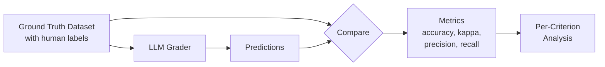
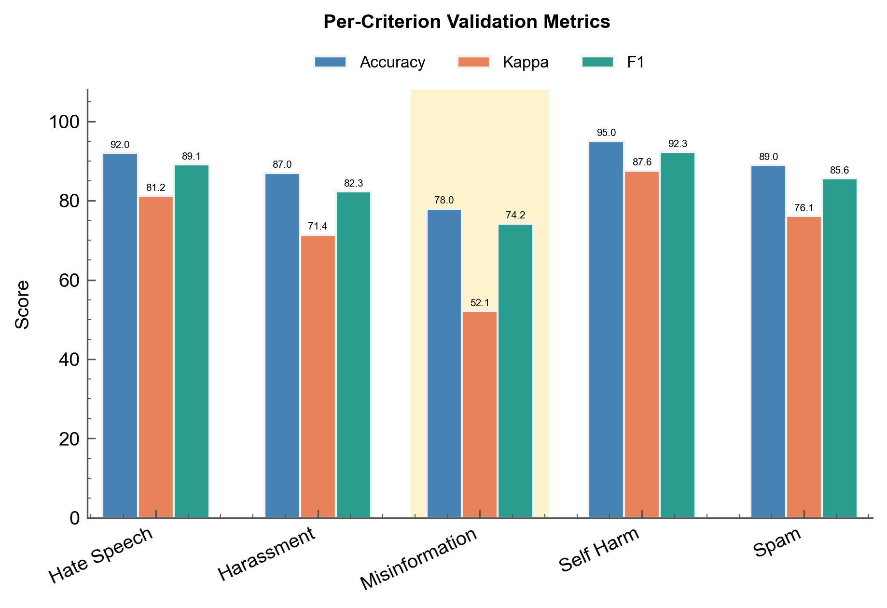

# Validating Your Judge Against Human Labels

Measure how well your LLM judge agrees with human evaluators.

## The Scenario

You've deployed an LLM judge for content moderation. Before trusting it at scale, you need to validate it against human moderator decisions. You have 100 items with human labels and want comprehensive metrics: accuracy, precision, recall, Cohen's kappa, and analysis of systematic biases.

## What You'll Learn

- Using `compute_metrics()` with ground truth datasets
- Interpreting accuracy, precision, recall, F1, and kappa
- Detecting systematic bias with `metrics.bias`
- Per-criterion breakdown for targeted improvements
- Bootstrap confidence intervals for statistical rigor
- Reading Matthews φ, macro vs micro aggregation, and the confusion matrix (FPR/FNR)

## The Solution



### Step 1: Prepare Your Validation Dataset

Load a dataset with human-labeled ground truth:

```python
from autorubric import RubricDataset

# Load dataset with ground truth labels
dataset = RubricDataset.from_file("content_moderation_labeled.json")

print(f"Dataset: {dataset.name}")
print(f"Items: {len(dataset)}")
print(f"Criteria: {dataset.criterion_names}")

# Verify ground truth coverage
items_with_gt = sum(1 for item in dataset if item.ground_truth is not None)
print(f"Items with ground truth: {items_with_gt}/{len(dataset)}")
```

### Step 2: Run Evaluation

Evaluate the dataset with your grader:

```python
from autorubric import LLMConfig, evaluate
from autorubric.graders import CriterionGrader

grader = CriterionGrader(
    llm_config=LLMConfig(model="openai/gpt-4.1-mini", temperature=0.0)
)

# Run evaluation
result = await evaluate(
    dataset,
    grader,
    show_progress=True,
    experiment_name="judge-validation-v1"
)

print(f"Evaluated: {result.successful_items}/{result.total_items}")
print(f"Cost: ${result.total_completion_cost or 0:.4f}")
```

### Step 3: Compute Validation Metrics

Use `compute_metrics()` to compare predictions against ground truth:

```python
metrics = result.compute_metrics(dataset)

# Metric fields are `float | None` — None when genuinely undefined (e.g. precision/
# recall/F1 for a rubric with no binary MET class, or kappa on a degenerate class).
# Guard the format spec so the snippet never crashes on None.
def pct(x):
    return f"{x:.1%}" if x is not None else "n/a"

def num(x):
    return f"{x:.3f}" if x is not None else "n/a"

# Overall metrics
print("=" * 50)
print("OVERALL VALIDATION METRICS")
print("=" * 50)
print(f"Criterion Accuracy:  {pct(metrics.criterion_accuracy)}")
print(f"Cohen's Kappa:       {num(metrics.mean_kappa)}")
print(f"Precision (MET):     {pct(metrics.criterion_precision)}")
print(f"Recall (MET):        {pct(metrics.criterion_recall)}")
print(f"F1 Score:            {num(metrics.criterion_f1)}")
```

### Interpreting the Metrics

| Metric | What It Measures | Good Value |
|--------|-----------------|------------|
| **Accuracy** | % of verdicts matching ground truth | >85% |
| **Cohen's Kappa** | Agreement beyond chance | >0.6 (substantial) |
| **Precision** | Of predicted MET, % actually MET | Depends on use case |
| **Recall** | Of actual MET, % predicted MET | Depends on use case |
| **F1** | Harmonic mean of precision/recall | >0.7 |

!!! tip "Kappa Interpretation"
    | Kappa | Agreement Level |
    |-------|-----------------|
    | < 0.2 | Slight |
    | 0.2–0.4 | Fair |
    | 0.4–0.6 | Moderate |
    | 0.6–0.8 | Substantial |
    | > 0.8 | Near perfect |

### Step 4: Per-Criterion Analysis

Identify which criteria need improvement:

```python
print("\nPER-CRITERION BREAKDOWN")
print("-" * 50)
print(f"{'Criterion':<25} {'Acc':>8} {'Kappa':>8} {'F1':>8}")
print("-" * 50)

# Per-criterion metrics are `float | None`; render None as a right-aligned "n/a".
def cell(x, width, fmt):
    return f"{x:>{width}.{fmt}}" if x is not None else f"{'n/a':>{width}}"

for cr_metrics in metrics.per_criterion:
    print(f"{cr_metrics.name:<25} {cell(cr_metrics.accuracy, 7, '1%')} "
          f"{cell(cr_metrics.kappa, 8, '3f')} {cell(cr_metrics.f1, 8, '3f')}")
```

Sample output:

```
PER-CRITERION BREAKDOWN
--------------------------------------------------
Criterion                      Acc    Kappa       F1
--------------------------------------------------
hate_speech                  92.0%    0.812    0.891
harassment                   87.0%    0.714    0.823
misinformation               78.0%    0.521    0.742
self_harm                    95.0%    0.876    0.923
spam                         89.0%    0.761    0.856
```



The `misinformation` criterion has lower kappa—consider few-shot calibration or clearer criteria definition.

### Step 5: Detect Systematic Bias

Check if the judge systematically over- or under-predicts MET:

```python
bias = metrics.bias

print(f"\nSystematic Bias Analysis:")
# BiasResult numeric fields are `float | None` — None when undefined (mean_bias at
# n=0; p_value / effect_size when there is too little data). Guard before formatting.
def num(x):
    return f"{x:.3f}" if x is not None else "n/a"

print(f"  Mean bias: {num(bias.mean_bias)}")
print(f"  Bias direction: {bias.direction}")  # "positive", "negative", or "none"
print(f"  Statistically significant: {bias.is_significant}")
print(f"  P-value: {bias.p_value:.4f}" if bias.p_value is not None else "  P-value: n/a")
print(f"  Effect size: {num(bias.effect_size)}")
```

- **Permissive bias**: Judge marks MET more often than humans
- **Strict bias**: Judge marks MET less often than humans

!!! note "Remediation strategies for judge bias"
    When bias is detected, several options can bring the judge closer to human agreement.
    Adding few-shot examples of correctly labeled edge cases often fixes borderline misclassifications.
    Rewording ambiguous criteria reduces disagreement that stems from unclear requirements rather than model error.
    Upgrading to a more capable model or using ensemble judging across multiple models both reduce individual model bias at the cost of higher inference spend.

### Step 6: Bootstrap Confidence Intervals

Get statistical confidence in your metrics:

```python
metrics = result.compute_metrics(
    dataset,
    bootstrap=True,
    n_bootstrap=1000,
    confidence_level=0.95,
    seed=42
)

# criterion_accuracy / mean_kappa are `float | None` (None when undefined).
acc = metrics.criterion_accuracy
kappa = metrics.mean_kappa
# Bootstrap CIs are `tuple[float, float] | None` (None on no-samples / all-degenerate
# resamples), so guard before subscripting.
acc_ci = metrics.bootstrap.accuracy_ci
kappa_ci = metrics.bootstrap.kappa_ci
print(f"\nAccuracy: {acc:.1%}" if acc is not None else "\nAccuracy: n/a")
print(f"  95% CI: [{acc_ci[0]:.1%}, {acc_ci[1]:.1%}]" if acc_ci is not None else "  95% CI: n/a")

print(f"\nKappa: {kappa:.3f}" if kappa is not None else "\nKappa: n/a")
print(f"  95% CI: [{kappa_ci[0]:.3f}, {kappa_ci[1]:.3f}]" if kappa_ci is not None else "  95% CI: n/a")
```

!!! warning "Bootstrap Cost"
    Bootstrap analysis is computationally expensive. For quick iteration,
    use `bootstrap=False` during development, then enable for final validation.

### Step 7: Score Correlation

Check how well predicted scores correlate with ground truth scores:

```python
print(f"\nScore Correlation:")
# CorrelationResult.coefficient is `float | None` (None for a constant array or < 3 samples).
def corr(c):
    return f"{c:.3f}" if c is not None else "n/a"

print(f"  Pearson:  {corr(metrics.score_pearson.coefficient)}")
print(f"  Spearman: {corr(metrics.score_spearman.coefficient)}")
print(f"  RMSE:     {metrics.score_rmse:.3f}")
```

High correlation (>0.8) indicates the judge ranks items similarly to humans, even if individual verdicts differ.

### Step 8: Matthews φ, Macro vs Micro, and the Confusion Matrix

Accuracy and kappa summarize agreement, but two further diagnostics tell you *why* a judge disagrees and *where* its errors land.

**Matthews correlation (φ).** The φ coefficient is the Matthews correlation coefficient on the binary {MET, UNMET} dichotomy. `compute_metrics()` exposes it at two levels: the aggregate `metrics.criterion_phi` (pooled over every binary decision) and per binary criterion as `cr_metrics.phi`.

```python
# Aggregate Matthews phi is `float | None` (None for a multi-choice-only rubric,
# or when a class is entirely absent so the coefficient is undefined).
print(f"\nMatthews phi (aggregate, MET/UNMET): {num(metrics.criterion_phi)}")

print("\nPER-CRITERION phi vs kappa")
print("-" * 50)
print(f"{'Criterion':<25} {'Kappa':>8} {'Phi':>8}")
print("-" * 50)
for cr_metrics in metrics.per_criterion:
    # phi is only defined for binary criteria; multi-choice criteria expose no `.phi`.
    if cr_metrics.criterion_type != "binary":
        continue
    print(f"{cr_metrics.name:<25} "
          f"{cell(cr_metrics.kappa, 8, '3f')} {cell(cr_metrics.phi, 8, '3f')}")
```

!!! note "When to read φ vs κ"
    On binary data φ coincides with Pearson/Spearman/Kendall and the MCC — they are *one* statistic, not corroborating evidence. The useful signal is the **κ–φ relationship**:

    - **φ == κ** when the judge's MET rate matches the human's (matched marginals). Agreement is genuine, not an artifact of base rates.
    - **φ > κ** when the judge's positive (MET) rate drifts away from the human's. The κ–φ gap *is* that positive-rate drift, so a wide gap flags a judge that is systematically more permissive or stricter than the labels — corroborate with `metrics.bias` from Step 5.
    - **φ is None** when one class is entirely absent (all-MET or all-UNMET ground truth), where the coefficient is genuinely undefined. The framework returns `None` rather than a misleading `0.0` — so always guard before formatting.

    Reach for φ when you suspect base-rate imbalance is inflating or deflating accuracy; reach for κ as the headline chance-corrected agreement number.

**Macro vs micro accuracy.** `metrics.criterion_accuracy` is the *micro* accuracy: it pools every decision, so a high-support criterion dominates. `metrics.macro_accuracy` is the unweighted mean across criteria, so each criterion counts equally regardless of how often it fires. `metrics.micro_kappa` is the analogous pooled Cohen's kappa (versus the per-criterion mean in `metrics.mean_kappa`).

```python
# micro pools decisions (high-support criteria dominate); macro averages criteria equally.
print(f"\nAccuracy (micro): {pct(metrics.criterion_accuracy)}")
print(f"Accuracy (macro): {pct(metrics.macro_accuracy)}")
print(f"Kappa (micro):    {num(metrics.micro_kappa)}")
print(f"Kappa (macro):    {num(metrics.mean_kappa)}")
```

A large micro-vs-macro split means a few frequent criteria are carrying the headline number while rarer criteria fare differently — inspect the per-criterion breakdown from Step 4.

**Confusion matrix, FPR/FNR, and degeneracy.** Each binary criterion carries a 2×2 `ConfusionMatrix` (rows = ground truth, columns = prediction; labels `["MET", "UNMET"]`) plus derived false-positive / false-negative rates. `is_degenerate` flags a criterion that *had* samples but whose ground truth collapsed onto a single class, so kappa could not be estimated.

```python
print("\nCONFUSION & ERROR RATES (binary criteria)")
print("-" * 50)
for cr_metrics in metrics.per_criterion:
    if cr_metrics.criterion_type != "binary":
        continue
    if cr_metrics.is_degenerate:
        # Had samples but a single ground-truth class — agreement is undefined.
        print(f"{cr_metrics.name}: degenerate (single class, kappa undefined)")
        continue

    cm = cr_metrics.confusion_matrix  # ConfusionMatrix | None
    if cm is None:
        print(f"{cr_metrics.name}: no samples")
        continue

    # tp/fp/fn/tn are defined on the binary 2x2 layout (labels[0] == "MET").
    print(f"{cr_metrics.name}:")
    print(f"  TP={cm.tp}  FP={cm.fp}  FN={cm.fn}  TN={cm.tn}")
    # fpr / fnr are `float | None` (None when their denominator is zero).
    print(f"  FPR={num(cr_metrics.fpr)}  FNR={num(cr_metrics.fnr)}")
```

Illustrative output (your numbers will differ):

```
CONFUSION & ERROR RATES (binary criteria)
--------------------------------------------------
hate_speech:
  TP=8  FP=1  FN=2  TN=89
  FPR=0.011  FNR=0.200
misinformation:
  TP=6  FP=9  FN=4  TN=81
  FPR=0.100  FNR=0.400
```

A high **FNR** means the judge misses real violations (it under-predicts MET — a strict judge); a high **FPR** means it flags clean content (it over-predicts MET — a permissive judge). This decomposes the systematic bias from Step 5 into the two error directions, so you can choose remediation (e.g. few-shot examples of the missed class) per criterion.

### Step 9: Export Results

Save metrics for reporting:

```python
# Get summary as text
print(metrics.summary())

# Export to DataFrame for analysis
df = metrics.to_dataframe()
df.to_csv("validation_results.csv")
```

## Key Takeaways

- **`compute_metrics()`** provides comprehensive validation against ground truth
- **Cohen's kappa** is more meaningful than accuracy for imbalanced labels
- **Per-criterion analysis** identifies weak spots for targeted improvement
- **Systematic bias** detection reveals if judge is too permissive or strict
- **Matthews φ** vs kappa exposes positive-rate drift (φ > κ); macro vs micro reveals whether frequent criteria dominate the headline number
- **Confusion matrix** with FPR/FNR decomposes errors into misses vs false flags per criterion
- **Bootstrap CIs** provide statistical confidence in your metrics
- **Score correlation** shows overall ranking agreement

## Going Further

- [Few-Shot Calibration](few-shot-calibration.md) - Improve accuracy on weak criteria
- [Ensemble Judging](ensemble-judging.md) - Reduce bias with multiple judges
- [API Reference: Metrics](../api/metrics.md) - Full metrics documentation

---

## Appendix: Complete Code

```python
"""Judge Validation - Content Moderation Evaluation"""

import asyncio
from autorubric import (
    Rubric, RubricDataset, CriterionVerdict,
    LLMConfig, evaluate
)
from autorubric.graders import CriterionGrader


def create_moderation_dataset() -> RubricDataset:
    """Create a content moderation dataset with human labels."""

    rubric = Rubric.from_dict([
        {
            "name": "hate_speech",
            "weight": -15.0,
            "requirement": "Contains hate speech targeting protected groups"
        },
        {
            "name": "harassment",
            "weight": -12.0,
            "requirement": "Contains harassment or bullying directed at individuals"
        },
        {
            "name": "misinformation",
            "weight": -10.0,
            "requirement": "Contains demonstrably false claims about health/safety"
        },
        {
            "name": "appropriate_content",
            "weight": 10.0,
            "requirement": "Content is appropriate for general audience"
        }
    ])

    dataset = RubricDataset(
        prompt="Moderate this user-generated content.",
        rubric=rubric,
        name="content-moderation-v1"
    )

    # Sample content with human moderator labels
    # In practice, these would come from your human annotation process
    items = [
        {
            "submission": "I love this product! Works great for my family.",
            "description": "Positive review",
            "ground_truth": [CriterionVerdict.UNMET, CriterionVerdict.UNMET,
                           CriterionVerdict.UNMET, CriterionVerdict.MET]
        },
        {
            "submission": "This group of people are all criminals and should be deported.",
            "description": "Hate speech",
            "ground_truth": [CriterionVerdict.MET, CriterionVerdict.UNMET,
                           CriterionVerdict.UNMET, CriterionVerdict.UNMET]
        },
        {
            "submission": "The vaccine contains microchips for mind control.",
            "description": "Health misinformation",
            "ground_truth": [CriterionVerdict.UNMET, CriterionVerdict.UNMET,
                           CriterionVerdict.MET, CriterionVerdict.UNMET]
        },
        {
            "submission": "Just tried the new restaurant downtown. The pasta was amazing!",
            "description": "Normal review",
            "ground_truth": [CriterionVerdict.UNMET, CriterionVerdict.UNMET,
                           CriterionVerdict.UNMET, CriterionVerdict.MET]
        },
        {
            "submission": "@username you're so stupid, everyone hates you, just quit already",
            "description": "Direct harassment",
            "ground_truth": [CriterionVerdict.UNMET, CriterionVerdict.MET,
                           CriterionVerdict.UNMET, CriterionVerdict.UNMET]
        },
        {
            "submission": "Studies show 5G towers cause cancer. Wake up sheeple!",
            "description": "Health misinformation",
            "ground_truth": [CriterionVerdict.UNMET, CriterionVerdict.UNMET,
                           CriterionVerdict.MET, CriterionVerdict.UNMET]
        },
        {
            "submission": "Thanks for the help! Your customer service team is wonderful.",
            "description": "Positive feedback",
            "ground_truth": [CriterionVerdict.UNMET, CriterionVerdict.UNMET,
                           CriterionVerdict.UNMET, CriterionVerdict.MET]
        },
        {
            "submission": "Anyone else notice the weather has been weird lately?",
            "description": "Neutral observation",
            "ground_truth": [CriterionVerdict.UNMET, CriterionVerdict.UNMET,
                           CriterionVerdict.UNMET, CriterionVerdict.MET]
        },
        {
            "submission": "[Religious group] are taking over the country. We need to stop them.",
            "description": "Religious discrimination",
            "ground_truth": [CriterionVerdict.MET, CriterionVerdict.UNMET,
                           CriterionVerdict.UNMET, CriterionVerdict.UNMET]
        },
        {
            "submission": "The product arrived damaged. Very disappointed with shipping.",
            "description": "Negative but appropriate review",
            "ground_truth": [CriterionVerdict.UNMET, CriterionVerdict.UNMET,
                           CriterionVerdict.UNMET, CriterionVerdict.MET]
        }
    ]

    for item in items:
        dataset.add_item(**item)

    return dataset


async def main():
    # Create/load dataset
    dataset = create_moderation_dataset()
    print(f"Dataset: {dataset.name}")
    print(f"Items: {len(dataset)}")
    print(f"Criteria: {dataset.criterion_names}")

    # Configure grader
    grader = CriterionGrader(
        llm_config=LLMConfig(model="openai/gpt-4.1-mini", temperature=0.0)
    )

    # Run evaluation
    print("\n" + "=" * 60)
    print("RUNNING EVALUATION")
    print("=" * 60)

    result = await evaluate(
        dataset,
        grader,
        show_progress=True,
        experiment_name="moderation-validation"
    )

    print(f"\nEvaluated: {result.successful_items}/{result.total_items}")
    print(f"Cost: ${result.total_completion_cost or 0:.4f}")

    # Compute validation metrics
    print("\n" + "=" * 60)
    print("VALIDATION METRICS")
    print("=" * 60)

    metrics = result.compute_metrics(dataset)

    # Metric fields are `float | None`; None when genuinely undefined (never a fake 0.0).
    def pct(x):
        return f"{x:.1%}" if x is not None else "n/a"

    def num(x):
        return f"{x:.3f}" if x is not None else "n/a"

    def cell(x, width, fmt):
        return f"{x:>{width}.{fmt}}" if x is not None else f"{'n/a':>{width}}"

    print(f"\nOverall Metrics:")
    print(f"  Criterion Accuracy:  {pct(metrics.criterion_accuracy)}")
    print(f"  Cohen's Kappa:       {num(metrics.mean_kappa)}")
    print(f"  Precision (MET):     {pct(metrics.criterion_precision)}")
    print(f"  Recall (MET):        {pct(metrics.criterion_recall)}")
    print(f"  F1 Score:            {num(metrics.criterion_f1)}")

    # Per-criterion breakdown
    print("\n" + "-" * 60)
    print("PER-CRITERION METRICS")
    print("-" * 60)
    print(f"{'Criterion':<20} {'Acc':>8} {'Kappa':>8} {'Prec':>8} {'Recall':>8}")
    print("-" * 60)

    for cr_metrics in metrics.per_criterion:
        print(f"{cr_metrics.name:<20} {cell(cr_metrics.accuracy, 7, '1%')} "
              f"{cell(cr_metrics.kappa, 8, '3f')} {cell(cr_metrics.precision, 7, '1%')} "
              f"{cell(cr_metrics.recall, 7, '1%')}")

    # Score correlation
    print("\n" + "-" * 60)
    print("SCORE CORRELATION")
    print("-" * 60)
    # CorrelationResult.coefficient is None for a constant array or < 3 samples.
    print(f"  Pearson r:   {num(metrics.score_pearson.coefficient)}")
    print(f"  Spearman ρ:  {num(metrics.score_spearman.coefficient)}")
    print(f"  RMSE:        {metrics.score_rmse:.3f}")

    # Bias analysis
    print("\n" + "-" * 60)
    print("BIAS ANALYSIS")
    print("-" * 60)

    # Count predicted vs ground truth MET rates
    pred_met = 0
    gt_met = 0
    total = 0

    for item_result in result.item_results:
        if item_result.error:
            continue
        item = item_result.item
        if item.ground_truth is None:
            continue

        for j, cr in enumerate(item_result.report.report or []):
            total += 1
            if cr.final_verdict == CriterionVerdict.MET:
                pred_met += 1
            if item.ground_truth[j] == CriterionVerdict.MET:
                gt_met += 1

    if total > 0:
        pred_rate = pred_met / total
        gt_rate = gt_met / total
        direction = "permissive" if pred_rate > gt_rate else "strict"
        magnitude = abs(pred_rate - gt_rate)

        print(f"  Predicted MET rate:    {pred_rate:.1%}")
        print(f"  Ground truth MET rate: {gt_rate:.1%}")
        print(f"  Bias direction:        {direction}")
        print(f"  Bias magnitude:        {magnitude:.1%}")


if __name__ == "__main__":
    asyncio.run(main())
```
