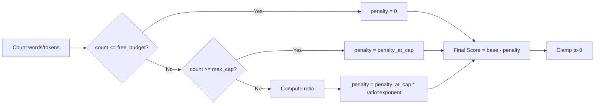
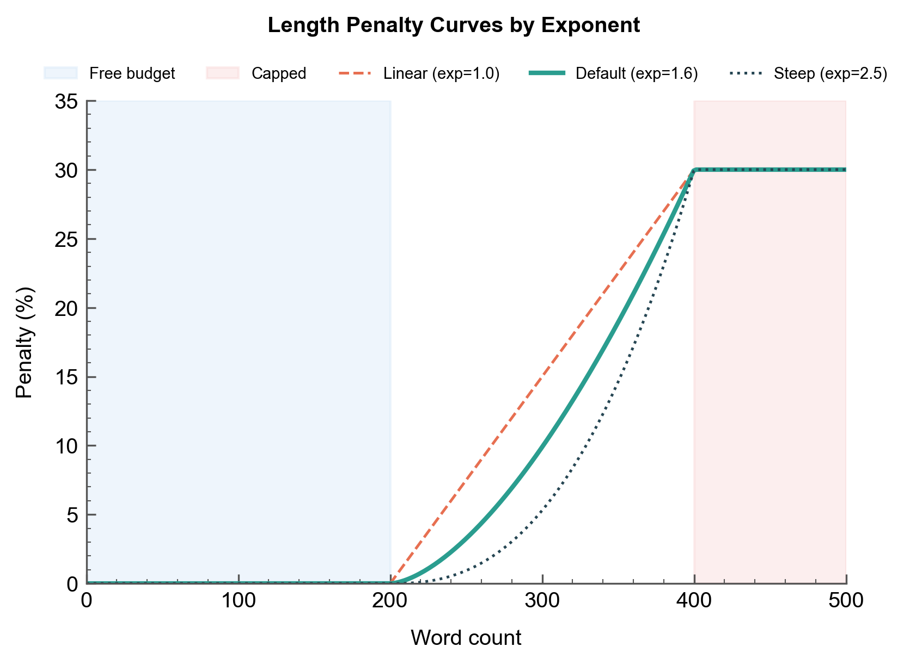

# Controlling Verbosity with Length Penalty

Penalize overly verbose responses when brevity matters.

## The Scenario

You're evaluating executive summaries for business reports. These summaries should be concise—under 200 words is ideal, and anything over 400 words defeats the purpose. You want to score both content quality and brevity, penalizing responses that ramble.

## What You'll Learn

- Configuring `LengthPenalty` with budget and cap
- Understanding the penalty curve via `exponent`
- Using custom tokenizers with `count_fn`
- Applying `OUTPUT_ONLY` penalty with extended thinking
- Integrating length penalty with content rubrics

## The Solution



### Step 1: Define Content Quality Criteria

First, create a rubric for summary quality:

```python
from autorubric import Rubric

rubric = Rubric.from_dict([
    {
        "name": "key_findings",
        "weight": 12.0,
        "requirement": "Captures the most important findings from the report"
    },
    {
        "name": "actionable_recommendations",
        "weight": 10.0,
        "requirement": "Includes clear, actionable recommendations"
    },
    {
        "name": "executive_appropriate",
        "weight": 8.0,
        "requirement": "Written at appropriate level for executive audience (no jargon)"
    },
    {
        "name": "logical_flow",
        "weight": 6.0,
        "requirement": "Information flows logically from findings to recommendations"
    },
    {
        "name": "missing_critical_info",
        "weight": -10.0,
        "requirement": "Omits critical information that executives would need"
    }
])
```

### Step 2: Configure Length Penalty

Add a length penalty that kicks in after the "free budget":

```python
from autorubric import LengthPenalty, LLMConfig
from autorubric.graders import CriterionGrader

grader = CriterionGrader(
    llm_config=LLMConfig(model="openai/gpt-4.1-mini"),
    length_penalty=LengthPenalty(
        free_budget=200,      # No penalty up to 200 words
        max_cap=400,          # Maximum penalty at 400+ words
        penalty_at_cap=0.3,   # Lose up to 30% of score
        exponent=1.6,         # Penalty curve steepness
    )
)
```

### Understanding the Penalty Curve

The penalty is calculated as:

```
if count <= free_budget:
    penalty = 0
elif count >= max_cap:
    penalty = penalty_at_cap
else:
    ratio = (count - free_budget) / (max_cap - free_budget)
    penalty = penalty_at_cap * (ratio ** exponent)
```

| Words | Penalty (exponent=1.6) |
|-------|------------------------|
| 200 | 0% (within budget) |
| 250 | ~5% |
| 300 | ~12% |
| 350 | ~21% |
| 400+ | 30% (capped) |



!!! tip "Exponent Tuning"
    - **Higher exponent** (2.0+): More lenient near free_budget, steep increase near cap
    - **Lower exponent** (1.0): Linear penalty growth
    - **1.5-1.8**: Good balance for most use cases

### Step 3: Custom Token Counting

By default, length is counted by whitespace-split words. For precise token counting:

```python
# Using tiktoken for OpenAI models
import tiktoken

encoder = tiktoken.encoding_for_model("gpt-4")

grader = CriterionGrader(
    llm_config=LLMConfig(model="openai/gpt-4.1-mini"),
    length_penalty=LengthPenalty(
        free_budget=800,   # 800 tokens
        max_cap=1200,      # 1200 tokens
        penalty_at_cap=0.3,
        count_fn=lambda text: len(encoder.encode(text)),
    )
)
```

### Step 4: Grade with Length Penalty

```python
import asyncio

# A concise summary (good)
concise_summary = """
Q3 revenue exceeded targets by 12%, driven by enterprise adoption.
Key recommendations: expand sales team in APAC region, accelerate
product roadmap for SMB features. Risk: competitor pricing pressure
in European markets requires monitoring.
"""

# A verbose summary (penalized)
verbose_summary = """
This executive summary provides a comprehensive overview of our
third quarter performance metrics and associated strategic recommendations.
Our revenue performance this quarter has been notably strong, with
actual results exceeding our previously established targets by a
margin of approximately 12 percentage points. This growth can be
primarily attributed to increased adoption rates among our enterprise
customer segment, which has shown particular interest in our advanced
analytics capabilities and integration features.

Looking forward, we have identified several key recommendations that
warrant executive attention. First, we believe there is significant
opportunity for expansion of our sales organization in the Asia-Pacific
region, where market conditions appear favorable. Second, we recommend
accelerating our product development roadmap with a specific focus on
features targeted at the small and medium business segment.

It is also important to note certain risk factors that require ongoing
monitoring. Competitive dynamics in European markets have intensified,
with several competitors implementing aggressive pricing strategies
that may impact our market position if left unaddressed.
"""

async def main():
    concise_result = await rubric.grade(
        to_grade=concise_summary,
        grader=grader,
        query="Summarize Q3 business performance."
    )

    verbose_result = await rubric.grade(
        to_grade=verbose_summary,
        grader=grader,
        query="Summarize Q3 business performance."
    )

    # Count words
    concise_words = len(concise_summary.split())
    verbose_words = len(verbose_summary.split())

    print(f"Concise ({concise_words} words): Score = {concise_result.score:.2f}")
    print(f"Verbose ({verbose_words} words): Score = {verbose_result.score:.2f}")

asyncio.run(main())
```

Sample output:

```
Concise (48 words): Score = 0.92
Verbose (198 words): Score = 0.68
```

The verbose summary scores lower despite potentially good content because it exceeds the word budget.

### Step 5: Training Mode with Raw Scores

For RL training, you may want unnormalized scores with absolute penalties:

```python
grader = CriterionGrader(
    llm_config=LLMConfig(model="openai/gpt-4.1-mini"),
    normalize=False,  # Return raw weighted sum
    length_penalty=LengthPenalty(
        free_budget=200,
        max_cap=400,
        penalty_at_cap=50.0,  # Subtract up to 50 points
        exponent=1.6,
    )
)

# With normalize=False:
# - Base score: sum of MET weights (e.g., 36.0)
# - Penalty subtracted directly (e.g., -15.0 for 300 words)
# - Final raw_score: 21.0
```

| Property | Normalized Mode | Raw Mode |
|---|---|---|
| Score range | 0.0 - 1.0 | Unbounded weighted sum |
| `penalty_at_cap` meaning | Fraction of score removed (e.g., 0.3 = 30%) | Absolute points subtracted (e.g., 50.0) |
| `free_budget` | Words/tokens before any penalty applies | Same |
| Typical use case | Leaderboard ranking, human-readable reports | RL reward shaping, training signal |
| How penalty is applied | `score * (1 - penalty)` | `raw_score - penalty` |

### Step 6: OUTPUT_ONLY with Extended Thinking

When using extended thinking, penalize only the output, not the reasoning:

```python
grader = CriterionGrader(
    llm_config=LLMConfig(
        model="anthropic/claude-sonnet-4-5-20250929",
        thinking="high",
    ),
    length_penalty=LengthPenalty(
        free_budget=200,
        max_cap=400,
        penalty_at_cap=0.3,
        penalty_type="OUTPUT_ONLY",  # Don't count thinking tokens
    )
)

# Submit response with thinking section
response = {
    "thinking": "Let me analyze this carefully... [long reasoning]",
    "output": "Q3 revenue exceeded targets by 12%..."  # Only this counts
}

result = await rubric.grade(
    to_grade=response,
    grader=grader,
    query=query
)
```

!!! note "Structured Input"
    When using `penalty_type="OUTPUT_ONLY"` or `"THINKING_ONLY"`, you can pass
    `to_grade` as a dict with `"thinking"` and `"output"` keys. The penalty
    applies only to the specified section.

## Key Takeaways

- **`free_budget`**: Words/tokens allowed without penalty
- **`max_cap`**: Length at which maximum penalty applies
- **`penalty_at_cap`**: Maximum penalty (0.3 = 30% for normalized scores)
- **`exponent`**: Controls curve shape (higher = more lenient near budget)
- **`count_fn`**: Custom function for precise token counting
- **`penalty_type`**: TARGET `ALL`, `OUTPUT_ONLY`, or `THINKING_ONLY`
- **`normalize=False`**: Use absolute penalties for training

## Going Further

- [Extended Thinking](extended-thinking.md) - Combine with reasoning
- [Batch Evaluation](batch-evaluation.md) - Length statistics across datasets
- [API Reference: Length Penalty](../api/length-penalty.md) - Full documentation

---

## Appendix: Complete Code

```python
"""Length Penalty - Executive Summary Evaluation"""

import asyncio
from autorubric import Rubric, LLMConfig, LengthPenalty
from autorubric.graders import CriterionGrader


# Sample executive summaries of varying lengths
SUMMARIES = [
    {
        "text": """
Q3 revenue exceeded targets by 12%, driven by enterprise adoption.
Key recommendations: expand sales team in APAC region, accelerate
product roadmap for SMB features. Risk: competitor pricing pressure
in European markets requires monitoring.
""",
        "description": "Ideal - concise and complete"
    },
    {
        "text": """
Revenue up. Sales good. Recommend hiring. Watch competitors.
""",
        "description": "Too brief - lacks substance"
    },
    {
        "text": """
This executive summary provides a comprehensive overview of our
third quarter performance metrics and associated strategic recommendations.

Our revenue performance this quarter has been notably strong, with
actual results exceeding our previously established targets by a
margin of approximately twelve percentage points. This growth can be
primarily attributed to increased adoption rates among our enterprise
customer segment, which has shown particular interest in our advanced
analytics capabilities and integration features.

The enterprise segment specifically demonstrated robust growth patterns,
with new customer acquisition rates increasing by 23% compared to the
previous quarter. Customer retention metrics have also improved, with
churn rates decreasing to 4.2% from 5.8% in Q2.

Looking forward, we have identified several key recommendations that
warrant executive attention and resource allocation. First and foremost,
we believe there is significant opportunity for expansion of our sales
organization in the Asia-Pacific region, where market conditions appear
favorable and competitor presence remains relatively limited.

Second, we recommend accelerating our product development roadmap with
a specific focus on features targeted at the small and medium business
segment, which represents an underserved market opportunity.

It is also important to note certain risk factors that require ongoing
monitoring and potential mitigation strategies. Competitive dynamics in
European markets have intensified significantly, with several competitors
implementing aggressive pricing strategies that may impact our market
position if left unaddressed.
""",
        "description": "Too verbose - excessive detail"
    },
    {
        "text": """
Q3 highlights: 12% revenue beat, enterprise segment driving growth with
23% new customer increase. Churn improved to 4.2%.

Priorities:
1. APAC sales expansion (favorable conditions, limited competition)
2. Accelerate SMB product features
3. Monitor EU pricing pressure from competitors

Action needed: Budget approval for Q4 APAC hiring plan.
""",
        "description": "Good balance - detailed but focused"
    },
    {
        "text": """
Third quarter results are in and they look good overall. We made more
money than we expected which is always nice. The enterprise customers
seem to like what we're doing.

I think we should probably hire more salespeople, maybe in Asia or
somewhere like that. Also the product team should build more stuff.

Oh and we should keep an eye on what competitors are doing, especially
in Europe where things seem competitive. That's about it really.

Let me know if you have questions!
""",
        "description": "Informal and vague"
    },
    {
        "text": """
Q3 Financial Summary:
- Revenue: $42.3M (vs $37.8M target, +12%)
- Enterprise ARR: $28.1M (+18% QoQ)
- SMB ARR: $14.2M (+4% QoQ)
- Churn: 4.2% (down from 5.8%)

Strategic Recommendations:
1. APAC Expansion: Add 8 sales reps in Singapore/Sydney offices
   - Expected ROI: 6 months to breakeven
   - Budget required: $1.2M

2. SMB Product Investment: Fast-track self-serve onboarding
   - Engineering allocation: 2 sprints
   - Expected impact: +15% SMB conversion

Risk Monitoring:
- EU competitors (Acme Corp) reduced pricing 20%
- Mitigation: Value-based positioning, customer success investment
""",
        "description": "Structured with specific metrics"
    }
]


async def main():
    # Define content quality rubric
    rubric = Rubric.from_dict([
        {
            "name": "key_findings",
            "weight": 12.0,
            "requirement": "Captures the most important findings and metrics"
        },
        {
            "name": "actionable_recommendations",
            "weight": 10.0,
            "requirement": "Includes clear, specific, actionable recommendations"
        },
        {
            "name": "executive_appropriate",
            "weight": 8.0,
            "requirement": "Written at appropriate level for executive audience"
        },
        {
            "name": "quantified_impact",
            "weight": 6.0,
            "requirement": "Quantifies business impact with specific numbers"
        },
        {
            "name": "missing_critical_info",
            "weight": -10.0,
            "requirement": "Omits critical information executives would need"
        }
    ])

    # Grader with length penalty
    grader = CriterionGrader(
        llm_config=LLMConfig(model="openai/gpt-4.1-mini", temperature=0.0),
        length_penalty=LengthPenalty(
            free_budget=100,      # No penalty up to 100 words
            max_cap=250,          # Max penalty at 250+ words
            penalty_at_cap=0.25,  # Lose up to 25% of score
            exponent=1.6,
        )
    )

    # Grader without length penalty (for comparison)
    grader_no_penalty = CriterionGrader(
        llm_config=LLMConfig(model="openai/gpt-4.1-mini", temperature=0.0)
    )

    print("=" * 75)
    print("EXECUTIVE SUMMARY EVALUATION - LENGTH PENALTY ANALYSIS")
    print("=" * 75)
    print(f"Length penalty: free_budget=100, max_cap=250, penalty_at_cap=25%")
    print()

    print(f"{'Description':<35} {'Words':>6} {'No Pen':>8} {'With Pen':>9} {'Delta':>7}")
    print("-" * 75)

    for summary in SUMMARIES:
        word_count = len(summary["text"].split())

        # Evaluate without penalty
        result_no_pen = await rubric.grade(
            to_grade=summary["text"],
            grader=grader_no_penalty,
            query="Summarize Q3 business performance for executive review."
        )

        # Evaluate with penalty
        result_with_pen = await rubric.grade(
            to_grade=summary["text"],
            grader=grader,
            query="Summarize Q3 business performance for executive review."
        )

        delta = result_with_pen.score - result_no_pen.score
        delta_str = f"{delta:+.2f}" if delta != 0 else "0.00"

        print(f"{summary['description']:<35} {word_count:>6} {result_no_pen.score:>8.2f} "
              f"{result_with_pen.score:>9.2f} {delta_str:>7}")

    # Detailed breakdown for one example
    print("\n" + "=" * 75)
    print("DETAILED BREAKDOWN: Verbose Summary")
    print("=" * 75)

    verbose = SUMMARIES[2]
    result = await rubric.grade(
        to_grade=verbose["text"],
        grader=grader,
        query="Summarize Q3 business performance for executive review."
    )

    print(f"Word count: {len(verbose['text'].split())}")
    print(f"Final score: {result.score:.2f}")
    print(f"Raw score: {result.raw_score:.2f}")
    print("\nPer-criterion verdicts:")
    for cr in result.report:
        verdict = cr.final_verdict.value
        print(f"  [{verdict}] {cr.criterion.name} (weight: {cr.criterion.weight:+.0f})")


if __name__ == "__main__":
    asyncio.run(main())
```
