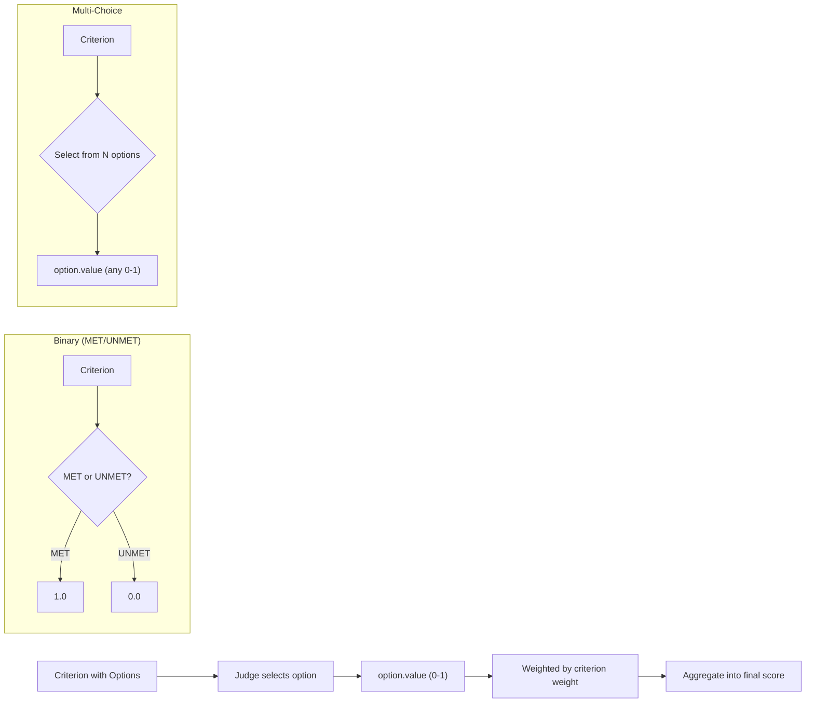

# Multi-Choice Rubrics for Nuanced Assessment

Go beyond binary MET/UNMET with ordinal and nominal scales for granular evaluation.

## The Scenario

You're evaluating restaurant reviews for a review platform. Simple "good/bad" doesn't capture the nuance—you need Likert scales for quality dimensions and categorical ratings for specific aspects. Some reviews might be excellent on detail but neutral on helpfulness.

## What You'll Learn

- Creating multi-choice criteria with `CriterionOption`
- Ordinal vs nominal scales with `scale_type`
- Handling NA options for inapplicable criteria
- Position bias mitigation with `shuffle_options`
- Interpreting `MultiChoiceVerdict` results

## The Solution



### Step 1: Define Ordinal (Likert) Criteria

For criteria with ordered options (1-5 scales, agreement levels):

```python
from autorubric import Rubric, Criterion, CriterionOption

# Ordinal criterion: options have inherent order
detail_criterion = Criterion(
    name="detail_level",
    weight=10.0,
    requirement="How detailed and informative is this review?",
    scale_type="ordinal",
    options=[
        CriterionOption(label="Very Poor - No useful details", value=0.0),
        CriterionOption(label="Poor - Minimal details", value=0.25),
        CriterionOption(label="Average - Some useful details", value=0.5),
        CriterionOption(label="Good - Detailed and helpful", value=0.75),
        CriterionOption(label="Excellent - Comprehensive with specifics", value=1.0),
    ]
)
```

!!! tip "Value Assignment"
    Assign `value` explicitly (0.0 to 1.0) rather than relying on position.
    This avoids position bias and makes scoring intentional.

### Step 2: Define Nominal (Categorical) Criteria

For criteria with unordered categories:

```python
# Nominal criterion: categories without inherent order
tone_criterion = Criterion(
    name="review_tone",
    weight=5.0,
    requirement="What is the overall tone of this review?",
    scale_type="nominal",
    options=[
        CriterionOption(label="Positive", value=1.0),
        CriterionOption(label="Neutral", value=0.5),
        CriterionOption(label="Negative", value=0.0),
        CriterionOption(label="Mixed", value=0.5),
    ]
)
```

### Step 3: Add NA Options for Inapplicable Cases

Some reviews may not cover certain aspects:

```python
# Criterion with NA option
service_criterion = Criterion(
    name="service_rating",
    weight=8.0,
    requirement="How does the reviewer rate the service quality?",
    scale_type="ordinal",
    options=[
        CriterionOption(label="Very Poor service", value=0.0),
        CriterionOption(label="Poor service", value=0.25),
        CriterionOption(label="Average service", value=0.5),
        CriterionOption(label="Good service", value=0.75),
        CriterionOption(label="Excellent service", value=1.0),
        CriterionOption(label="N/A - Service not mentioned", value=0.0, na=True),
    ]
)
```

!!! note "NA Handling"
    Options with `na=True` are treated like `CANNOT_ASSESS` for binary criteria.
    They're excluded from scoring when the `SKIP` strategy is used (default).

### Step 4: Build the Complete Rubric

Combine multi-choice and binary criteria:

```python
rubric = Rubric([
    # Multi-choice ordinal
    Criterion(
        name="detail_level",
        weight=10.0,
        requirement="How detailed and informative is this review?",
        scale_type="ordinal",
        options=[
            CriterionOption(label="Very Poor", value=0.0),
            CriterionOption(label="Poor", value=0.25),
            CriterionOption(label="Average", value=0.5),
            CriterionOption(label="Good", value=0.75),
            CriterionOption(label="Excellent", value=1.0),
        ]
    ),
    # Multi-choice nominal
    Criterion(
        name="review_tone",
        weight=5.0,
        requirement="What is the overall tone of this review?",
        scale_type="nominal",
        options=[
            CriterionOption(label="Positive", value=1.0),
            CriterionOption(label="Neutral", value=0.5),
            CriterionOption(label="Negative", value=0.0),
            CriterionOption(label="Mixed", value=0.5),
        ]
    ),
    # Multi-choice with NA
    Criterion(
        name="food_quality",
        weight=12.0,
        requirement="How does the reviewer rate the food quality?",
        scale_type="ordinal",
        options=[
            CriterionOption(label="Terrible", value=0.0),
            CriterionOption(label="Below Average", value=0.25),
            CriterionOption(label="Average", value=0.5),
            CriterionOption(label="Above Average", value=0.75),
            CriterionOption(label="Outstanding", value=1.0),
            CriterionOption(label="Not discussed", value=0.0, na=True),
        ]
    ),
    # Binary criterion (still supported)
    Criterion(
        name="spam_content",
        weight=-10.0,
        requirement="Review contains spam or promotional content"
    ),
])
```

### Step 5: Configure the Grader

Enable option shuffling to mitigate position bias:

```python
from autorubric import LLMConfig
from autorubric.graders import CriterionGrader

grader = CriterionGrader(
    llm_config=LLMConfig(model="openai/gpt-4.1-mini"),
    shuffle_options=True,  # Randomize option order (default)
)
```

!!! warning "Position Bias"
    LLMs tend to favor options presented earlier in the list.
    `shuffle_options=True` (default) randomizes presentation order and maps
    responses back to original indices, mitigating this bias.

### Step 6: Grade and Interpret Results

```python
import asyncio

review = """
Last night's dinner at Bistro Luna was exceptional. The pan-seared salmon
was perfectly cooked with a crispy skin and buttery interior. The accompanying
risotto was creamy without being heavy. Service was attentive but not intrusive -
our server knew the wine list well and made excellent pairing suggestions.
The ambiance was romantic with soft lighting and well-spaced tables.

Only minor issue: the dessert menu was limited. We opted for tiramisu which
was good but not memorable. Still, at $85 per person including wine, it's
excellent value for the quality.
"""

async def main():
    result = await rubric.grade(
        to_grade=review,
        grader=grader,
        query="Evaluate this restaurant review."
    )
    return result

result = asyncio.run(main())

# Print results
print(f"Overall Score: {result.score:.2f}\n")

for criterion in result.report:
    name = criterion.criterion.name

    if criterion.final_verdict is not None:
        # Binary criterion
        print(f"[{criterion.final_verdict.value}] {name}")
    else:
        # Multi-choice criterion
        mc = criterion.final_multi_choice_verdict
        print(f"[{mc.selected_label}] {name}")
        print(f"  Value: {mc.value:.2f}")
        if mc.na:
            print(f"  (Not applicable)")

    print(f"  Reason: {criterion.final_reason}\n")
```

Sample output:

```
Overall Score: 0.89

[Excellent] detail_level
  Value: 1.00
  Reason: Review provides specific details about dishes, service, ambiance, and pricing.

[Positive] review_tone
  Value: 1.00
  Reason: Overall positive with only minor criticism of dessert menu.

[Above Average] food_quality
  Value: 0.75
  Reason: Reviewer praises the salmon and risotto highly, mild criticism of dessert.

[UNMET] spam_content
  Reason: No promotional or spam content detected.
```

### Step 7: Ensemble Aggregation for Multi-Choice

With ensembles, multi-choice votes are aggregated differently based on scale type:

```python
grader = CriterionGrader(
    judges=[...],
    ordinal_aggregation="mean",  # Mean of values, snap to nearest option
    nominal_aggregation="mode",  # Most common selection
)
```

**Ordinal aggregation strategies:**

- `mean`: Average values, snap to nearest option
- `median`: Median value, snap to nearest
- `weighted_mean`: Weighted by judge weights
- `mode`: Most common selection

**Nominal aggregation strategies:**

- `mode`: Most common selection (majority)
- `weighted_mode`: Weighted by judge weights
- `unanimous`: All must agree (else fallback to mode)

| Property | Ordinal | Nominal |
|---|---|---|
| Option ordering | Matters - options have inherent rank | Does not matter - categories are unordered |
| Agreement metric | Weighted kappa (penalizes distant disagreements more) | Unweighted kappa (all disagreements equal) |
| Ensemble aggregation | Mean, median, or mode of option values | Mode or weighted mode of selections |
| When to use | Quality ratings, Likert scales, satisfaction levels | Sentiment type, content category, tone classification |
| Example | "Very Poor / Poor / Average / Good / Excellent" | "Positive / Neutral / Negative / Mixed" |

## Key Takeaways

- **Ordinal scales** for ordered options (satisfaction, quality ratings)
- **Nominal scales** for unordered categories (sentiment, type)
- **Explicit values** (0.0-1.0) avoid position bias in scoring
- **NA options** handle inapplicable criteria gracefully
- **`shuffle_options=True`** mitigates LLM position bias
- **Multi-choice and binary** can coexist in the same rubric

## Going Further

- [Judge Validation](judge-validation.md) - Weighted kappa for ordinal agreement
- [Ensemble Judging](ensemble-judging.md) - Aggregating multi-choice votes
- [API Reference: Multi-Choice](../api/multi-choice.md) - Full documentation

---

## Appendix: Complete Code

```python
"""Multi-Choice Rubrics - Restaurant Review Evaluation"""

import asyncio
from autorubric import Rubric, Criterion, CriterionOption, LLMConfig
from autorubric.graders import CriterionGrader


# Sample restaurant reviews
REVIEWS = [
    {
        "text": """
Last night's dinner at Bistro Luna was exceptional. The pan-seared salmon
was perfectly cooked with a crispy skin and buttery interior. The accompanying
risotto was creamy without being heavy. Service was attentive but not intrusive -
our server knew the wine list well and made excellent pairing suggestions.
The ambiance was romantic with soft lighting and well-spaced tables.

Only minor issue: the dessert menu was limited. We opted for tiramisu which
was good but not memorable. Still, at $85 per person including wine, it's
excellent value for the quality.
""",
        "description": "Detailed positive review with minor criticism"
    },
    {
        "text": """
Meh. Food was okay I guess. Nothing special. Wouldn't go out of my way to
come back but wouldn't avoid it either.
""",
        "description": "Vague neutral review"
    },
    {
        "text": """
DO NOT EAT HERE!!! Waited 45 minutes for cold pasta. The waiter was rude
when I complained. Manager didn't care. $60 wasted. ZERO STARS.
""",
        "description": "Angry negative review"
    },
    {
        "text": """
The new tasting menu is a culinary journey worth taking. Chef Maria's
interpretation of classic French techniques with local ingredients creates
unexpected harmonies. The course progression - from delicate amuse-bouche
through robust mains to ethereal desserts - demonstrates masterful pacing.

Standouts: the deconstructed bouillabaisse, and the 36-hour braised short
rib. Wine pairings ($75 supplement) are thoughtfully curated.

Note: Vegetarian tasting menu available with advance notice.
""",
        "description": "Sophisticated positive review"
    },
    {
        "text": """
Great spot for brunch! The avocado toast was Instagram-worthy and actually
tasty. Bloody Marys are strong. Gets crowded on weekends so arrive early.
Parking is tricky - use the lot behind the building.
""",
        "description": "Casual helpful review"
    },
    {
        "text": """
I had high hopes based on reviews but was disappointed. The $40 steak was
overcooked despite ordering medium-rare. However, the appetizers (especially
the crab cakes) were excellent, and the cocktails creative. Mixed bag overall.
""",
        "description": "Mixed review with specific details"
    },
    {
        "text": """
Perfect for business dinners. Private rooms available, excellent wine list,
professional service. Food is solid upscale American - nothing risky but
reliably good. Expense account friendly.
""",
        "description": "Practical business-focused review"
    },
    {
        "text": """
GET 50% OFF YOUR FIRST ORDER WITH CODE FOODIE50! This restaurant is
AMAZING and you should definitely try their new app for exclusive deals!
Download now at...
""",
        "description": "Spam/promotional content"
    }
]


async def main():
    # Build multi-choice rubric
    rubric = Rubric([
        Criterion(
            name="detail_level",
            weight=10.0,
            requirement="How detailed and informative is this review?",
            scale_type="ordinal",
            options=[
                CriterionOption(label="Very Poor - No useful details", value=0.0),
                CriterionOption(label="Poor - Minimal details", value=0.25),
                CriterionOption(label="Average - Some useful information", value=0.5),
                CriterionOption(label="Good - Detailed and helpful", value=0.75),
                CriterionOption(label="Excellent - Comprehensive with specifics", value=1.0),
            ]
        ),
        Criterion(
            name="review_tone",
            weight=5.0,
            requirement="What is the overall tone of this review?",
            scale_type="nominal",
            options=[
                CriterionOption(label="Positive", value=1.0),
                CriterionOption(label="Neutral", value=0.5),
                CriterionOption(label="Negative", value=0.0),
                CriterionOption(label="Mixed", value=0.5),
            ]
        ),
        Criterion(
            name="food_rating",
            weight=12.0,
            requirement="How does the reviewer rate the food quality?",
            scale_type="ordinal",
            options=[
                CriterionOption(label="Terrible", value=0.0),
                CriterionOption(label="Below Average", value=0.25),
                CriterionOption(label="Average", value=0.5),
                CriterionOption(label="Above Average", value=0.75),
                CriterionOption(label="Outstanding", value=1.0),
                CriterionOption(label="Not mentioned", value=0.0, na=True),
            ]
        ),
        Criterion(
            name="service_rating",
            weight=8.0,
            requirement="How does the reviewer rate the service?",
            scale_type="ordinal",
            options=[
                CriterionOption(label="Terrible", value=0.0),
                CriterionOption(label="Below Average", value=0.25),
                CriterionOption(label="Average", value=0.5),
                CriterionOption(label="Above Average", value=0.75),
                CriterionOption(label="Outstanding", value=1.0),
                CriterionOption(label="Not mentioned", value=0.0, na=True),
            ]
        ),
        Criterion(
            name="actionable_info",
            weight=6.0,
            requirement="Does the review provide actionable information (prices, tips, recommendations)?",
            scale_type="ordinal",
            options=[
                CriterionOption(label="None", value=0.0),
                CriterionOption(label="Minimal", value=0.33),
                CriterionOption(label="Moderate", value=0.67),
                CriterionOption(label="Extensive", value=1.0),
            ]
        ),
        Criterion(
            name="spam_content",
            weight=-15.0,
            requirement="Contains spam, promotional content, or fake review indicators"
        ),
    ])

    # Configure grader
    grader = CriterionGrader(
        llm_config=LLMConfig(model="openai/gpt-4.1-mini", temperature=0.0),
        shuffle_options=True,
    )

    print("=" * 70)
    print("RESTAURANT REVIEW QUALITY ASSESSMENT")
    print("=" * 70)

    for i, review in enumerate(REVIEWS, 1):
        result = await rubric.grade(
            to_grade=review["text"],
            grader=grader,
            query="Evaluate this restaurant review for quality and helpfulness."
        )

        print(f"\n{'─' * 70}")
        print(f"Review {i}: {review['description']}")
        print(f"Score: {result.score:.2f}")
        print(f"{'─' * 70}")

        for cr in result.report:
            if cr.final_verdict is not None:
                # Binary
                verdict_str = f"[{cr.final_verdict.value}]"
            else:
                # Multi-choice
                mc = cr.final_multi_choice_verdict
                na_marker = " (N/A)" if mc.na else ""
                verdict_str = f"[{mc.selected_label}]{na_marker}"

            print(f"  {verdict_str} {cr.criterion.name}")


if __name__ == "__main__":
    asyncio.run(main())
```
