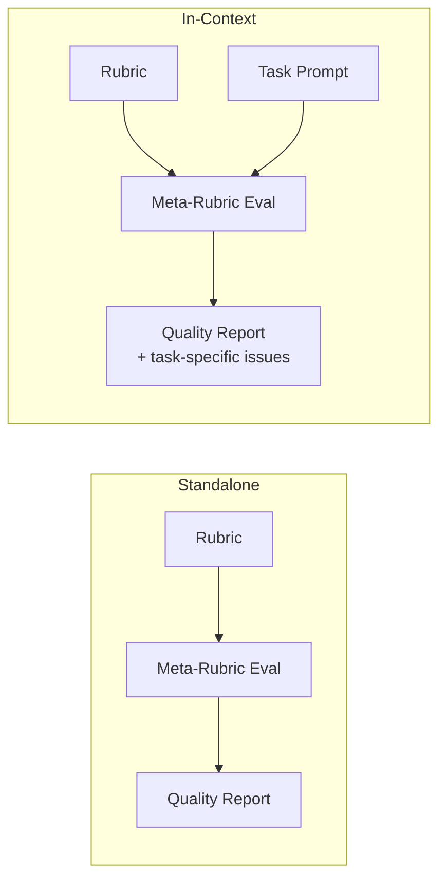

# Evaluating Rubric Quality

Use meta-rubrics to identify and fix issues in your grading rubrics before deployment.

## The Scenario

You're at a research lab building an automated system to evaluate LLM-generated peer reviews of scientific papers. Before deploying at scale, you want to ensure your rubrics are:

- Clear and unambiguous for LLM judges
- Free of common anti-patterns (vague language, double-barreled criteria)
- Well-aligned with academic peer review standards
- Capable of distinguishing quality levels in reviews

AutoRubric's meta-rubric module lets you evaluate rubric quality before using them for actual grading—catching issues early when they're cheap to fix.

## What You'll Learn

- How to evaluate rubric quality in isolation (standalone)
- How to evaluate rubric-task alignment (in-context)
- How to interpret meta-rubric scores and feedback
- How to iterate on rubric design based on feedback
- How to generate HTML reports for stakeholder review
- Patterns for batch evaluation and CI/CD integration

## The Solution



### Step 1: The Problem Rubric

Let's start with a rubric for evaluating peer reviews. This rubric has several common anti-patterns:

```python
from autorubric import Rubric

# A rubric with common anti-patterns (annotated)
flawed_rubric = Rubric.from_dict([
    {
        "name": "thoroughness",
        "weight": 10,
        # Double-barreled: assesses three distinct things
        "requirement": "Review is thorough, insightful, and constructive"
    },
    {
        "name": "methodology",
        "weight": 8,
        # Vague: what does "good" mean?
        "requirement": "Good assessment of methodology"
    },
    {
        "name": "professionalism",
        "weight": 5,
        # Generic boilerplate: could apply to any task
        "requirement": "Review is professional and appropriate"
    },
    {
        "name": "strengths_weaknesses",
        "weight": 10,
        # Double-barreled: two distinct things
        "requirement": "Identifies strengths and weaknesses"
    },
    {
        "name": "factual_errors",
        "weight": -8,
        # Hedging language: "may" makes assessment uncertain
        "requirement": "May contain factual errors"
    }
])
```

These anti-patterns hurt grading quality in different ways:

| Anti-Pattern | Impact |
|--------------|--------|
| Double-barreled | Unclear what verdict to give when only some aspects are met |
| Vague wording | Different judges interpret differently, reducing consistency |
| Generic boilerplate | Doesn't capture task-specific quality dimensions |
| Hedging language | Judges can't give definitive MET/UNMET verdicts |

### Step 2: Standalone Evaluation

Run `evaluate_rubric_standalone()` to assess intrinsic rubric quality:

```python
import asyncio
from autorubric import LLMConfig
from autorubric.meta import evaluate_rubric_standalone

llm_config = LLMConfig(model="openai/gpt-4.1-mini", temperature=0.0)

async def main():
    result = await evaluate_rubric_standalone(
        flawed_rubric,
        llm_config,
        display="stdout"  # Print results to terminal
    )
    return result

result = asyncio.run(main())
```

The output shows per-section results with verdicts and explanations:

```
═══════════════════════════════════════════════════════════════
STANDALONE EVALUATION (rubric quality in isolation)
Evaluating rubric with 5 criteria
═══════════════════════════════════════════════════════════════

Section: Clarity & Precision
─────────────────────────────────────────────────────────────────
[UNMET] clear_requirements (weight: 10)
  Several criteria use vague language that different raters would
  interpret differently (e.g., "good", "professional").

[UNMET] unidimensional (weight: 10)
  Multiple criteria assess several distinct constructs in one
  requirement ("thorough, insightful, and constructive").

Section: Anti-Patterns
─────────────────────────────────────────────────────────────────
[MET] double_barreled (weight: -8)
  "thoroughness" and "strengths_weaknesses" both combine multiple
  assessments into single criteria.

[MET] vague_wording (weight: -8)
  "methodology" uses "good" without defining what constitutes good.

[MET] hedging_language (weight: -6)
  "factual_errors" uses "may" which makes definitive assessment impossible.

═══════════════════════════════════════════════════════════════
SCORE: 0.42
═══════════════════════════════════════════════════════════════
```

### Step 3: Understanding Meta-Rubric Criteria

The standalone meta-rubric evaluates four areas:

| Section | What It Checks |
|---------|---------------|
| **Clarity & Precision** | Clear requirements, specific language, single-dimension criteria, behavioral language |
| **Structure & Design** | Reasonable criteria count, balanced weights, non-overlapping criteria |
| **LLM-Friendliness** | Independent verification, objectivity, well-defined multi-choice options |
| **Anti-Patterns** | Double-barreled, vague, circular, overlapping, verbose, hedging, generic (negative weights) |

Anti-pattern criteria have **negative weights**—a verdict of MET means the issue was detected:

```python
from autorubric.meta import get_standalone_meta_rubric

# Inspect the meta-rubric itself
meta_rubric = get_standalone_meta_rubric()

for criterion in meta_rubric.rubric:
    if criterion.weight < 0:
        print(f"  [{criterion.weight:+.0f}] {criterion.name}")
```

```
  [-8] double_barreled
  [-8] vague_wording
  [-6] circular_tautological
  [-6] excessive_overlap
  [-6] overly_verbose
  [-6] hedging_language
  [-8] generic_boilerplate
```

!!! warning "Negative weights and MET verdicts"
    For negative-weight criteria, a MET verdict means the undesirable behavior was detected.
    This is the correct pattern: set the weight to a negative value when the criterion
    describes something bad (e.g., "contains factual errors"). Do not use a positive weight
    and invert the requirement wording --- that breaks the scoring algebra.

### Step 4: In-Context Evaluation

Standalone evaluation checks intrinsic quality, but doesn't know your task. Use `evaluate_rubric_in_context()` to also assess task alignment:

```python
from autorubric.meta import evaluate_rubric_in_context

task_prompt = """
Evaluate the quality of an LLM-generated peer review of a scientific paper.

The peer review should:
1. Assess whether the methodology is appropriate for the research questions
2. Identify any statistical or technical errors in the analysis
3. Evaluate the clarity and organization of the paper
4. Provide actionable suggestions for improvement
5. Maintain a constructive, professional tone

The review should NOT simply summarize the paper.
"""

async def main():
    result = await evaluate_rubric_in_context(
        flawed_rubric,
        task_prompt,
        llm_config,
        display="stdout"
    )
    return result

result = asyncio.run(main())
```

In-context evaluation adds two more sections:

```
Section: Construct Alignment (In-Context)
─────────────────────────────────────────────────────────────────
[UNMET] task_aligned (weight: 12)
  Task requires assessing statistical/technical errors, but rubric
  only vaguely mentions "methodology".

[UNMET] covers_key_aspects (weight: 10)
  Missing coverage of: clarity/organization assessment, actionable
  suggestions, avoiding summary.

Section: Anti-Patterns (In-Context)
─────────────────────────────────────────────────────────────────
[MET] missing_critical (weight: -10)
  Rubric fails to assess statistical/technical errors and
  actionable suggestions, both explicitly required by the task.
```

### Step 5: Comparing Standalone vs In-Context

| Mode | What It Catches | When to Use |
|------|-----------------|-------------|
| **Standalone** | Intrinsic issues: vague wording, double-barreled, hedging, structure | Early rubric development, reusable rubric libraries |
| **In-Context** | Task alignment: missing critical aspects, irrelevant criteria, discriminative power | Before deployment for a specific task |

Some issues only surface with task context:

| Issue | Standalone | In-Context |
|-------|------------|------------|
| Vague wording | Detects | Detects |
| Double-barreled criteria | Detects | Detects |
| Missing critical task requirements | Cannot detect | **Detects** |
| Irrelevant criteria for task | Cannot detect | **Detects** |
| Poor discriminative power | Cannot detect | **Detects** |

!!! tip "Use Both"
    Run standalone first to fix intrinsic issues, then in-context to ensure task alignment.

### Step 6: Iterating on the Rubric

Fix issues one by one based on the feedback. Here's an improved rubric:

```python
improved_rubric = Rubric.from_dict([
    {
        "name": "methodology_assessment",
        "weight": 10,
        # Fixed: Specific, single-dimension
        "requirement": "Evaluates whether the research methodology is appropriate for the stated research questions"
    },
    {
        "name": "technical_accuracy",
        "weight": 10,
        # Fixed: Clear, no hedging
        "requirement": "Technical claims about the paper's methods or results are factually correct"
    },
    {
        "name": "specific_feedback",
        "weight": 8,
        # Fixed: Specific, observable behavior
        "requirement": "Provides specific, actionable suggestions for improvement with concrete examples"
    },
    {
        "name": "scope_coverage",
        "weight": 8,
        # Fixed: Addresses task requirement
        "requirement": "Addresses all major sections of the paper (introduction, methods, results, discussion)"
    },
    {
        "name": "constructive_tone",
        "weight": 5,
        # Fixed: Behavioral, not generic
        "requirement": "Criticism is framed constructively with suggestions rather than dismissive statements"
    },
    {
        "name": "factual_errors",
        "weight": -10,
        # Fixed: No hedging, clear what triggers it
        "requirement": "Contains incorrect statements about the paper's content or methodology"
    },
    {
        "name": "superficial",
        "weight": -8,
        # Fixed: Observable behavior
        "requirement": "Provides only surface-level observations without substantive analysis"
    }
])
```

Re-evaluate to verify improvements:

```python
async def compare_rubrics():
    print("FLAWED RUBRIC")
    print("-" * 40)
    flawed_result = await evaluate_rubric_in_context(
        flawed_rubric, task_prompt, llm_config, display="stdout"
    )

    print("\nIMPROVED RUBRIC")
    print("-" * 40)
    improved_result = await evaluate_rubric_in_context(
        improved_rubric, task_prompt, llm_config, display="stdout"
    )

    print("\nSCORE COMPARISON")
    print("-" * 40)
    print(f"  Flawed:   {flawed_result.score:.2f}")
    print(f"  Improved: {improved_result.score:.2f}")
    print(f"  Delta:    {improved_result.score - flawed_result.score:+.2f}")

asyncio.run(compare_rubrics())
```

Expected output:

```
SCORE COMPARISON
----------------------------------------
  Flawed:   0.35
  Improved: 0.89
  Delta:    +0.54
```

### Step 7: Generating HTML Reports

For documentation or stakeholder review, generate HTML reports:

```python
async def generate_reports():
    # Standalone report
    await evaluate_rubric_standalone(
        improved_rubric,
        llm_config,
        display="html",
        output_html_path="rubric_standalone_report.html"
    )

    # In-context report
    await evaluate_rubric_in_context(
        improved_rubric,
        task_prompt,
        llm_config,
        display="html",
        output_html_path="rubric_in_context_report.html"
    )

    print("Reports generated:")
    print("  - rubric_standalone_report.html")
    print("  - rubric_in_context_report.html")

asyncio.run(generate_reports())
```

The HTML reports include:

- Score summary with visual progress bar
- Per-section breakdown with expandable details
- Color-coded verdicts (green for passed, red for issues)
- Full reasoning for each criterion
- Timestamp and configuration details

### Step 8: Batch Evaluation of Multiple Rubrics

Compare rubric variants to find the best design:

```python
async def compare_variants():
    variants = {
        "v1_minimal": Rubric.from_dict([
            {"name": "quality", "weight": 10, "requirement": "Review is high quality"}
        ]),
        "v2_detailed": improved_rubric,
        "v3_strict": Rubric.from_dict([
            # ... stricter version
        ])
    }

    results = {}
    for name, rubric in variants.items():
        result = await evaluate_rubric_in_context(
            rubric, task_prompt, llm_config
        )
        results[name] = result

    # Comparison table
    print(f"{'Variant':<20} {'Score':>8} {'Criteria':>10}")
    print("-" * 40)
    for name, result in results.items():
        n_criteria = len(variants[name].rubric)
        print(f"{name:<20} {result.score:>8.2f} {n_criteria:>10}")

asyncio.run(compare_variants())
```

### Step 9: Integrating into CI/CD

Add rubric quality gates to your pipeline:

```python
import sys

async def validate_rubric(rubric_path: str, task_path: str, threshold: float = 0.7):
    """Validate rubric quality in CI/CD pipeline."""
    rubric = Rubric.from_file(rubric_path)
    with open(task_path, encoding="utf-8") as f:
        task_prompt = f.read()

    llm_config = LLMConfig(model="openai/gpt-4.1-mini", temperature=0.0)

    result = await evaluate_rubric_in_context(
        rubric, task_prompt, llm_config,
        display="html",
        output_html_path="rubric_validation_report.html"
    )

    print(f"Rubric quality score: {result.score:.2f}")
    print(f"Threshold: {threshold:.2f}")
    print(f"Report: rubric_validation_report.html")

    if result.score < threshold:
        print(f"FAILED: Score {result.score:.2f} below threshold {threshold:.2f}")
        sys.exit(1)
    else:
        print("PASSED: Rubric meets quality threshold")
        sys.exit(0)

# Usage: python validate_rubric.py rubric.json task.txt --threshold 0.7
```

In your CI configuration:

```yaml
# .github/workflows/validate-rubric.yml
- name: Validate Rubric Quality
  run: python validate_rubric.py rubrics/peer_review.json prompts/task.txt
  env:
    OPENAI_API_KEY: ${{ secrets.OPENAI_API_KEY }}

- name: Upload Validation Report
  uses: actions/upload-artifact@v4
  with:
    name: rubric-validation-report
    path: rubric_validation_report.html
```

!!! note "Choosing a quality threshold"
    A threshold of 0.7 is permissive and appropriate during early rubric iteration, when
    you want fast feedback without blocking on marginal issues. For production rubrics,
    raise the bar to 0.85 or higher. The right value depends on your tolerance for false
    positives (rejecting an acceptable rubric) versus false negatives (passing a flawed one).

## Key Takeaways

- **Always evaluate rubrics before large-scale deployment**—catching issues early saves rework
- **Standalone evaluation** checks intrinsic quality: clarity, structure, LLM-friendliness
- **In-context evaluation** checks task alignment and discriminative power
- **Anti-pattern criteria have negative weights**—MET means the issue was detected
- **Common anti-patterns**: double-barreled, vague wording, hedging language, generic boilerplate
- **Iterate based on feedback**: fix one issue at a time, re-evaluate
- **HTML reports** are useful for documentation, stakeholder review, and audit trails
- **Automated quality gates** in CI/CD prevent deploying flawed rubrics

## Going Further

- [Automated Rubric Improvement](automated-rubric-improvement.md) - LLM-driven iterative refinement
- [Meta-Rubric API Reference](../api/meta.md) - Full documentation
- [Judge Validation](judge-validation.md) - Measuring agreement with human labels
- [Your First Evaluation](first-evaluation.md) - Basic rubric creation
- [Configuration Management](configuration-management.md) - Sharing rubrics across teams

---

## Appendix: Complete Code

```python
"""Evaluating Rubric Quality - Peer Review Evaluation System"""

import asyncio
from autorubric import Rubric, LLMConfig
from autorubric.meta import (
    evaluate_rubric_standalone,
    evaluate_rubric_in_context,
    get_standalone_meta_rubric,
)


# Task prompt for peer review evaluation
TASK_PROMPT = """
Evaluate the quality of an LLM-generated peer review of a scientific paper.

The peer review should:
1. Assess whether the methodology is appropriate for the research questions
2. Identify any statistical or technical errors in the analysis
3. Evaluate the clarity and organization of the paper
4. Provide actionable suggestions for improvement
5. Maintain a constructive, professional tone

The review should NOT simply summarize the paper.
"""


def create_flawed_rubric() -> Rubric:
    """Create a rubric with common anti-patterns for demonstration."""
    return Rubric.from_dict([
        {
            "name": "thoroughness",
            "weight": 10,
            "requirement": "Review is thorough, insightful, and constructive"
        },
        {
            "name": "methodology",
            "weight": 8,
            "requirement": "Good assessment of methodology"
        },
        {
            "name": "professionalism",
            "weight": 5,
            "requirement": "Review is professional and appropriate"
        },
        {
            "name": "strengths_weaknesses",
            "weight": 10,
            "requirement": "Identifies strengths and weaknesses"
        },
        {
            "name": "factual_errors",
            "weight": -8,
            "requirement": "May contain factual errors"
        }
    ])


def create_improved_rubric() -> Rubric:
    """Create an improved rubric with issues fixed."""
    return Rubric.from_dict([
        {
            "name": "methodology_assessment",
            "weight": 10,
            "requirement": "Evaluates whether the research methodology is appropriate for the stated research questions"
        },
        {
            "name": "technical_accuracy",
            "weight": 10,
            "requirement": "Technical claims about the paper's methods or results are factually correct"
        },
        {
            "name": "specific_feedback",
            "weight": 8,
            "requirement": "Provides specific, actionable suggestions for improvement with concrete examples"
        },
        {
            "name": "scope_coverage",
            "weight": 8,
            "requirement": "Addresses all major sections of the paper (introduction, methods, results, discussion)"
        },
        {
            "name": "constructive_tone",
            "weight": 5,
            "requirement": "Criticism is framed constructively with suggestions rather than dismissive statements"
        },
        {
            "name": "factual_errors",
            "weight": -10,
            "requirement": "Contains incorrect statements about the paper's content or methodology"
        },
        {
            "name": "superficial",
            "weight": -8,
            "requirement": "Provides only surface-level observations without substantive analysis"
        }
    ])


async def main():
    llm_config = LLMConfig(model="openai/gpt-4.1-mini", temperature=0.0)

    flawed_rubric = create_flawed_rubric()
    improved_rubric = create_improved_rubric()

    # Show meta-rubric anti-pattern criteria
    print("=" * 60)
    print("META-RUBRIC ANTI-PATTERN CRITERIA")
    print("=" * 60)
    meta_rubric = get_standalone_meta_rubric()
    for criterion in meta_rubric.rubric:
        if criterion.weight < 0:
            print(f"  [{criterion.weight:+.0f}] {criterion.name}")
    print()

    # Standalone evaluation of flawed rubric
    print("=" * 60)
    print("STANDALONE EVALUATION - FLAWED RUBRIC")
    print("=" * 60)
    flawed_standalone = await evaluate_rubric_standalone(
        flawed_rubric, llm_config, display="stdout"
    )
    print()

    # In-context evaluation of flawed rubric
    print("=" * 60)
    print("IN-CONTEXT EVALUATION - FLAWED RUBRIC")
    print("=" * 60)
    flawed_in_context = await evaluate_rubric_in_context(
        flawed_rubric, TASK_PROMPT, llm_config, display="stdout"
    )
    print()

    # In-context evaluation of improved rubric
    print("=" * 60)
    print("IN-CONTEXT EVALUATION - IMPROVED RUBRIC")
    print("=" * 60)
    improved_in_context = await evaluate_rubric_in_context(
        improved_rubric, TASK_PROMPT, llm_config, display="stdout"
    )
    print()

    # Score comparison
    print("=" * 60)
    print("SCORE COMPARISON")
    print("=" * 60)
    print(f"{'Rubric':<25} {'Standalone':>12} {'In-Context':>12}")
    print("-" * 50)
    print(f"{'Flawed':<25} {flawed_standalone.score:>12.2f} {flawed_in_context.score:>12.2f}")
    print(f"{'Improved':<25} {'N/A':>12} {improved_in_context.score:>12.2f}")
    print("-" * 50)
    print(f"{'Improvement (In-Context)':<25} {'':<12} "
          f"{improved_in_context.score - flawed_in_context.score:>+12.2f}")
    print()

    # Generate HTML reports
    print("=" * 60)
    print("GENERATING HTML REPORTS")
    print("=" * 60)

    await evaluate_rubric_standalone(
        improved_rubric, llm_config,
        display="html",
        output_html_path="improved_rubric_standalone.html"
    )
    print("  - improved_rubric_standalone.html")

    await evaluate_rubric_in_context(
        improved_rubric, TASK_PROMPT, llm_config,
        display="html",
        output_html_path="improved_rubric_in_context.html"
    )
    print("  - improved_rubric_in_context.html")

    print("\nDone!")


if __name__ == "__main__":
    asyncio.run(main())
```
