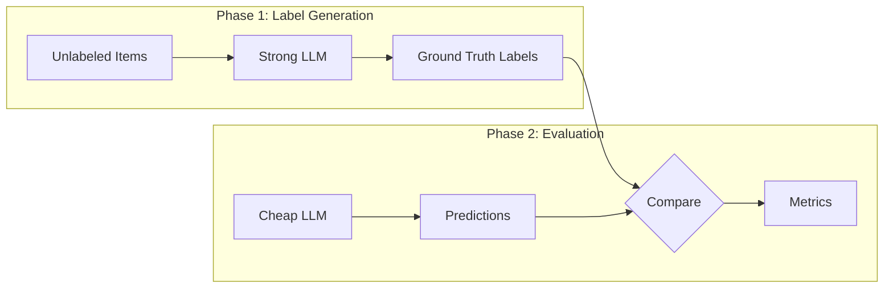

# Generating Synthetic Ground Truth

Bootstrap evaluation by generating labels with a strong model.

## The Scenario

You're evaluating product descriptions for an e-commerce platform. You have 100 unlabeled descriptions and no budget for human annotation. You want to use a powerful model (like GPT-4 or Claude Opus) to generate ground truth labels, then use those labels to evaluate a cheaper model for production.



## What You'll Learn

- Using `fill_ground_truth()` to generate synthetic labels
- Choosing strong models for ground truth generation
- The `force` parameter for re-generating labels
- Filtering items with generation errors
- Evaluating cheaper models against synthetic ground truth

## The Solution

### Step 1: Create an Unlabeled Dataset

Start with items that have no ground truth:

```python
from autorubric import Rubric, RubricDataset

rubric = Rubric.from_dict([
    {
        "name": "accurate_description",
        "weight": 12.0,
        "requirement": "Product description accurately represents the item"
    },
    {
        "name": "key_features",
        "weight": 10.0,
        "requirement": "Lists important features and specifications"
    },
    {
        "name": "compelling_copy",
        "weight": 8.0,
        "requirement": "Copy is engaging and persuasive without being misleading"
    },
    {
        "name": "clear_formatting",
        "weight": 6.0,
        "requirement": "Well-formatted with bullet points or clear structure"
    },
    {
        "name": "misleading_claims",
        "weight": -15.0,
        "requirement": "Contains exaggerated or misleading claims"
    }
])

dataset = RubricDataset(
    prompt="Evaluate this product description for quality.",
    rubric=rubric,
    name="product-descriptions-unlabeled"
)

# Add unlabeled items (no ground_truth)
dataset.add_item(
    submission="""
    Wireless Noise-Canceling Headphones

    Experience premium sound with our flagship headphones featuring:
    • Active Noise Cancellation with 3 levels
    • 30-hour battery life
    • Bluetooth 5.2 with multipoint connection
    • Hi-Res Audio certified (LDAC codec support)
    • Comfortable memory foam ear cushions

    Weight: 250g | Drivers: 40mm | Frequency: 4Hz-40kHz

    Includes: Carrying case, USB-C cable, 3.5mm audio cable
    """,
    description="High-quality tech product listing"
)

# Add more items...
```

### Step 2: Generate Ground Truth with Strong Model

Use `fill_ground_truth()` to label items with a capable model:

```python
from autorubric import LLMConfig
from autorubric.graders import CriterionGrader

# Use a powerful model for ground truth generation
strong_grader = CriterionGrader(
    llm_config=LLMConfig(
        model="openai/gpt-4.1",  # or "anthropic/claude-sonnet-4-5-20250929"
        temperature=0.0,
    )
)

# Generate ground truth for all unlabeled items
labeled_dataset = await dataset.fill_ground_truth(
    grader=strong_grader,
    show_progress=True
)

# Check results
labeled_count = sum(1 for item in labeled_dataset if item.ground_truth is not None)
print(f"Items labeled: {labeled_count}/{len(labeled_dataset)}")
```

!!! warning "Cost Consideration"
    Ground truth generation uses the same grading process as evaluation.
    For large datasets, this can be expensive. Consider labeling a
    representative sample rather than the entire dataset.

### Step 3: Handle Partial Labels and Errors

Some items may fail to label. Filter or retry:

```python
# Check for unlabeled items
unlabeled = [item for item in labeled_dataset if item.ground_truth is None]
if unlabeled:
    print(f"Failed to label {len(unlabeled)} items")

    # Retry with force=True to regenerate
    labeled_dataset = await labeled_dataset.fill_ground_truth(
        grader=strong_grader,
        force=True,  # Re-generate even if ground_truth exists
        show_progress=True
    )

# Or filter to only labeled items for downstream use
clean_items = [item for item in labeled_dataset if item.ground_truth is not None]
```

!!! note "Partial label strategies"
    You do not need to label every criterion for every item. Labeling a
    representative subset of items fully is more cost-effective than labeling
    all items partially, because full labels per item give you reliable
    per-criterion metrics for that subset.

### Step 4: Save the Labeled Dataset

Persist synthetic ground truth for reuse:

```python
# Save to file
labeled_dataset.to_file("product_descriptions_labeled.json")

# The JSON includes ground truth:
# {
#   "items": [
#     {
#       "submission": "...",
#       "description": "High-quality tech listing",
#       "ground_truth": ["MET", "MET", "MET", "MET", "UNMET"]
#     }
#   ]
# }
```

### Step 5: Evaluate a Cheaper Model

Now use the synthetic ground truth to validate a cheaper production model:

```python
from autorubric import evaluate

# Production model (cheaper, faster)
production_grader = CriterionGrader(
    llm_config=LLMConfig(
        model="openai/gpt-4.1-mini",  # or "gemini/gemini-2.0-flash"
        temperature=0.0,
    )
)

# Evaluate against synthetic ground truth
result = await evaluate(
    labeled_dataset,
    production_grader,
    show_progress=True,
    experiment_name="production-model-eval"
)

# Compute metrics against synthetic labels
metrics = result.compute_metrics(labeled_dataset)

print(f"Agreement with GPT-4 labels:")
print(f"  Accuracy: {metrics.criterion_accuracy:.1%}")
print(f"  Kappa: {metrics.mean_kappa:.3f}")
print(f"  Cost: ${result.total_completion_cost:.4f}")
```

### Step 6: Estimate Quality Gap

Compare production model to the ground truth generator:

```python
# Evaluate the strong model against itself (upper bound)
strong_result = await evaluate(
    labeled_dataset,
    strong_grader,
    experiment_name="strong-model-eval"
)

strong_metrics = strong_result.compute_metrics(labeled_dataset)
production_metrics = result.compute_metrics(labeled_dataset)

print("\nModel Comparison:")
print(f"{'Model':<20} {'Accuracy':>10} {'Kappa':>10} {'Cost':>10}")
print("-" * 50)
print(f"{'GPT-4 (GT source)':<20} {strong_metrics.criterion_accuracy:>9.1%} "
      f"{strong_metrics.mean_kappa:>10.3f} ${strong_result.total_completion_cost or 0:>8.4f}")
print(f"{'GPT-4-mini (prod)':<20} {production_metrics.criterion_accuracy:>9.1%} "
      f"{production_metrics.mean_kappa:>10.3f} ${result.total_completion_cost or 0:>8.4f}")
```

Sample output:

```
Model Comparison:
Model                 Accuracy      Kappa       Cost
--------------------------------------------------
GPT-4 (GT source)        100.0%      1.000   $0.0823
GPT-4-mini (prod)         89.0%      0.762   $0.0124
```

| Model | Accuracy | Kappa | Cost |
|-------|----------|-------|------|
| GPT-4 (GT source) | 100.0% | 1.000 | $0.0823 |
| GPT-4-mini (prod) | 89.0% | 0.762 | $0.0124 |

!!! tip "Synthetic Label Limitations"
    Synthetic ground truth is only as good as the generating model.
    If the strong model makes systematic errors, the cheaper model will
    be evaluated against incorrect labels. Consider:

    - Validating a sample of synthetic labels manually
    - Using ensemble generation (multiple strong models)
    - Treating metrics as relative, not absolute

| Scenario | Recommended Approach |
|----------|----------------------|
| No annotation budget, need relative model comparison | Synthetic GT from a strong model |
| High-stakes domain (medical, legal) where errors are costly | Human labels, at least for a validation sample |
| Large dataset, partial budget available | Synthetic GT for bulk labeling, human labels for a validation subset |
| Comparing models from the same provider/family | Synthetic GT from a different provider to avoid shared biases |
| Ground truth already exists from production logs | Use existing labels directly; no generation needed |

## Key Takeaways

- **`fill_ground_truth()`** automates label generation with any grader
- **Use powerful models** for ground truth (GPT-4, Claude Opus/Sonnet)
- **`force=True`** regenerates labels for already-labeled items
- **Save labeled datasets** to avoid regenerating expensive labels
- **Compare model costs** against accuracy when choosing production models
- **Synthetic labels have limitations**—validate a sample when possible

## Going Further

- [Judge Validation](judge-validation.md) - Validate against human labels
- [Cost Optimization](cost-optimization.md) - Balance accuracy and cost
- [Batch Evaluation](batch-evaluation.md) - Large-scale evaluation with checkpoints

---

## Appendix: Complete Code

```python
"""Synthetic Ground Truth - Product Description Evaluation"""

import asyncio
from autorubric import Rubric, RubricDataset, LLMConfig, evaluate
from autorubric.graders import CriterionGrader


def create_product_dataset() -> RubricDataset:
    """Create an unlabeled product description dataset."""

    rubric = Rubric.from_dict([
        {
            "name": "accurate_description",
            "weight": 12.0,
            "requirement": "Product description accurately represents the item"
        },
        {
            "name": "key_features",
            "weight": 10.0,
            "requirement": "Lists important features and specifications"
        },
        {
            "name": "compelling_copy",
            "weight": 8.0,
            "requirement": "Copy is engaging and persuasive without being misleading"
        },
        {
            "name": "clear_formatting",
            "weight": 6.0,
            "requirement": "Well-formatted and easy to scan"
        },
        {
            "name": "misleading_claims",
            "weight": -15.0,
            "requirement": "Contains exaggerated or misleading claims"
        }
    ])

    dataset = RubricDataset(
        prompt="Evaluate this product description for e-commerce quality.",
        rubric=rubric,
        name="product-descriptions-v1"
    )

    # Sample product descriptions (unlabeled)
    items = [
        {
            "submission": """
Wireless Noise-Canceling Headphones

Experience premium sound with our flagship headphones featuring:
• Active Noise Cancellation with 3 levels
• 30-hour battery life
• Bluetooth 5.2 with multipoint connection
• Hi-Res Audio certified (LDAC codec support)
• Comfortable memory foam ear cushions

Weight: 250g | Drivers: 40mm | Frequency: 4Hz-40kHz

Includes: Carrying case, USB-C cable, 3.5mm audio cable
""",
            "description": "High-quality tech listing"
        },
        {
            "submission": """
THE BEST HEADPHONES EVER MADE!!! You won't believe how amazing these are.
GUARANTEED to change your life. Sound quality that puts $1000 headphones
to shame for a fraction of the price. BUY NOW!!!
""",
            "description": "Overhyped marketing copy"
        },
        {
            "submission": """
headphones. wireless. good sound. black color. comes in box.
""",
            "description": "Minimal low-effort listing"
        },
        {
            "submission": """
Premium Organic Cotton T-Shirt

Crafted from 100% GOTS-certified organic cotton, this classic tee
combines comfort with sustainability.

Features:
- Pre-shrunk fabric (6.0 oz/yd²)
- Reinforced shoulder seams
- Tag-free neck label
- Machine washable

Available in sizes XS-3XL
Colors: White, Black, Navy, Heather Gray

Made in Portugal | Fair Trade Certified
""",
            "description": "Well-structured apparel listing"
        },
        {
            "submission": """
This coffee maker is okay. It makes coffee. Sometimes it works well,
sometimes not so much. The reviews online are mixed. We're not sure if
you'll like it but give it a try I guess.
""",
            "description": "Uncertain, unhelpful description"
        },
        {
            "submission": """
Smart Home Security Camera

24/7 peace of mind for your home with intelligent detection.

What's Included:
✓ 2K HDR camera with night vision
✓ 180° wide-angle lens
✓ Two-way audio with noise reduction
✓ Local storage (microSD up to 256GB) + optional cloud
✓ Works with Alexa, Google Home, HomeKit

Key Specs:
- Detection: AI person/pet/vehicle/package
- Storage: Local + Cloud options
- Power: Wired or battery (3-month life)
- Weather: IP66 rated for outdoor use

Free app for iOS/Android | 2-year warranty
""",
            "description": "Comprehensive tech listing"
        },
        {
            "submission": """
MIRACLE WEIGHT LOSS SUPPLEMENT!!!

Lose 30 pounds in 30 days GUARANTEED with no exercise or diet changes!
Doctors DON'T want you to know about this ancient secret. Made from
100% natural ingredients that MELT FAT while you sleep.

As seen on TV! Celebrity endorsed! Limited time offer!

*Results not typical. Individual results may vary.
""",
            "description": "Misleading health claims"
        },
        {
            "submission": """
Stainless Steel Water Bottle | 32oz

Keep drinks cold for 24 hours or hot for 12 hours with our
vacuum-insulated design.

- Food-grade 18/8 stainless steel
- BPA-free, non-toxic materials
- Leak-proof screw cap + flip straw lid included
- Wide mouth for easy cleaning
- Fits standard cup holders

Care: Hand wash recommended
Warranty: Lifetime against defects

Colors: Matte Black, Ocean Blue, Rose Gold, Forest Green
""",
            "description": "Clean lifestyle product listing"
        },
        {
            "submission": """
gaming chair. has wheels. you can sit on it. might be comfortable
idk never tried it. pretty sure its a chair. could be wrong.
RGB lights maybe?
""",
            "description": "Vague unhelpful description"
        },
        {
            "submission": """
Professional Chef's Knife | 8-inch

Precision-forged from high-carbon German steel for the home cook
who demands professional performance.

Blade: VG-10 steel, 67-layer Damascus pattern
Hardness: 60±2 HRC
Handle: African blackwood with triple rivets
Balance: Full tang construction

Includes: Magnetic blade guard, care guide, sharpening steel

Hand-sharpened in Japan | Lifetime resharpening service included
""",
            "description": "Premium kitchen product listing"
        }
    ]

    for item in items:
        dataset.add_item(**item)

    return dataset


async def main():
    # Create unlabeled dataset
    dataset = create_product_dataset()
    print(f"Created dataset: {dataset.name}")
    print(f"Items: {len(dataset)} (unlabeled)")

    # Strong model for ground truth generation
    strong_grader = CriterionGrader(
        llm_config=LLMConfig(
            model="openai/gpt-4.1",
            temperature=0.0,
        )
    )

    # Generate ground truth
    print("\n" + "=" * 60)
    print("GENERATING SYNTHETIC GROUND TRUTH")
    print("=" * 60)

    labeled_dataset = await dataset.fill_ground_truth(
        grader=strong_grader,
        show_progress=True
    )

    labeled_count = sum(1 for item in labeled_dataset if item.ground_truth is not None)
    print(f"\nLabeled: {labeled_count}/{len(labeled_dataset)} items")

    # Save labeled dataset
    labeled_dataset.to_file("product_descriptions_labeled.json")
    print("Saved to: product_descriptions_labeled.json")

    # Production model for comparison
    production_grader = CriterionGrader(
        llm_config=LLMConfig(
            model="openai/gpt-4.1-mini",
            temperature=0.0,
        )
    )

    # Evaluate production model
    print("\n" + "=" * 60)
    print("EVALUATING PRODUCTION MODEL")
    print("=" * 60)

    result = await evaluate(
        labeled_dataset,
        production_grader,
        show_progress=True,
        experiment_name="prod-model-eval"
    )

    metrics = result.compute_metrics(labeled_dataset)

    print(f"\nProduction Model vs GPT-4 Ground Truth:")
    print(f"  Criterion Accuracy: {metrics.criterion_accuracy:.1%}")
    print(f"  Cohen's Kappa: {metrics.mean_kappa:.3f}")
    print(f"  F1 Score: {metrics.criterion_f1:.3f}")
    print(f"  Eval Cost: ${result.total_completion_cost or 0:.4f}")

    # Per-criterion breakdown
    print("\nPer-Criterion Agreement:")
    for cr_metrics in metrics.per_criterion:
        print(f"  {cr_metrics.name}: {cr_metrics.accuracy:.0%} accuracy, κ={cr_metrics.kappa:.2f}")


if __name__ == "__main__":
    asyncio.run(main())
```
